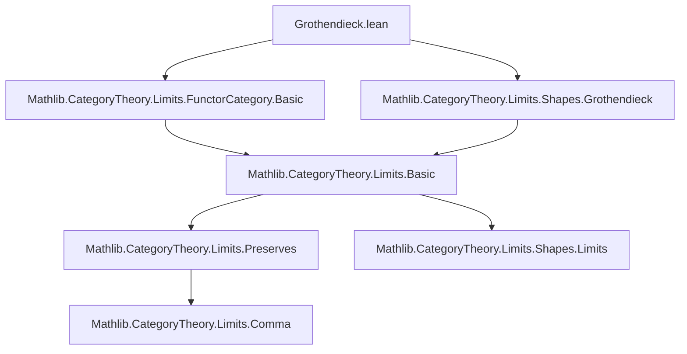
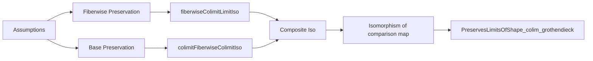

### Technical Brief: Grothendieck Colimit–Limit Preservation

---

#### **1. Key Definitions & Theorems**

| Name | Type / Signature | Purpose |
|------|------------------|---------|
| `fiberwiseColimitLimitIso` | `def fiberwiseColimitLimitIso (K : J ⥤ Grothendieck F ⥤ H) [...] : fiberwiseColimit (limit K) ≅ limit (K ⋙ fiberwiseColim F H)` | Constructs a natural isomorphism between the fiberwise colimit of a limit diagram and the limit of the fiberwise colimit diagram, assuming each fiber colimit preserves limits of shape `J`. |
| `preservesLimitsOfShape_colim_grothendieck` | `instance [...] : PreservesLimitsOfShape J (colim (J := Grothendieck F) (C := H))` | Main theorem: if colimits preserve limits of shape `J` in the base category `C` and in all fibers `F.obj c`, then colimits on the Grothendieck construction `Grothendieck F` also preserve limits of shape `J`. |

---

#### **2. Naming Conventions**

- **Prefixes**:
  - `fiberwise_`: for constructions factoring through fibers of the Grothendieck fibration.
  - `preservesLimit_`: for properties of colimits preserving limits.
  - `colim_`: for colimit-related constructions (e.g., `colim`, `colimitFiberwiseColimitIso`).
- **Suffixes**:
  - `_iso`: for isomorphisms (e.g., `fiberwiseColimitLimitIso`, `preservesLimitIso`).
  - `_obj`, `_map`: for object and morphism parts of functors/natural transformations.
  - `_hom`, `_inv`: for hom/inv components of isomorphisms.
- **Functional composition**:
  - `K ⋙ G`: right-to-left composition of functors (category-theoretic convention).
  - `whiskerLeft`, `associator`, `limitObjIsoLimitCompEvaluation`: standard coherence isomorphisms.

---

#### **3. Tactic Stack**

- **Core tactics**:
  - `simp only [...]`: heavily used for rewriting with `simps!`-generated lemmas and coherence laws.
  - `congr 1`: to reduce equality of natural transformations to component-wise equality.
  - `apply colimit.hom_ext`, `apply limit.hom_ext`: standard extensionality lemmas for (co)limits.
  - `ext`: for extensionality proofs (e.g., natural transformations, morphisms of (co)limits).
  - `apply preservesLimit_of_isIso_post`: key lemma to deduce preservation from invertibility of a comparison map.
- **Isomorphism manipulation**:
  - `Iso.trans`, `Iso.symm`, `HasColimit.isoOfNatIso`, `HasLimit.isoOfNatIso`: for constructing and manipulating isomorphisms.
  - `≈⟨⟩`-style calculation blocks (`calc`) for chaining isomorphisms.

---

#### **4. Proof Logic**

The proof proceeds in two main steps:

1. **Fiberwise characterization** (`fiberwiseColimitLimitIso`):
   - Uses universal properties of limits and colimits.
   - Constructs a component-wise isomorphism via:
     - `limitCompWhiskeringLeftIsoCompLimit`: relates limit and whiskering.
     - `preservesLimitIso colim _`: assumes fiberwise colimits preserve limits.
     - Coherence isomorphisms (`associator`, `isoWhiskerLeft`, etc.) to rearrange compositions.
   - Verifies naturality by reducing to component-wise equalities using `hom_ext` lemmas.

2. **Main preservation theorem** (`preservesLimitsOfShape_colim_grothendieck`):
   - Shows the comparison map `limit K → colim (limit K ⋙ π)` is an isomorphism.
   - Constructs a composite isomorphism:
     $$
     \operatorname{colim} \lim K \xrightarrow{\sim} \operatorname{colim} \operatorname{fiberwiseColim}(\lim K)
     \xrightarrow{\sim} \operatorname{colim} \lim(K \circ \operatorname{fiberwiseColim})
     \xrightarrow{\sim} \lim(K \circ \operatorname{fiberwiseColim} \circ \operatorname{colim})
     \xrightarrow{\sim} \lim(K \circ \operatorname{colim})
     $$
   - Uses:
     - `colimitFiberwiseColimitIso`: identifies colimit over Grothendieck with colimit over base of fiberwise colimits.
     - `fiberwiseColimitLimitIso`: fiberwise limit–colimit interchange.
     - `preservesLimitIso colim _`: base colimit preserves limits.
     - `fiberwiseColimCompColimIso`: identifies fiberwise colimit after colimit with colimit of composite.
   - Concludes by showing the comparison map has an inverse (hence is iso), then applies `preservesLimit_of_isIso_post`.

---

#### **5. Imports & Dependencies**

- **Core dependencies**:
  - `Mathlib.CategoryTheory.Limits.FunctorCategory.Basic`: basic limit/colimit theory in functor categories.
  - `Mathlib.CategoryTheory.Limits.Shapes.Grothendieck`: definition and basic properties of Grothendieck constructions.

- **Implicit dependencies** (via `Mathlib`):
  - `CategoryTheory.Limits.Preserves`: preservation lemmas (e.g., `preservesLimit_of_isIso_post`).
  - `CategoryTheory.Limits.ConcreteCategory`: implicit use of `hom_ext` lemmas.
  - `CategoryTheory.FunctorCategory`: whiskering, associators, coherence.

---

#### **6. Mermaid Diagrams**

##### **Dependency Graph (Module Level)**



##### **Theoretical Overview (Proof Structure)**



##### **Fiberwise Isomorphism Construction**

```mermaid
graph LR
  X[limit K] -->|whiskering| Y[limit (K ⋙ π_c)]
  Y -->|preservesLimitIso| Z[colim_c (limit K_c)]
  Z -->|associator| W[limit (colim_c K_c)]
  W -->|fiberwiseColimCompColimIso| V[limit (K ⋙ colim)]
  X -.->|fiberwiseColimitLimitIso| V
```

---

#### **7. Mathematical Summary**

The Grothendieck construction $\int F$ for $F : C \to \mathbf{Cat}$ is a fibration whose fibers are the categories $F(c)$. The theorem shows:

> **Theorem.**  
> Let $J$ be a shape category. If:
> - colimits of shape $C$ in $H$ preserve limits of shape $J$, and  
> - for every $c \in C$, colimits of shape $F(c)$ in $H$ preserve limits of shape $J$,  
> then colimits of shape $\int F$ in $H$ preserve limits of shape $J$.

This is a *fiberwise + base* decomposition of limit preservation for Grothendieck constructions — a categorical analog of Fubini’s theorem for (co)limits.

--- 

Let me know if you'd like a formalized version of the theorem in natural language or a diagrammatic proof sketch.
