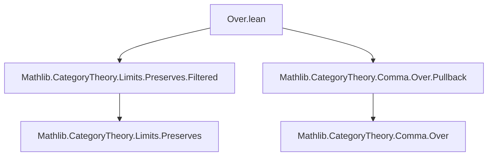
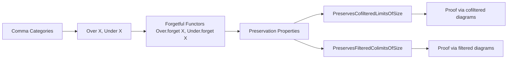
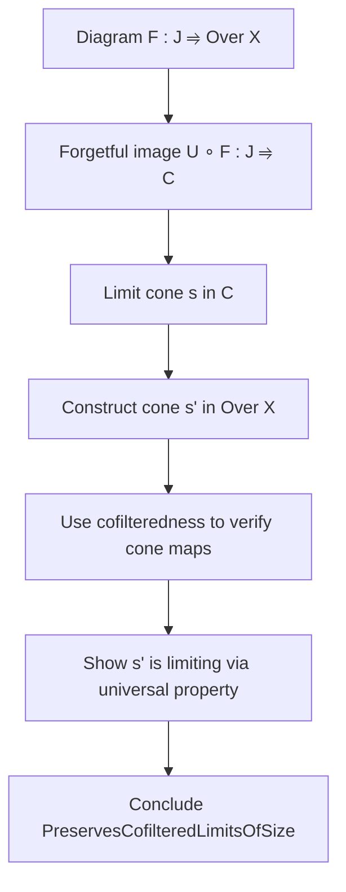

**Technical Brief: `Over.lean` — Forgetful Functors from Over/Under Categories Preserve (Co)filtered (Co)limits**

---

### 1. **Key Definitions & Theorems**

| Name | Type | Purpose |
|------|------|---------|
| `PreservesCofilteredLimitsOfSize` | `PreservesCofilteredLimitsOfSize (Over.forget X)` | States that the forgetful functor `Over.forget X : Over X ⥤ C` preserves cofiltered limits (of a given size). |
| `PreservesFilteredColimitsOfSize` | `PreservesFilteredColimitsOfSize (Under.forget X)` | States that the forgetful functor `Under.forget X : Under X ⥤ C` preserves filtered colimits (of a given size). |

Both are proven as *instances*, i.e., canonical witnesses of preservation properties.

---

### 2. **Naming Conventions**

- **Prefixes**:
  - `Over.` / `Under.` — module/namespace prefixes for comma category constructions.
  - `forget` — standard for the underlying-object functor from comma categories.
  - `PreservesCofilteredLimitsOfSize`, `PreservesFilteredColimitsOfSize` — standard Lean/`Mathlib` naming for (co)limit preservation properties with size control.

- **Suffixes**:
  - `OfExistsUnique` — used in constructing universal cones/cocones via existence-uniqueness arguments.
  - `homMk`, `mk`, `left`, `right` — constructors and projections for morphisms in comma categories (`Over.homMk`, `Under.homMk`, etc.).
  - `OverMorphism.ext`, `UnderMorphism.ext` — extensionality lemmas for morphisms in comma categories.

- **Variables**:
  - `s.π`, `s.ι` — cone/cocone structure maps.
  - `hc.lift`, `hc.desc`, `hc.fac`, `hc.uniq` — standard cone/cocone universal property components.

---

### 3. **Tactic Stack**

The proofs use a combination of:

- `refine` — to construct the instance step-by-step.
- `obtain ⟨i⟩ := Nonempty.some ...` — extract a witness from nonemptiness.
- `simp only [...]` — with lemmas about `Over.mk`, `Under.mk`, cone/cocone compatibility.
- `ext` — extensionality for morphisms in comma categories.
- `simpa using ...` — simplification with a target equality.
- `congr` — to lift equality of morphisms through projections (`left`, `right`).
- `dsimp` — definitional simplification in hypotheses.

No heavy automation (e.g., `aesop`, `ring`, `linarith`) is used — the proofs are mostly *constructive* and *diagram-chasing*.

---

### 4. **Proof Logic**

#### For `PreservesCofilteredLimitsOfSize`:
1. Given a cofiltered diagram `F : J ⥤ Over X`, construct a limiting cone in `Over X`.
2. Use the cofilteredness of `J` to:
   - Pick a base object `i : J`.
   - For any two objects `j, k`, find a common cone object `k` with maps `j → k ← i`.
3. Construct a cone `s'` in `Over X` from a limiting cone `s` in `C`:
   - Object: `Over.mk (s.π.app i ≫ F.obj i .hom)`
   - Morphisms: `Over.homMk (s.π.app j)` — verified to be compatible using cofilteredness.
4. Show that the candidate cone is limiting:
   - **Lift**: `hc.lift s'` — use universal property in `C`.
   - **Facility**: `hc.fac s' j` — project to `C` and use uniqueness.
   - **Uniqueness**: `hc.uniq s' ...` — use extensionality in `Over X`.

#### For `PreservesFilteredColimitsOfSize`:
- Dual argument: filtered colimits in `Under X` via dual construction.
- Use `Under.mk`, `Under.homMk`, `ι` instead of `π`.
- Use filteredness to get common cocone objects.

Both proofs rely on:
- **Definitional equalities** of forgetful functors (`Over.forget X = .obj`, etc.).
- **Extensionality principles** for comma category morphisms.
- **Cofiltered/filtered diagram properties** (existence of connecting morphisms).

---

### 5. **Imports**

- `Mathlib.CategoryTheory.Limits.Preserves.Filtered` — provides general machinery for (co)limit preservation.
- `Mathlib.CategoryTheory.Comma.Over.Pullback` — referenced for related facts (e.g., `Over.forget` preserves colimits as a left adjoint).

---

### 6. **Mermaid Diagrams**

#### Dependency Graph (Module-Level)

#### Overview of Theoretical Flow

#### Proof Sketch (Cofiltered Limits Case)

---

### 7. **Summary**

This file establishes foundational preservation properties of forgetful functors from comma categories:
- `Over.forget X` preserves *all* colimits (left adjoint), and *cofiltered limits* (nontrivial).
- `Under.forget X` preserves *filtered colimits* (dual to above).
- Proofs are constructive, leveraging diagrammatic properties of cofiltered/filtered categories and extensionality in comma categories.

These results are essential for reasoning about limits/colimits in slice/coslice categories, especially in homotopical and categorical logic contexts.

--- 

*End of Technical Brief.*
