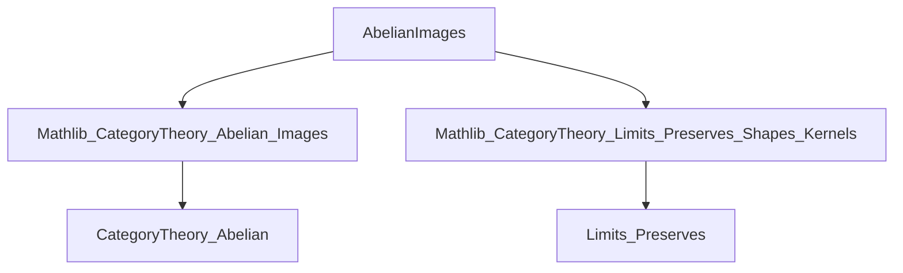
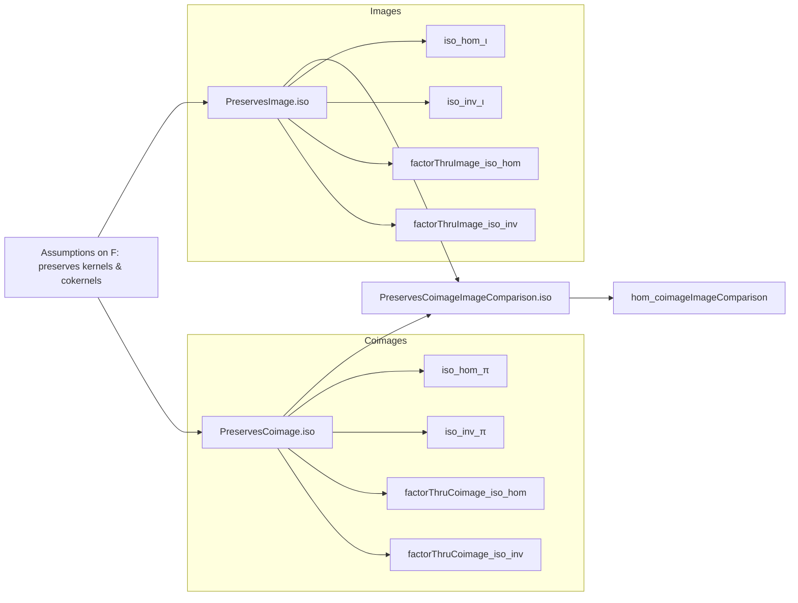

### Technical Brief: `AbelianImages.lean`

---

#### **1. Key Definitions & Theorems**

| Name | Type / Purpose |
|------|----------------|
| `PreservesImage.iso` | `F.obj (Abelian.image f) ≅ Abelian.image (F.map f)`<br>Constructs an isomorphism between the image of `f` under `F` and the image of `F.map f`, assuming `F` preserves kernels and cokernels. |
| `PreservesCoimage.iso` | `F.obj (Abelian.coimage f) ≅ Abelian.coimage (F.map f)`<br>Constructs an isomorphism between the coimage of `f` under `F` and the coimage of `F.map f`, under similar assumptions. |
| `PreservesCoimageImageComparison.iso` | `Arrow.mk (F.map (coimageImageComparison f)) ≅ Arrow.mk (coimageImageComparison (F.map f))`<br>Shows that `F` preserves the coimage-image comparison morphism as an arrow isomorphism. |
| `PreservesImage.iso_hom_ι`, `PreservesImage.iso_inv_ι` | `simp`-friendly lemmas about how the image inclusion interacts with the isomorphism. |
| `PreservesCoimage.iso_hom_π`, `PreservesCoimage.iso_inv_π` | `simp`-friendly lemmas about how the coimage projection interacts with the isomorphism. |
| `PreservesCoimage.hom_coimageImageComparison` | Commutativity of the square involving coimage-image comparison and the image/coimage isomorphisms. |

---

#### **2. Naming Conventions**

- **Prefixes**:
  - `PreservesImage.iso`, `PreservesCoimage.iso`: indicate preservation of a categorical construction under a functor.
  - `factorThruImage`, `factorThruCoimage`: standard factorization morphisms in abelian categories.
- **Suffixes**:
  - `_hom_ι`, `_inv_ι`, `_hom_π`, `_inv_π`: describe how the isomorphism interacts with canonical morphisms (`ι` for image inclusion, `π` for coimage projection).
  - `_factorThruImage_iso_hom`, `_factorThruCoimage_iso_inv`: describe interaction with factorization morphisms.
- **`iso`**: suffix for isomorphisms constructed in the section.
- **`Arrow.isoMk'`**: used to construct isomorphisms of arrows (i.e., commuting squares).

---

#### **3. Tactic Stack**

- `simp`: heavily used, especially with `[reassoc (attr := simp)]` attributes.
- `ext`: extensionality for morphisms (e.g., in `factorThruImage_iso_hom`).
- `simp [iso]`, `simp [Iso.comp_inv_eq]`, `simp [← Functor.map_comp]`: standard simplifications for isomorphisms and functors.
- `cancel_epi`, `cancel_mono`: used to simplify compositions with monos/epis.
- `← Iso.eq_inv_comp`: to rewrite using inverse of isomorphisms.

---

#### **4. Proof Logic**

- **Structure**: The file proceeds in three sections:
  1. **Images**: assuming `F` preserves kernels and cokernels of `f`, construct `PreservesImage.iso`.
     - Uses `PreservesKernel.iso`, `PreservesCokernel.iso`, and `kernel.mapIso`.
     - Proves coherence lemmas with `simp` and `ext`.
  2. **Coimages**: dual to images, using `PreservesCokernel.iso`, `PreservesKernel.iso`, and `cokernel.mapIso`.
  3. **Coimage–Image Comparison**: shows that `F` preserves the comparison morphism `coimageImageComparison f : coimage f ⟶ image f`.
     - Uses the previously constructed isomorphisms and commutativity lemmas.
     - Proof relies on diagram chasing and cancellation properties.

- **General Flow**:
  - Assume sufficient limits/colimits exist.
  - Use preservation assumptions to build isomorphisms.
  - Prove naturality/simplicity lemmas for coherence.
  - Assemble into arrow isomorphisms.

---

#### **5. Imports**

| Import | Purpose |
|--------|---------|
| `Mathlib.CategoryTheory.Abelian.Images` | Core definitions: `Abelian.image`, `Abelian.coimage`, `coimageImageComparison`, `Abelian.factorThruImage`, etc. |
| `Mathlib.CategoryTheory.Limits.Preserves.Shapes.Kernels` | Tools for preservation of kernels/cokernels, including `PreservesKernel.iso`, `PreservesCokernel.iso`. |

Other implicit dependencies:
- `CategoryTheory.Abelian` namespace assumes `[Category]`, `[HasZeroMorphisms]`, `[HasKernel]`, `[HasCokernel]`.
- `Limits` namespace for `parallelPair`, `PreservesLimit`, `PreservesColimit`.

---

#### **6. Mermaid Diagrams**

##### **Dependency Graph (Module-Level)**



##### **Overview of File Structure**



##### **Commutative Square for Coimage–Image Preservation**

```mermaid
graph LR
  F(coimage f) -- (PreservesCoimage.iso).hom --> coimage(F f)
  F(coimage f) -- F(map coimageImageComparison f) --> F(image f)
  coimage(F f) -- coimageImageComparison(F f) --> image(F f)
  F(image f) -- (PreservesImage.iso).hom --> image(F f)

  %% Commutativity: top path = right path
  F(coimage f) -- F(map coimageImageComparison f) --> F(image f)
  F(coimage f) -- (PreservesCoimage.iso).hom --> coimage(F f)
  coimage(F f) -- coimageImageComparison(F f) --> image(F f)
  F(image f) -- (PreservesImage.iso).hom --> image(F f)

  style F(coimage f) fill:#f9f,stroke:#333
  style coimage(F f) fill:#bbf,stroke:#333
  style F(image f) fill:#bfb,stroke:#333
  style image(F f) fill:#f96,stroke:#333
```

---

#### **7. Summary**

This file formalizes a key result in homological algebra: **a functor preserving kernels and cokernels automatically preserves abelian images, coimages, and the comparison morphism between them**. The proofs are constructive and rely on standard limit/colimit preservation machinery, with heavy use of `simp`-friendly lemmas to ensure coherence. The structure is modular and reusable for further developments in homological algebra in Lean.
