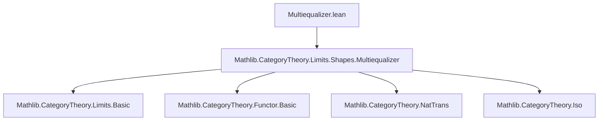

**Technical Brief: `Multiequalizer.lean` (Multicoequalizer Preservation)**  
*Domain: Category Theory — Limits and Colimits in Multispan Diagrams*

---

### 1. **Key Definitions & Theorems**

| Name | Type / Signature | Purpose |
|------|------------------|---------|
| `MultispanIndex.map` | `d.map F : MultispanIndex J D` | Applies a functor `F : C ⥤ D` componentwise to a multispan index `d` over `C`. |
| `MultispanIndex.multispanMapIso` | `(d.map F).multispan ≅ d.multispan ⋙ F` | Natural isomorphism showing that mapping a multispan index through `F` is equivalent to precomposing the original multispan diagram with `F`. |
| `Multicofork.map` | `c.map F : Multicofork (d.map F)` | Induces a multicofork over the mapped multispan from a given multicofork `c` over `d`, via functoriality of `F`. |
| `Multicofork.isColimitMapEquiv` | `IsColimit (F.mapCocone c) ≃ IsColimit (c.map F)` | Establishes a bijection between colimitness of the cocone `F.mapCocone c` and the mapped multicofork `c.map F`. |
| `Multicofork.isColimitMapOfPreserves` | `[PreservesColimit d.multispan F] → IsColimit c → IsColimit (c.map F)` | Concludes that if `F` preserves the colimit of `d.multispan`, then colimitness descends from `c` to `c.map F`. |

---

### 2. **Naming Conventions**

- **Prefixes**:
  - `map`: Indicates functorial action (`map`, `mapCocone`, `map F`).
  - `isColimit`: Predicate for colimit structure.
- **Suffixes**:
  - `Iso`: Denotes isomorphisms (`multispanMapIso`).
  - `Equiv`: Denotes equivalences/bijections (`isColimitMapEquiv`).
- **Structure**:
  - `MultispanIndex.*`, `Multicofork.*`: Module-specific naming for data and properties.
  - `ofπ`: Constructor pattern for multicoforks defined via projections.

---

### 3. **Tactic Stack**

Frequent tactics used in proofs and definitions:

- `simp`, `simp only`, `simp_rw`: Simplification of structure projections and compositions.
- `rw`: Rewriting using isomorphisms and naturality.
- `dsimp`: Simplification of definitional equalities (especially in `map` definitions).
- `intro`, `rintro`: Intro-style pattern matching on sums (`left`, `right`) and product types.
- `match`: Pattern matching on inductive types (e.g., `i : Sum _ _`).
- `exact`, `apply`: For constructing morphisms and proofs.
- `aesop`: Likely used in later proofs (not explicit here, but standard in `Limits` modules).

---

### 4. **Proof Logic**

- **Structure**: The development follows a *diagrammatic transport* strategy:
  1. **Transport data**: Define `d.map F` and `c.map F` via functoriality.
  2. **Transport structure**: Construct `multispanMapIso` to relate diagrams.
  3. **Transport colimit structure**: Use the iso to relate colimit cones (`F.mapCocone c`) and multicoforks (`c.map F`) via:
     - `IsColimit.precomposeInvEquiv` (change of diagram via iso),
     - `IsColimit.equivIsoColimit` (equivalence of colimitness under iso).
  4. **Preservation theorem**: Combine the equivalence with `PreservesColimit` to deduce colimitness of `c.map F`.

- **Induction**: Not used directly; reasoning is categorical and diagrammatic.

---

### 5. **Imports**

- `Mathlib.CategoryTheory.Limits.Shapes.Multiequalizer`: Core definitions of multispan diagrams, multicoforks, and multicoequalizers.

> Note: The module name `Multiequalizer.lean` is likely a misnomer — the content concerns *multicoequalizers* (colimits over multispan diagrams), not equalizers.

---

### 6. **Mermaid Diagrams**

#### **Dependency Graph (Module Level)**



#### **Conceptual Overview (Data Flow)**

```mermaid
graph LR
  d[MultispanIndex J C] -->|F : C ⥤ D| dF[d.map F : MultispanIndex J D]
  c[Multicofork d] -->|F| cF[c.map F : Multicofork (d.map F)]
  dF --> multispanF[(d.map F).multispan]
  d --> multispan[d.multispan]
  multispanF <-->|multispanMapIso| multispan ⋙ F
  cF --> isColimitF[IsColimit (c.map F)]
  F.mapCocone c --> isColimitFC[IsColimit (F.mapCocone c)]
  isColimitFC <-->|isColimitMapEquiv| isColimitF
  hc[IsColimit c] -->|preserves| isColimitFC
```

#### **Theorem Flow**

```mermaid
graph LR
  hc[IsColimit c] -->|PreservesColimit| isColimitFC[IsColimit (F.mapCocone c)]
  isColimitFC <-->|isColimitMapEquiv| isColimitF[IsColimit (c.map F)]
  isColimitF -->|isColimitMapOfPreserves| conclusion[IsColimit (c.map F)]
```

---

### 7. **Summary**

This module formalizes the *functorial preservation of multicoequalizers* (i.e., colimits over multispan diagrams). It constructs the induced multicofork under a functor, relates it to the mapped cocone via a natural isomorphism, and proves that colimitness descends along functors that preserve the underlying colimit. The development is clean, modular, and follows standard `Mathlib` patterns for limit/colimit transport.
