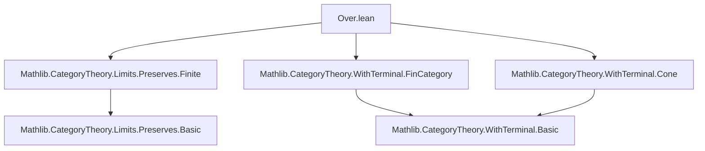

### Technical Brief: `Over.lean` — Preservation of (Co)limits by `Over.post` and `Under.post`

---

#### **1. Key Definitions & Theorems**

| Name | Type | Purpose |
|------|------|---------|
| `PreservesLimitsOfShape.ofWidePullbacks` | `{J : Type*} → [PreservesLimitsOfShape (WidePullbackShape J) F] → PreservesLimitsOfShape (WithTerminal <| Discrete J) F` | Shows that preservation of wide pullbacks (indexed by `J`) implies preservation of limits of shape `WithTerminal (Discrete J)` (i.e., limits over `J` with a terminal object adjoined). Uses an equivalence `WithTerminal.widePullbackShapeEquiv`. |
| `PreservesLimitsOfShape.overPost` | `[PreservesLimitsOfShape (WithTerminal J) F] → PreservesLimitsOfShape J (Over.post F (X := X))` | Main theorem: if `F` preserves limits of shape `WithTerminal J`, then the induced functor `Over.post F : Over X ⥤ Over (F X)` preserves limits of shape `J`. |
| `PreservesFiniteLimits.overPost` | `[PreservesFiniteLimits F] → PreservesFiniteLimits (Over.post F (X := X))` | Corollary: finite limit preservation descends to `Over.post`. |
| `PreservesLimitsOfSize.overPost` | `[PreservesLimitsOfSize.{w', w} F] → PreservesLimitsOfSize.{w', w} (Over.post F (X := X))` | Corollary: size-bounded limit preservation descends to `Over.post`. |
| `PreservesColimitsOfShape.underPost` | `[PreservesColimitsOfShape (WithInitial J) F] → PreservesColimitsOfShape J (Under.post F (X := X))` | Dual of `overPost`: colimit preservation descends to `Under.post`. |
| `PreservesFiniteColimits.underPost` | `[PreservesFiniteColimits F] → PreservesFiniteColimits (Under.post F (X := X))` | Dual corollary for finite colimits. |
| `PreservesColimitsOfSize.underPost` | `[PreservesColimitsOfSize.{w', w} F] → PreservesColimitsOfSize.{w', w} (Under.post F (X := X))` | Dual corollary for size-bounded colimits. |

---

#### **2. Naming Conventions**

- **Prefixes**:
  - `Preserves*`: Indicates a class/instance asserting preservation of a certain kind of (co)limit.
  - `overPost`, `underPost`: Functors induced on over/under categories.
  - `of*`: Conversion lemmas (e.g., `ofWidePullbacks`).
- **Suffixes**:
  - `OfShape`: Preservation for a specific diagram shape.
  - `Finite`: Preservation of finite diagrams.
  - `OfSize`: Preservation of diagrams of bounded size.
- **Structure**:
  - `WithTerminal J`: Diagram shape with a terminal object adjoined (used for ordinary limits).
  - `WithInitial J`: Dual, with an initial object adjoined (used for colimits).
  - `WidePullbackShape J`: Shape for wide pullbacks over a discrete diagram `J`.

---

#### **3. Tactic Stack**

- `aesop`: Used for automated reasoning in extensionality proofs (e.g., `Cones.ext`, `Cocones.ext`).
- `simp_rw`: Implicit via `isLimitEquiv`, `isColimitEquiv`, and hom-equivalences.
- `exact`, `apply`, `symm`, `ofIsoLimit`, `ofIsoColimit`: Standard for manipulating isomorphisms of (co)limits.
- `have`: Local proof introduction to extract intermediate (co)limit data.
- `funext`, `cases`: Used implicitly in `Cones.ext`/`Cocones.ext` proofs.

---

#### **4. Proof Logic**

The core proof pattern is:

1. **Assume** `F` preserves limits/colimits of shape `WithTerminal J` / `WithInitial J`.
2. **Given** a limiting cone `coneK` over `Over X`, use the equivalence:
   - `IsLimit.postcomposeHomEquiv` (for limits) or
   - `IsColimit.precomposeHomEquiv` (for colimits)
   to transport the (co)limit data to the base category `C`.
3. **Apply** preservation: `F` sends the (co)limit cone in `C` to a (co)limit cone in `D`.
4. **Transport back** via the same equivalence to get a (co)limit cone in `Over (F X)` / `Under (F X)`.
5. **Verify** that the induced morphism is an isomorphism of (co)cones using:
   - `ofIsoLimit` / `ofIsoColimit`
   - `Cones.ext` / `Cocones.ext` with `aesop` for component-wise equality.

This is a standard “change-of-base” argument using representability and universal properties.

---

#### **5. Imports**

| Module | Role |
|--------|------|
| `Mathlib.CategoryTheory.Limits.Preserves.Finite` | Defines `PreservesFiniteLimits`, `PreservesFiniteColimits`. |
| `Mathlib.CategoryTheory.WithTerminal.FinCategory` | Provides `WithTerminal` construction and equivalences (e.g., `widePullbackShapeEquiv`). |
| `Mathlib.CategoryTheory.WithTerminal.Cone` | Defines cones over `WithTerminal J`, and equivalences like `postcomposeHomEquiv`. |

---

#### **6. Mermaid Diagrams**

##### **Dependency Graph (Module Level)**



##### **Conceptual Overview (Theoretical Flow)**

```mermaid
graph LR
  F[F : C ⥤ D] -->|preserves| L[Limit of shape WithTerminal J]
  L -->|induces| L_over[Limit in Over X]
  L_over -->|via Over.post F| L'_over[Limit in Over (F X)]
  
  F -->|preserves| C[Colimit of shape WithInitial J]
  C -->|induces| C_under[Colimit in Under X]
  C_under -->|via Under.post F| C'_under[Colimit in Under (F X)]
```

##### **Proof Strategy Flow (for `overPost`)**

```mermaid
graph TD
  A[coneK : J ⥤ Over X] --> B[coneD : J ⥤ C]
  B --> C[F coneD : J ⥤ D]
  C --> D[coneD' : Over (F X)]
  
  A -.->|postcomposeHomEquiv| B
  C -.->|preserves| C'
  C' -.->|postcomposeHomEquiv.symm| D
  D --> E[isLimitConeD]
  E --> F[isLimitConeK']
  F -->|ofIsoLimit| G[PreservesLimit]
```

---

#### **7. Summary**

This file formalizes a foundational result in categorical limit theory: **limit (resp. colimit) preservation descends along the canonical functors `Over.post F` and `Under.post F`**, provided the original functor `F` preserves the corresponding shape of (co)limits. It leverages the universal property of over/under categories and the equivalence between diagrams over `J` with a terminal object and wide pullback diagrams. The proof is uniform across finite, size-bounded, and shape-specific cases, and is dualized for colimits.

This is essential for developing internal category theory (e.g., in toposes or fibred categories), where over/under categories serve as “slice” contexts.
