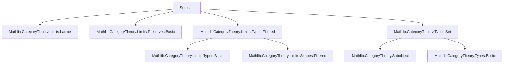
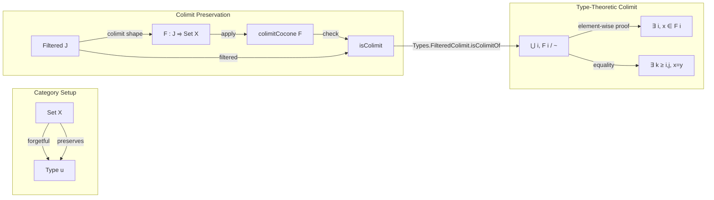

**Technical Brief: `Set.lean` — Preservation of Filtered Colimits by `Set.functorToTypes`**

---

### 1. **Key Definitions & Theorems**

| Name | Type / Signature | Purpose |
|------|------------------|---------|
| `functorToTypes` | `Set X ⥤ Type u` | The forgetful functor from the category of subsets of `X` (i.e., `Set X`, viewed as a full subcategory of `Type u`) to `Type u`. |
| `PreservesColimitsOfShape` | `Category → (C ⥤ D) → Prop` | Predicate stating that a functor preserves colimits of a given shape. |
| `preservesColimit_of_preserves_colimit_cocone` | `∀ {F : J ⥤ _}, isColimit (colimitCocone F) → PreservesColimit F → …` | A lemma to deduce preservation of a specific colimit from preservation of its cocone. |
| `Types.FilteredColimit.isColimitOf` | `IsFiltered J → … → isColimit …` | A key lemma in `Types` asserting that a certain cocone is colimiting under filteredness. |
| `colimitCocone` | `F : J ⥤ C → Cocone F` | The canonical cocone over a diagram `F`. |
| `isColimit` | `Cocone F → Prop` | Predicate for a cocone being a colimit. |

**Main Theorem (exposed):**  
`instance {J : Type w} [Category J] {X : Type u} [IsFilteredOrEmpty J] : PreservesColimitsOfShape J (functorToTypes (X := X))`  
→ *The forgetful functor `Set X ⥤ Type u` preserves filtered colimits (and empty colimits).*

---

### 2. **Naming Conventions**

- **Prefixes:**
  - `preserves_…`: e.g., `preservesColimit`, `preservesColimitsOfShape`
  - `is_…`: e.g., `isColimit`, `IsFiltered`
  - `functorTo…`: e.g., `functorToTypes`
- **Suffixes:**
  - `_cocone`: e.g., `colimitCocone`
  - `_of_…`: e.g., `preservesColimit_of_preserves_colimit_cocone`
- **Category-theoretic terms:** `colimit`, `Cocone`, `PreservesColimitsOfShape`, `IsFilteredOrEmpty`

---

### 3. **Tactic Stack**

The proof uses a compact, high-level tactic script:

- `apply` (twice): to apply lemmas about colimit preservation.
- `intro` / `rintro`: to unpack existential and dependent hypotheses.
- `simp only [colimitCocone_cocone_pt, iSup_eq_iUnion, mem_iUnion]`: simplification using definitions of colimit in `Type` and set-theoretic unions.
- `obtain ⟨i, hi⟩ := hx`: destruct existential.
- `exact ⟨i, ⟨x, hi⟩, rfl⟩`: construct witness for colimit cocone element.
- `obtain rfl : x = y := …`: use filteredness to identify elements.
- `exact ⟨IsFiltered.max i j, …, rfl⟩`: construct morphism witness using filtered category properties.

No heavy automation (e.g., `aesop`, `ring`, `linarith`) — relies on structural reasoning and `simp`.

---

### 4. **Proof Logic**

The proof proceeds as follows:

1. **Goal:** Show `functorToTypes` preserves colimits of shape `J`, where `J` is filtered or empty.
2. Reduce to showing preservation of *one* colimit: `colimitCocone F` is colimiting.
3. Use `Types.FilteredColimit.isColimitOf`, which requires:
   - **(i)** Every element of the colimit (i.e., `⋃ i, F i`) comes from some component:  
     `⟨x, hx⟩ ∈ ⋃ i, F i` ⇒ `∃ i, x ∈ F i`.
   - **(ii)** Any two elements `x ∈ F i`, `y ∈ F j` that become equal in the colimit already agree in some common extension `k ≥ i, j`.  
     Uses `IsFiltered.max i j` and the filteredness morphisms.
4. Translate set-theoretic union (`iSup_eq_iUnion`, `mem_iUnion`) into categorical colimit structure in `Type`.
5. Conclude via `preservesColimit_of_preserves_colimit_cocone`.

The logic is *element-based*, leveraging the concrete description of filtered colimits in `Type` as quotients of disjoint unions.

---

### 5. **Imports**

| Import | Role |
|--------|------|
| `Mathlib.CategoryTheory.Limits.Lattice` | Provides lattice-theoretic characterizations of limits/colimits (e.g., `iSup`, `iInf`). |
| `Mathlib.CategoryTheory.Limits.Preserves.Basic` | Defines `PreservesColimitsOfShape`, basic lemmas. |
| `Mathlib.CategoryTheory.Limits.Types.Filtered` | Contains `Types.FilteredColimit.isColimitOf`, characterization of filtered colimits in `Type`. |
| `Mathlib.CategoryTheory.Types.Set` | Defines `Set X` as a category and `functorToTypes`. |

---

### 6. **Mermaid Diagrams**

#### **Dependency Graph (Module-Level)**

#### **Overview of Theoretical Flow**

---

### 7. **Domain-Specific AI Agent Notes**

- **Key reasoning pattern**: *Concrete element-chasing in colimits of `Type`*, then lifting to categorical statements.
- **Critical lemmas to surface**: `Types.FilteredColimit.isColimitOf`, `preservesColimit_of_preserves_colimit_cocone`.
- **Common proof patterns**:  
  - Use `iSup_eq_iUnion` + `mem_iUnion` to translate categorical colimits in `Type` to unions.  
  - Use `IsFiltered.max` to handle equality in filtered colimits.
- **Suggest tactic automation**: `simp only [colimitCocone_cocone_pt, iSup_eq_iUnion, mem_iUnion]` is highly domain-specific — could be cached as a `simp` lemma group.

--- 

Let me know if you'd like the corresponding `leanpkg` dependency graph or a formalization roadmap for extending this to other forgetful functors (e.g., `Group`, `Ring`).
