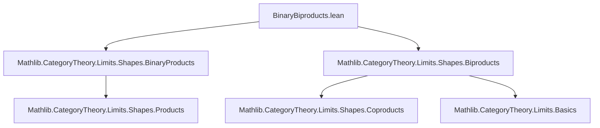
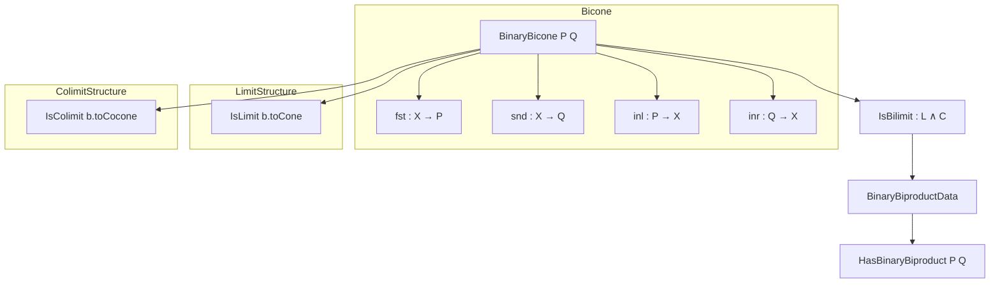

Here is the structured technical brief for `BinaryBiproducts.lean`:

---

### **1. Key Definitions & Theorems**

| Name | Type / Signature | Purpose |
|------|------------------|---------|
| `BinaryBicone P Q` | `Structure` | A diagram with cone point `X`, projections `fst, snd : X → P, Q` and inclusions `inl, inr : P, Q → X`, satisfying orthogonality axioms (`inl ≫ fst = 1`, `inl ≫ snd = 0`, etc.). |
| `BinaryBiconeMorphism A B` | `Structure` | Morphism between binary bicones: a map `A.pt → B.pt` commuting with all four legs. |
| `BinaryBicone.category` | `Instance` | Makes `BinaryBicone P Q` a category. |
| `BinaryBicone.toCone` / `toCocone` | `def` | Forgets cocone / cone structure, yielding a cone / cocone over `pair P Q`. |
| `BinaryBicone.IsBilimit` | `Structure` | Witness that a binary bicone is both a limit cone and a colimit cocone. |
| `BinaryBiproductData P Q` | `Structure` | A binary bicone equipped with a bilimit witness. |
| `HasBinaryBiproduct P Q` | `Class Prop` | Mere existence of a binary biproduct for `P, Q`. |
| `BinaryBiproduct.bicone P Q` | `def` | Canonical choice of bicone when `HasBinaryBiproduct P Q`. |
| `biprod X Y` (notation `X ⊞ Y`) | `abbrev` | Vertex of the biproduct bicone. |
| `biprod.fst, biprod.snd, biprod.inl, biprod.inr` | `abbrev` | Canonical projections and inclusions. |
| `biprod.lift f g` | `abbrev` | Universal map into biproduct from `W → X, W → Y`. |
| `biprod.desc f g` | `abbrev` | Universal map out of biproduct from `X → W, Y → W`. |
| `biprod.map f g` | `abbrev` | Induced map `X ⊞ Y → X' ⊞ Y'` from `f : X → X'`, `g : Y → Y'`. |
| `biprod.isoProd`, `biprod.isoCoprod` | `def` | Canonical isos `X ⊞ Y ≅ X × Y` and `X ⊞ Y ≅ X ⊔ Y`. |
| `biprod.map_eq_map'` | `thm` | Equality of two constructions of `biprod.map` (via limits and colimits). |
| `biprod.uniqueUpToIso` | `def` | Explicit iso between any bilimit bicone and the canonical one. |
| `BinaryBicone.fstKernelFork`, `sndKernelFork`, `inlCokernelCofork`, `inrCokernelCofork` | `def` | Kernel / cokernel forks/coforks induced by biproduct structure. |

---

### **2. Naming Conventions**

- **Prefixes**:
  - `biprod.`: for operations on biproducts (`biprod.fst`, `biprod.lift`, etc.)
  - `BinaryBicone.`: for operations on bicones (`BinaryBicone.toCone`, `BinaryBicone.fstKernelFork`)
  - `HasBinaryBiproduct.`: for class-related lemmas (e.g., `HasBinaryBiproduct.mk`)
- **Suffixes**:
  - `_isLimit`, `_isColimit`, `_isBilimit`: indicate (co)limit properties.
  - `_fork`, `_cofork`: for kernel/cokernel constructions.
  - `_map`, `_map'`: alternative constructions of the same map.
- **Infix notation**:
  - `X ⊞ Y` for `biprod X Y`.

---

### **3. Tactic Stack**

- **`aesop`**: Used in `BinaryBicone` structure fields to discharge simple diagrammatic equations.
- **`cat_disch`**: Used in `BinaryBiconeMorphism` to discharge triangle commutativity conditions.
- **`simp` / `simp only`**: Heavily used, especially with `reassoc` attributes on axioms.
- **`ext`**: For extensionality proofs (e.g., `biprod.hom_ext`, `BinaryBiconeMorphism.ext`).
- **`rw`, `refine`, `cases`**: For manual rewriting and case analysis on `WalkingPair`.
- **`infer_instance`**: To discharge typeclass goals after rewriting.
- **`all_goals`**: In `biprod.conePointUniqueUpToIso_inv`.

---

### **4. Proof Logic**

- **Induction / case analysis** on `WalkingPair` (a discrete category with two objects) is pervasive, especially in proving `simp` lemmas and uniqueness.
- **Universal properties** are used to construct maps:
  - `IsLimit.lift` for maps *into* biproducts.
  - `IsColimit.desc` for maps *out of* biproducts.
- **Isomorphism uniqueness** is shown via:
  - `conePointUniqueUpToIso` / `coconePointUniqueUpToIso`, then specialized to biproducts.
  - Explicit inverses via `lift`/`desc` (e.g., `biprod.uniqueUpToIso`).
- **Equational reasoning**:
  - Many proofs reduce to checking commutativity of diagrams using `simp` and `reassoc`.
  - `biprod.map_eq_map'` is proven by `ext` + `simp` over the four components of `WalkingPair`.

---

### **5. Imports**

- `Mathlib.CategoryTheory.Limits.Shapes.BinaryProducts`
- `Mathlib.CategoryTheory.Limits.Shapes.Biproducts`

> These imports provide foundational definitions for products, coproducts, limits, colimits, and general biproducts (finite biproducts), upon which binary biproducts are built.

---

### **6. Mermaid Diagrams**

#### **Dependency Graph (Module-Level)**



#### **Conceptual Overview (Binary Biproduct Structure)**



#### **Canonical Biproduct Construction Flow**

```mermaid
graph LR
  A[HasBinaryBiproduct P Q] -->|Classical.choice| B[BinaryBiproductData P Q]
  B --> C[BinaryBicone P Q]
  C --> D[pt = X ⊞ Y]
  C --> E[toCone : Cone(pair P Q)]
  C --> F[toCocone : Cocone(pair P Q)]
  E -->|IsLimit| G[prod P Q ≅ X ⊞ Y]
  F -->|IsColimit| H[coprod P Q ≅ X ⊞ Y]
```

---

This file formalizes binary biproducts as *simultaneous limits and colimits*, emphasizing the interplay between product and coproduct structure in categories with zero morphisms. It provides a robust interface for reasoning about biproducts, including universal properties, functoriality, and connections to kernels/cokernels.
