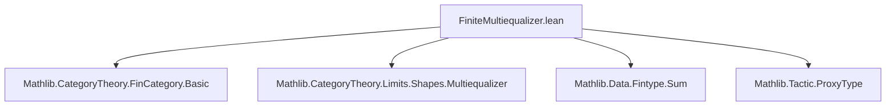
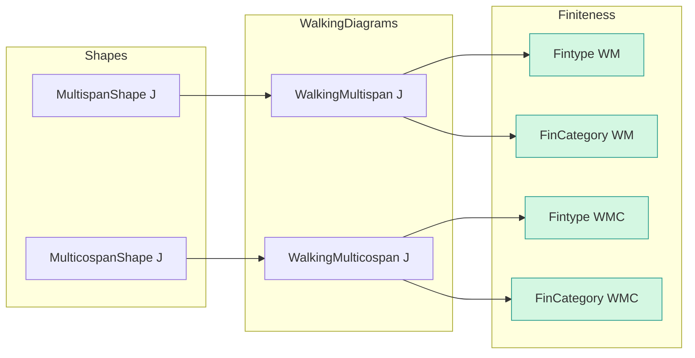
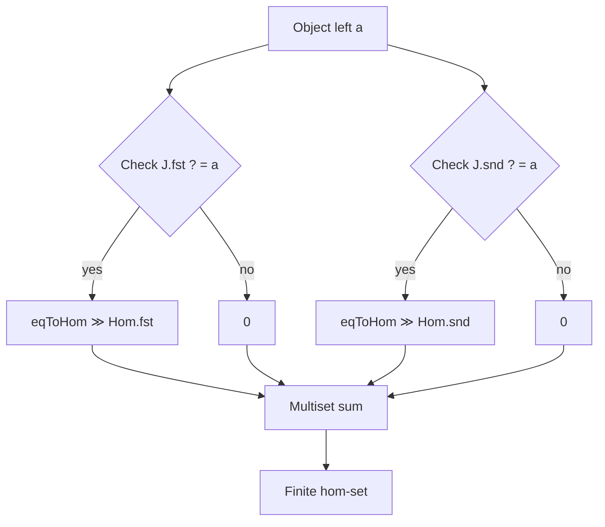

**Technical Brief: `FiniteMultiequalizer.lean`**

---

### 1. **Key Definitions & Theorems**

| Name | Type / Purpose |
|------|----------------|
| `WalkingMulticospan` | A `MulticospanShape`-indexed diagram shape; represents a finite multi-cospan (dual of multi-span). |
| `WalkingMultispan` | A `MultispanShape`-indexed diagram shape; represents a finite multi-span. |
| `instance : Fintype (WalkingMulticospan J)` | Constructs finiteness of objects in the walking multicospan category using `proxy_equiv%`. |
| `instance : FinCategory (WalkingMulticospan J)` | Under decidable equality on `J.L` and `J.R`, equips `WalkingMulticospan J` with a finite category structure (`fintypeHom`). |
| `instance : Fintype (WalkingMultispan J)` | Analogous finiteness for walking multispan. |
| `instance : FinCategory (WalkingMultispan J)` | Analogous finite category structure for walking multispan. |

**Purpose**: To establish that the *walking* finite multi-(co)span categories are *finite categories* (`FinCategory`) when the source data (`J.L`, `J.R`) are finite and have decidable equality.

---

### 2. **Naming Conventions**

- **Prefixes**:
  - `WalkingMulticospan`, `WalkingMultispan`: Standard Lean/Category Theory naming for *free* diagrams (walking diagrams).
  - `fintypeHom`: Instance field name for `FinCategory`, following Mathlib’s convention (`fintypeHom : ∀ a b, Fintype (a ⟶ b)`).
- **Suffixes**:
  - `.left`, `.right`: Constructor tags for objects in the walking (multi)span — indicating source or target side of the span.
  - `.fst`, `.snd`: Constructor tags for morphisms in the walking (multi)span — indexing the two legs of each span/cospan.
- **Pattern**:
  - `eqToHom (e ▸ rfl)` — used to transport identities along equalities.
  - `0` used as zero morphism placeholder in finite hom-sets (via `+` and `∑` over `Multiset`-like sums).
  - `proxy_equiv%` — tactic-generated equivalence for finiteness via `ProxyType`.

---

### 3. **Tactic Stack**

| Tactic | Usage |
|--------|-------|
| `split_ifs` | To decompose nested `if-then-else` expressions in hom-set definitions. |
| `simp` | Extensive simplification, especially with `Multiset` lemmas (`singleton_add`, `nodup_cons`, etc.). |
| `subst` (via `conv_lhs => tactic => subst h₁`) | To substitute equality proofs into goals. |
| `intro` / `rintro` | For introducing hypotheses and destructing `⟨⟩` (dependent pairs/sums). |
| `all_goals` | To apply same tactic to all goals. |
| `conv_lhs` / `conv_rhs` | To focus left/right side of equation for substitution. |
| `ne_of_apply_ne` | To prove inequality by showing a function distinguishes two terms. |

---

### 4. **Proof Logic**

- **Structure**:
  1. **Fintype instance**: Proven via `ofEquiv`, using `proxy_equiv%` to reduce to a known finite type.
  2. **FinCategory instance**:
     - Define hom-sets case-by-case on object types (`.left`, `.right`).
     - For `.left → .left` and `.right → .right`: singleton set if objects equal, else empty.
     - For `.left → .right` (or vice versa in cospan case): sum of at most two morphisms (via `.fst`/`.snd`), each present iff a compatibility condition holds (`J.fst b = a`, etc.).
     - Prove finiteness by constructing finite sets explicitly (via `⟨…, by rintro ⟨⟩; simp⟩⟩`).
     - Prove `Fintype` and `DecidableEq` on homs via `simp` and `Multiset` reasoning.

- **Core idea**: Use decidability of equality to construct finite hom-sets as disjoint unions of singletons or empties, encoded via `if-then-else` and `+` over `Multiset`-like finite collections.

---

### 5. **Imports**

| Import | Role |
|--------|------|
| `Mathlib.CategoryTheory.FinCategory.Basic` | Provides `FinCategory` typeclass and basic finite category theory. |
| `Mathlib.CategoryTheory.Limits.Shapes.Multiequalizer` | Provides `MultispanShape`, `MulticospanShape`, and related diagram shapes. |
| `Mathlib.Data.Fintype.Sum` | Enables finite type reasoning on sums (used implicitly in `Multiset`/finite hom-set constructions). |
| `Mathlib.Tactic.ProxyType` | Supplies `proxy_equiv%`, used to construct `Fintype` via equivalence with a proxy finite type. |

---

### 8. **Mermaid Diagrams**

#### **Dependency Graph (Module-Level)**

#### **Theoretical Overview (Conceptual Flow)**

#### **Hom-Set Construction Logic (`.left a → .right b` case)**

---

**Summary**: This file establishes that *finite* multi-spans and multi-cospans form *finite categories* under decidable equality assumptions — a foundational step for constructing finite limits (e.g., multi-equalizers) in categorical settings with computational content.
