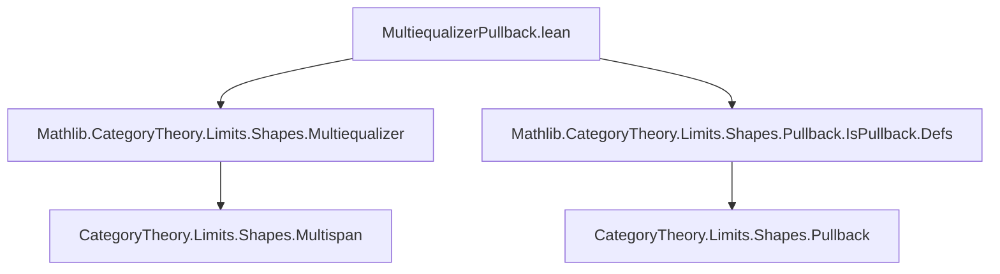
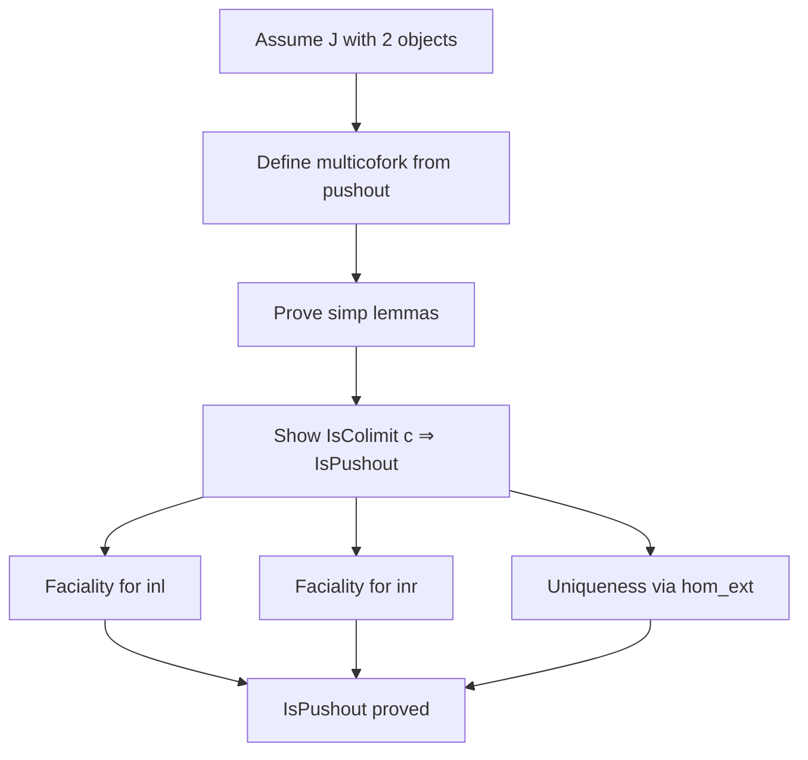

**Technical Brief: `MultiequalizerPullback.lean`**

---

### 1. **Key Definitions & Theorems**

| Name | Type / Signature | Purpose |
|------|------------------|---------|
| `multicofork` | `PushoutCocone (I.fst default) (I.snd default) → Multicofork I` | Constructs a multicofork from a pushout cocone under the assumption that the indexing multispan shape `J` has exactly two objects (`ι ≃ Fin 2`). |
| `multicofork_π_eq_inl` | `π (J.fst default) = s.inl` | Simplification lemma: the first leg of the constructed multicofork equals the left injection of the pushout. |
| `multicofork_π_eq_inr` | `π (J.snd default) = s.inr` | Simplification lemma: the second leg equals the right injection. |
| `isPushout` | `IsColimit c → IsPushout ...` | Main theorem: if a multicofork `c` is a colimit (i.e., a *multicoequalizer*), then under the 2-element indexing condition, it is also a *pushout*. |

---

### 2. **Naming Conventions**

- **Prefixes**:
  - `multicofork_`: for constructions/lemmas about multicoforks derived from pushouts.
  - `isPushout.`: namespace for auxiliary definitions/lemmas used in the proof.
- **Suffixes**:
  - `_eq_inl`, `_eq_inr`: indicate equality with canonical injections in a pushout.
- **Variables**:
  - `h`, `h'`: hypotheses encoding that `J` has exactly two objects (`Set.univ` and distinctness).
  - `s`: a pushout cocone.
  - `c`: a multicofork, assumed to be a colimit.

---

### 3. **Tactic Stack**

Frequently used tactics in this file:

| Tactic | Role |
|--------|------|
| `simp` / `simpa` | Simplification using definitional equalities and lemmas like `eqToHom_refl`, `Category.id_comp`. |
| `rw` | Rewriting using hypotheses or lemmas (e.g., `dif_pos`, `dif_neg`). |
| `dsimp` | Definitional simplification (e.g., unfolding `multicofork`, `π`). |
| `push` | Used to manipulate set membership and equality (e.g., `push _ ∈ _ at this`). |
| `tauto` | Solves propositional tautologies after set-theoretic reasoning. |
| `obtain rfl : ...` | Case analysis on equality (here, using `h` and `h'` to deduce `k` is one of two values). |
| `apply ... hom_ext` | Category-theoretic uniqueness argument for morphisms between colimits. |

---

### 4. **Proof Logic**

The proof proceeds as follows:

1. **Setup**: Assume `J` is a multispan shape with a unique object (`Unique J.L`) and two morphisms (`J.fst default`, `J.snd default`) covering all morphisms (`h`) and being distinct (`h'`). This models `J ≃ .ofLinearOrder (Fin 2)`.

2. **Construction** (`multicofork`):
   - From a pushout cocone `s`, define a multicofork over `I` by assigning:
     - `π (J.fst default) := s.inl`
     - `π (J.snd default) := s.inr`
   - Use `eqToHom` to transport along equalities deduced from `h` and `h'`.
   - Verify the cocone condition using `s.condition`.

3. **Simp lemmas** (`multicofork_π_eq_inl`, `multicofork_π_eq_inr`):
   - Direct simplifications using `dif_pos`, `dif_neg`, and identity laws.

4. **Main theorem** (`isPushout`):
   - Given `hc : IsColimit c`, construct a pushout colimit structure on `c.π (J.fst default)` and `c.π (J.snd default)`.
   - Define the mediating morphism using `hc.desc` applied to the multicofork constructed from a pushout cocone.
   - Verify the universal property:
     - **Faciality**: uses `hc.fac` for each leg.
     - **Uniqueness**: uses `Multicofork.IsColimit.hom_ext` and case analysis on `k` (via `h`), reducing to the two faciality facts.

---

### 5. **Imports**

| Import | Purpose |
|--------|---------|
| `Mathlib.CategoryTheory.Limits.Shapes.Multiequalizer` | Provides `Multicofork`, `IsColimit`, and related theory for multicoequalizers/multispan colimits. |
| `Mathlib.CategoryTheory.Limits.Shapes.Pullback.IsPullback.Defs` | Provides `PushoutCocone`, `IsPushout`, and definitions for pushouts. |

> Note: Despite the module name referencing *pullbacks*, the file actually deals with **pushouts**, as clarified in the docstring.

---

### 6. **Mermaid Diagrams**

#### **Dependency Graph (File-Level)**



#### **Conceptual Overview (Theory Flow)**

```mermaid
flowchart LR
  J[Multispan Shape J] -->|Unique J.L, h,h'|[Exactly 2 objects]
  I[Multispan Index I : J → C] -->|Multicofork c| IsColimit[IsColimit c]
  IsColimit -->|Main Thm| IsPushout[IsPushout of I.fst, I.snd]
  PushoutCocone[s : PushoutCocone] -->|multicofork h h'| Multicofork[c]
  Multicofork[c] -->|hc : IsColimit c| IsPushout
```

#### **Proof Structure (High-Level)**



---

### 7. **Summary**

This file establishes a key equivalence: in a category `C`, a *multicoequalizer* indexed by a 2-element linear order (i.e., a span with two parallel arrows) is precisely a *pushout*. The proof leverages the universal property of multicoequalizers and carefully handles indexing via set-theoretic reasoning (`h`, `h'`) to reduce to the binary case. It exemplifies how Lean’s dependent type theory enables precise categorical reasoning about limits/colimits across varying indexing shapes.
