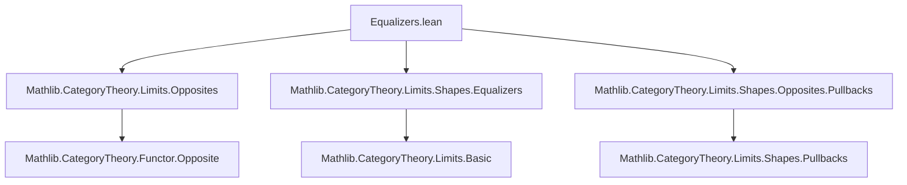
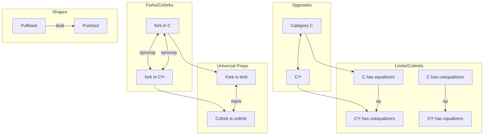

### Technical Brief: Equalizers and Coequalizers in Opposite Categories (`Equalizers.lean`)

---

#### **1. Key Definitions & Theorems**

| Name | Type / Signature | Purpose |
|------|------------------|---------|
| `hasEqualizers_opposite` | `[HasCoequalizers C] → HasEqualizers Cᵒᵖ` | Constructs equalizers in `Cᵒᵖ` from coequalizers in `C`. |
| `hasCoequalizers_opposite` | `[HasEqualizers C] → HasCoequalizers Cᵒᵖ` | Constructs coequalizers in `Cᵒᵖ` from equalizers in `C`. |
| `parallelPairOpIso` | `parallelPair f.op g.op ≅ (parallelPair f g).op ⋙ walkingParallelPairOpEquiv.functor` | Canonical isomorphism between parallel pairs in opposite category and opposite of parallel pair. |
| `opParallelPairIso` | `(parallelPair f g).op ≅ parallelPair f.op g.op ⋙ walkingParallelPairOpEquiv.inverse` | Inverse direction of above isomorphism. |
| `Cofork.unop`, `Cofork.op` | Maps between coforks in `C`/`Cᵒᵖ` and forks in `C`/`Cᵒᵖ` | Translate cofork structures across opposites. |
| `Fork.unop`, `Fork.op` | Maps between forks in `C`/`Cᵒᵖ` and coforks in `C`/`Cᵒᵖ` | Dual to above; enables duality between limits/colimits. |
| `opUnopIso`, `unopOpIso` (for `Cofork`, `Fork`) | `c.op.unop ≅ c`, `c.unop.op ≅ c` | Show that applying `op`/`unop` twice yields isomorphic (not equal) objects. |
| `isColimitEquivIsLimitOp`, `isColimitEquivIsLimitUnop` | `IsColimit c ≃ IsLimit c.op`, `IsColimit c ≃ IsLimit c.unop` | Core equivalence: a cofork is a colimit iff its opposite/unop is a limit. |
| `isLimitEquivIsColimitOp`, `isLimitEquivIsColimitUnop` | `IsLimit c ≃ IsColimit c.op`, `IsLimit c ≃ IsColimit c.unop` | Dual of above: a fork is a limit iff its opposite/unop is a colimit. |
| `ofπOpIsoOfι`, `ofπUnopIsoOfι`, `ofιOpIsoOfπ`, `ofιUnopIsoOfπ` | Canonical isos between `Cofork.ofπ` and `Fork.ofι` under `op`/`unop` | Relate universal constructions (coforks/forks) built from maps. |
| `isColimitCoforkPushoutEquivIsColimitForkOpPullback`, etc. | Equivalences between colimit of pushout cofork and limit of pullback fork (and variants) | Connects pullbacks/pushouts across opposites via universal properties. |

---

#### **2. Naming Conventions**

- **Prefixes**:
  - `op_`, `unop_`: Indicate passage to opposite category (`op`: `C → Cᵒᵖ`, `unop`: `Cᵒᵖ → C`).
  - `isColimit_`, `isLimit_`: Relate universal properties across opposites.
  - `ofπ_`, `ofι_`: From universal constructions: `π` for projection (cofork), `ι` for injection (fork).
- **Suffixes**:
  - `_Iso`: Denotes canonical isomorphisms.
  - `_equiv_`: Denotes logical equivalences (often `≃`).
  - `_op`, `_unop`: Distinguish variants for `op` vs `unop` constructions.

---

#### **3. Tactic Stack**

- **Core tactics**:
  - `simp`: Heavily used to simplify using `@[simp]` lemmas (e.g., `op_π_app_one`, `unop_ι`).
  - `cat_disch`: Category-theoretic discharge tactic (likely custom or from `Mathlib.Tactic.CategoryTheory`).
  - `rw`, `refl`, `exact`, `intro`, `cases`, `rintro`: Basic proof scripting.
  - `calc`: Used in constructing `opParallelPairIso`.
  - `equivOfSubsingletonOfSubsingleton`: For proving equivalences between propositions with at most one inhabitant.
  - `isoWhiskerLeft`, `isoWhiskerRight`, `Functor.associator`: For manipulating natural isomorphisms.

---

#### **4. Proof Logic**

- **Structure**:
  - **Step 1**: Construct isomorphisms between diagram shapes (`parallelPairOpIso`, `opParallelPairIso`) using `NatIso.ofComponents`.
  - **Step 2**: Define functors between forks/coforks via whiskering and post/pre-composition with these isomorphisms.
  - **Step 3**: Prove component-wise equalities (e.g., `op_π_app_one`) using `simp` and definitions.
  - **Step 4**: Show that constructions are inverse up to isomorphism (`opUnopIso`, `unopOpIso`) using extensionality (`Fork.ext`, `Cofork.ext`).
  - **Step 5**: Prove universal property equivalences (`isColimitEquivIsLimitOp`, etc.) using:
    - Subsingleton-ness of limit/colimit structures.
    - Isomorphism-invariance of limit/colimit (`IsLimit.equivIsoLimit`, `IsColimit.equivIsoColimit`).
    - Whiskering and post/pre-composition equivalences.
  - **Step 6**: Derive pullback-pushout dualities via composition of previous equivalences and known isos (`pullbackIsoUnopPushout`, `pushoutIsoUnopPullback`).

- **Pattern**:
  > *Induction on diagram shape → construct canonical isos → verify naturality → lift to universal properties via equivalence of subsingletons.*

---

#### **5. Imports**

| Module | Purpose |
|--------|---------|
| `Mathlib.CategoryTheory.Limits.Opposites` | General theory of opposites, `op`, `unop`, `Cᵒᵖ`. |
| `Mathlib.CategoryTheory.Limits.Shapes.Equalizers` | Definitions of equalizers, coforks, forks, and their universal properties. |
| `Mathlib.CategoryTheory.Limits.Shapes.Opposites.Pullbacks` | Pullbacks/pushouts in opposite categories and their relations. |

---

#### **8. Mermaid Diagrams**

##### **Dependency Graph (Module-Level)**



##### **Conceptual Overview (Theory Flow)**

```mermaid
graph LR
  subgraph Diagrams
    P[parallelPair f g] -->|op| P_op[(parallelPair f g).op]
    P_op -->|iso| Q[parallelPair f.op g.op]
  end

  subgraph Forks & Coforks
    F[fork in C] -->|op| CF[cofork in Cᵒᵖ]
    CF -->|unop| F
    C[cofork in C] -->|op| FC[fork in Cᵒᵖ]
    FC -->|unop| C
  end

  subgraph Universal Properties
    L[IsLimit fork] -->|equiv| C[IsColimit cofork]
    C -->|equiv| L
  end

  subgraph Pullbacks/Pushouts
    PB[Pullback f f] -->|iso| PS[Pushout f.op f.op]
    PS -->|equiv| PB
  end

  P --> F
  Q --> CF
  PB --> L
  PS --> C
```

##### **High-Level Theory Map**



--- 

This file formalizes the **duality between limits and colimits** in opposite categories, with a focus on *equalizers/coequalizers* and *pullbacks/pushouts*. It demonstrates how universal properties translate across `op`/`unop`, enabling automated duality reasoning in category theory.
