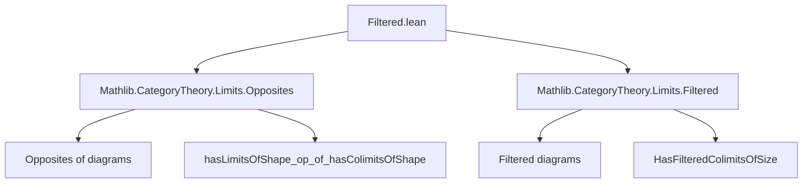

**Technical Brief: `Filtered.lean` Module**

---

### 1. **Key Definitions & Theorems**

| Name | Type / Signature | Purpose |
|------|------------------|---------|
| `has_cofiltered_limits_op_of_has_filtered_colimits` | `instance [HasFilteredColimitsOfSize.{v₂, u₂} C] : HasCofilteredLimitsOfSize.{v₂, u₂} Cᵒᵖ` | Constructs cofiltered limits in `Cᵒᵖ` from filtered colimits in `C`, using `hasLimitsOfShape_op_of_hasColimitsOfShape`. |
| `has_cofiltered_limits_of_has_filtered_colimits_op` | `theorem [HasFilteredColimitsOfSize.{v₂, u₂} Cᵒᵖ] : HasCofilteredLimitsOfSize.{v₂, u₂} C` | Recovers cofiltered limits in `C` from filtered colimits in `Cᵒᵖ`. |
| `has_filtered_colimits_op_of_has_cofiltered_limits` | `instance [HasCofilteredLimitsOfSize.{v₂, u₂} C] : HasFilteredColimitsOfSize.{v₂, u₂} Cᵒᵖ` | Constructs filtered colimits in `Cᵒᵖ` from cofiltered limits in `C`. |
| `has_filtered_colimits_of_has_cofiltered_limits_op` | `theorem [HasCofilteredLimitsOfSize.{v₂, u₂} Cᵒᵖ] : HasFilteredColimitsOfSize.{v₂, u₂} C` | Recovers filtered colimits in `C` from cofiltered limits in `Cᵒᵖ`. |

All four statements express the *duality* between filtered colimits and cofiltered limits under category opposite.

---

### 2. **Naming Conventions**

- **Prefixes**:
  - `has_…_of_has_…`: Indicates implication/transfer of existence properties across dualities.
  - `op_of_…`: Constructs structure in `Cᵒᵖ` from structure in `C`.
  - `of_has_…_op`: Recovers structure in `C` from structure in `Cᵒᵖ`.

- **Suffixes**:
  - `_OfSize`: Indicates size-dependent existence (e.g., `HasFilteredColimitsOfSize.{v₂, u₂} C` means filtered colimits of size `(v₂, u₂)` exist in `C`).

- **Core terms**:
  - `FilteredColimits`, `CofilteredLimits`, `Opposite`, `op`, `unop`.

---

### 3. **Tactic Stack**

- **`inferInstance`**: Used to synthesize instances via typeclass resolution.
- **`hasLimitsOfShape_op_of_hasColimitsOfShape`**, **`hasColimitsOfShape_of_hasLimitsOfShape_op`**: Derived lemmas (from `Limits.Opposites`) used as constructors/destructors.
- No explicit use of `aesop`, `ring`, `simp`, or `rw` in this snippet — proof automation is minimal; relies on *typeclass inference* and *definition unfolding*.

---

### 4. **Proof Logic**

- **Structure**: Purely *typeclass-based duality*.
- **Pattern**:
  1. Assume existence of filtered colimits (or cofiltered limits) in a category `C` (or `Cᵒᵖ`).
  2. Use existing lemmas from `Limits.Opposites` to lift/reverse limits/colimits across the opposite category.
  3. Construct or infer the corresponding instance/theorem via `instance` or `theorem` blocks.
- **No induction or case analysis** — all proofs are *definitionally* or *typeclass*-driven.

---

### 5. **Imports**

- `Mathlib.CategoryTheory.Limits.Opposites`: Provides lemmas like `hasLimitsOfShape_op_of_hasColimitsOfShape`.
- `Mathlib.CategoryTheory.Limits.Filtered`: Defines filtered diagrams and filtered colimits.

These imports define the *scope* of the module: it operates at the interface between *filtered/cofiltered* limits/colimits and *opposite categories*.

---

### 8. **Mermaid Diagrams**

#### **Dependency Graph (Module-Level)**



#### **Conceptual Overview (Duality Flow)**

```mermaid
graph LR
  C[Category C] -- opposite --> Cᵒᵖ[Category Cᵒᵖ]
  C -- HasFilteredColimitsOfSize -->|instance| Cᵒᵖ[HasCofilteredLimitsOfSize]
  Cᵒᵖ -- HasFilteredColimitsOfSize -->|theorem| C[HasCofilteredLimitsOfSize]
  C -- HasCofilteredLimitsOfSize -->|instance| Cᵒᵖ[HasFilteredColimitsOfSize]
  Cᵒᵖ -- HasCofilteredLimitsOfSize -->|theorem| C[HasFilteredColimitsOfSize]
```

#### **Theoretical Context**

- This module formalizes the well-known categorical principle:
  $$
  \text{Colim}_\text{filtered}^{C} \;\cong\; \text{Lim}_\text{cofiltered}^{C^\mathrm{op}}
  $$
  and vice versa.

- It is foundational for:
  - Constructing ind-objects and pro-objects.
  - Working with sheaves, spectra, or pro-categories.
  - Ensuring closure properties under duality in `CategoryTheory`.

--- 

Let me know if you'd like the corresponding `Limits.Opposites` lemmas formalized or a proof sketch for one of the theorems.
