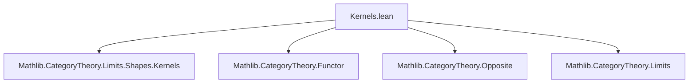
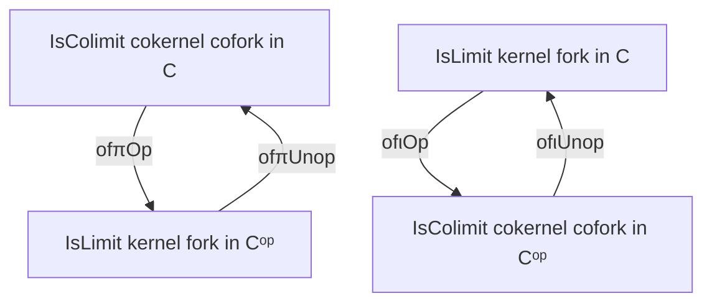

**Technical Brief: Kernels.lean (Mathlib Category Theory — Kernels and Cokernels in Opposite Categories)**

---

### 1. **Key Definitions & Theorems**

| Name | Type / Signature | Purpose |
|------|------------------|---------|
| `CokernelCofork.IsColimit.ofπOp` | `{X Y Q : C} → (p : Y ⟶ Q) → (f : X ⟶ Y) → (w : f ≫ p = 0) → IsColimit (CokernelCofork.ofπ p w) → IsLimit (KernelFork.ofι p.op …)` | Converts a *colimit cokernel cofork* in `C` into a *limit kernel fork* in `Cᵒᵖ` via opposite morphism. |
| `CokernelCofork.IsColimit.ofπUnop` | `{X Y Q : Cᵒᵖ} → (p : Y ⟶ Q) → (f : X ⟶ Y) → (w : f ≫ p = 0) → IsColimit (CokernelCofork.ofπ p w) → IsLimit (KernelFork.ofι p.unop …)` | Converts a *colimit cokernel cofork* in `Cᵒᵖ` into a *limit kernel fork* in `C`. |
| `KernelFork.IsLimit.ofιOp` | `{K X Y : C} → (i : K ⟶ X) → (f : X ⟶ Y) → (w : i ≫ f = 0) → IsLimit (KernelFork.ofι i w) → IsColimit (CokernelCofork.ofπ i.op …)` | Converts a *limit kernel fork* in `C` into a *colimit cokernel cofork* in `Cᵒᵖ`. |
| `KernelFork.IsLimit.ofιUnop` | `{K X Y : Cᵒᵖ} → (i : K ⟶ X) → (f : X ⟶ Y) → (w : i ≫ f = 0) → IsLimit (KernelFork.ofι i w) → IsColimit (CokernelCofork.ofπ i.unop …)` | Converts a *limit kernel fork* in `Cᵒᵖ` into a *colimit cokernel cofork* in `C`. |

All four theorems establish *duality* between kernels and cokernels across the opposite category construction.

---

### 2. **Naming Conventions**

- **Prefixes**:
  - `ofπ`: Indicates construction from a *cokernel cofork* (via the universal morphism `π`).
  - `ofι`: Indicates construction from a *kernel fork* (via the universal morphism `ι`).
- **Suffixes**:
  - `Op`: Applies to morphisms in `C` → moves to `Cᵒᵖ` via `op`.
  - `Unop`: Applies to morphisms in `Cᵒᵖ` → moves to `C` via `unop`.
- **Structure**:
  - `X.Y.ofZ` pattern: `X` is the source structure (e.g., `CokernelCofork.IsColimit`), `Y` is the target structure (`IsLimit`/`IsColimit`), `Z` is the direction (`Op`/`Unop`).

---

### 3. **Tactic Stack**

Frequent tactics used in proofs:

| Tactic | Role |
|--------|------|
| `rw` | Rewriting composition/zero axioms (`op_comp`, `unop_comp`, `op_zero`, `unop_zero`) |
| `simp_rw` | Simplifying with rewrite rules (e.g., `Quiver.Hom.unop_op`, `Cofork.IsColimit.π_desc`) |
| `simpa` | Simplifying goals using assumptions and rewrite rules |
| `Quiver.Hom.op_inj`, `Quiver.Hom.unop_inj` | Injectivity of `op`/`unop` on homs (used to lift equality) |
| `Fork.IsLimit.lift_ι`, `Cofork.IsColimit.π_desc`, `Fork.IsLimit.hom_ext`, `Cofork.IsColimit.hom_ext` | Universal properties of limits/colimits |
| `fun x hx => …` | Lambda abstraction for universal property constructions |

---

### 4. **Proof Logic**

- **General Strategy**:
  1. **Construct candidate fork/cofork** in the opposite category using `ofι`/`ofπ`.
  2. **Verify commutativity** using `rw [← op_comp, w, op_zero]` or `unop` variants.
  3. **Define mediating morphism** using the universal property (`h.desc`, `h.lift`) and `op`/`unop`.
  4. **Prove uniqueness and commutativity** of mediating morphism using:
     - Injectivity of `op`/`unop` (`op_inj`, `unop_inj`)
     - Universal properties (`hom_ext`, `π_desc`, `lift_ι`)
     - Simplification (`simpa`, `simp_rw`)

- **Pattern**:
  > *Given a universal property in one category, transport it to the opposite category via `op`/`unop`, using the fact that `op` is a contravariant equivalence.*

---

### 5. **Imports**

- `Mathlib.CategoryTheory.Limits.Shapes.Kernels`: Core definitions of kernels, cokernels, forks, coforks, and their universal properties.
- `CategoryTheory.Functor`, `Opposite`: For categorical duality and opposite category machinery.
- `CategoryTheory.Limits`: General limits/colimits infrastructure.

---

### 8. **Mermaid Diagrams**

#### **Dependency Graph (Module-Level)**



#### **Conceptual Flow (Duality between Kernels and Cokernels)**

```mermaid
graph LR
  subgraph C
    K[C] -->|kernel i| X
    X -->|f| Y
  end

  subgraph Cᵒᵖ
    Kᵒᵖ[Cᵒᵖ] <--|iᵒᵖ| Xᵒᵖ
    Xᵒᵖ <--|fᵒᵖ| Yᵒᵖ
  end

  Kᵒᵖ -- colimit cokernel cofork in Cᵒᵖ --> Xᵒᵖ
  X -- cokernel p --> Q
  Q -- kernel fork in Cᵒᵖ --> Kᵒᵖ

  style C fill:#f9f,stroke:#333
  style Cᵒᵖ fill:#9ff,stroke:#333
```

#### **Overview of Theorem Interplay**



---

**Summary**: This module formalizes the categorical duality between kernels and cokernels via opposite categories. It provides explicit constructions showing how universal properties of kernels in one category correspond to universal properties of cokernels in its opposite, and vice versa. The proofs rely heavily on the contravariant equivalence `op : C ↝ Cᵒᵖ`, and use standard tactics for manipulating homs and universal properties.
