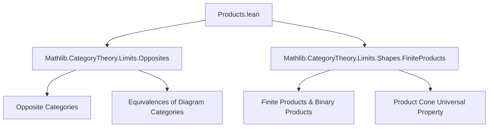

Here is the structured technical brief for `Products.lean`:

---

### **1. Key Definitions & Theorems**

| Name | Type / Signature | Purpose |
|------|------------------|---------|
| `hasCoproductsOfShape_opposite` | `[HasProductsOfShape X C] → HasCoproductsOfShape X Cᵒᵖ` | Constructs coproducts in `Cᵒᵖ` from products in `C`. |
| `hasCoproductsOfShape_of_opposite` | `[HasProductsOfShape X Cᵒᵖ] → HasCoproductsOfShape X C` | Reverse direction: products in `Cᵒᵖ` ⇒ coproducts in `C`. |
| `hasProductsOfShape_opposite` | `[HasCoproductsOfShape X C] → HasProductsOfShape X Cᵒᵖ` | Products in `Cᵒᵖ` from coproducts in `C`. |
| `hasProductsOfShape_of_opposite` | `[HasCoproductsOfShape X Cᵒᵖ] → HasProductsOfShape X C` | Reverse direction: coproducts in `Cᵒᵖ` ⇒ products in `C`. |
| `hasProducts_opposite` | `[HasCoproducts.{v₂} C] → HasProducts.{v₂} Cᵒᵖ` | Global version for all products. |
| `hasProducts_of_opposite` | `[HasCoproducts.{v₂} Cᵒᵖ] → HasProducts.{v₂} C` | Reverse global version. |
| `hasCoproducts_opposite` | `[HasProducts.{v₂} C] → HasCoproducts.{v₂} Cᵒᵖ` | Global version for all coproducts. |
| `hasCoproducts_of_opposite` | `[HasProducts.{v₂} Cᵒᵖ] → HasCoproducts.{v₂} C` | Reverse global version. |
| `hasFiniteCoproducts_opposite` | `[HasFiniteProducts C] → HasFiniteCoproducts Cᵒᵖ` | Finite products in `C` ⇒ finite coproducts in `Cᵒᵖ`. |
| `hasFiniteCoproducts_of_opposite` | `[HasFiniteProducts Cᵒᵖ] → HasFiniteCoproducts C` | Reverse finite case. |
| `hasFiniteProducts_opposite` | `[HasFiniteCoproducts C] → HasFiniteProducts Cᵒᵖ` | Finite coproducts in `C` ⇒ finite products in `Cᵒᵖ`. |
| `hasFiniteProducts_of_opposite` | `[HasFiniteCoproducts Cᵒᵖ] → HasFiniteProducts C` | Reverse finite case. |
| `Cofan.op` | `Cofan Z → Fan (op ∘ Z)` | Opposite of a coproduct cocone is a product cone in `Cᵒᵖ`. |
| `Cofan.IsColimit.op` | `IsColimit c → IsLimit c.op` | Colimit cocone ⇒ limit cone in opposite category. |
| `opCoproductIsoProduct'` | `IsColimit c → IsLimit f → op c.pt ≅ f.pt` | Canonical iso between opposite of abstract coproduct and product in `Cᵒᵖ`. |
| `opCoproductIsoProduct` | `op (∐ Z) ≅ ∏ᶜ (op ∘ Z)` | Canonical iso between opposite of global coproduct and product in `Cᵒᵖ`. |
| `Fan.op` | `Fan Z → Cofan (op ∘ Z)` | Opposite of a product cone is a coproduct cocone in `Cᵒᵖ`. |
| `Fan.IsLimit.op` | `IsLimit f → IsColimit f.op` | Limit cone ⇒ colimit cocone in opposite category. |
| `opProductIsoCoproduct'` | `IsLimit f → IsColimit c → op f.pt ≅ c.pt` | Canonical iso between opposite of abstract product and coproduct in `Cᵒᵖ`. |
| `opProductIsoCoproduct` | `op (∏ᶜ Z) ≅ ∐ (op ∘ Z)` | Canonical iso between opposite of global product and coproduct in `Cᵒᵖ`. |
| `opProdIsoCoprod` | `op (A ⨯ B) ≅ op A ⨿ op B` | Binary case: opposite of binary product ≅ binary coproduct in `Cᵒᵖ`. |

---

### **2. Naming Conventions**

- **Prefixes**:
  - `has*OfShape_opposite`: constructions from `C` to `Cᵒᵖ`.
  - `has*OfShape_of_opposite`: reverse direction (`Cᵒᵖ` → `C`).
  - `op*Iso*`: canonical isomorphisms between constructions in `C` and `Cᵒᵖ`.
  - `op`: unary operation on morphisms/cones (e.g., `op c`, `op f`, `op A`).
- **Suffixes**:
  - `'` (prime): abstract version (for arbitrary limiting/colimiting cones).
  - No prime: global version (using chosen limits/colimits).
- **Cone/Cocone naming**:
  - `Fan` = product cone, `Cofan` = coproduct cocone.
  - `Fan.op`, `Cofan.op`: opposite construction.
- **Morphism notation**:
  - `proj`, `inj`, `ι`, `π`: standard cone/cocone legs.
  - `lift`, `desc`: universal morphisms from limit/colimit.

---

### **3. Tactic Stack**

- **Core tactics**:
  - `infer_instance`, `refine`, `apply`, `rw`, `simp`, `erw`
- **Category-theoretic automation**:
  - `congr'`, `ext`, `funext`, `cases x <;> ...`
  - `apply Quiver.Hom.op_inj`, `apply Quiver.Hom.unop_inj` (for extensionality in `Cᵒᵖ`)
- **Simplification & reassoc**:
  - `@[reassoc (attr := simp)]` annotations for `simp`-friendly rewrites.
  - `simp only [...]` with explicit lemmas to avoid over-simplification.
- **Equivalence/iso reasoning**:
  - `hasLimit_equivalence_comp`, `hasColimit_equivalence_comp`, `postcomposeInvEquiv`, `precomposeHomEquiv`, `whiskerEquivalence`
- **Unop/Op simplifications**:
  - `unop_op`, `op_unop`, `op_comp`, `unop_comp`, `op_inj`, `unop_inj`

---

### **4. Proof Logic**

- **High-level strategy**:
  1. Use equivalences between diagram categories:  
     $$(\mathrm{Discrete}\ X)^\mathrm{op} \simeq \mathrm{Discrete}\ X$$  
     to transfer (co)limits across opposites.
  2. Construct opposite cones (`Fan.op`, `Cofan.op`) and show they preserve limiting/colimiting property via `IsLimit.op`, `IsColimit.op`.
  3. Use uniqueness of (co)limiting cones to build canonical isomorphisms (`opCoproductIsoProduct'`, etc.).
  4. Prove naturality/simp lemmas by unfolding definitions and applying `simp` + `Category.assoc`.
- **Typical proof pattern**:
  - For isomorphisms:  
    `IsLimit.conePointUniqueUpToIso` / `IsColimit.coconePointUniqueUpToIso`
  - For morphism equations:  
    Use `hom_ext` / `funext` + `simp` on cone legs (`proj`, `inj`).
  - For inverses:  
    Reduce to `hom_inv_id` / `inv_hom_id` using `op_inj`/`unop_inj`.

---

### **5. Imports**

- `Mathlib.CategoryTheory.Limits.Opposites`: foundational facts about opposite categories and (co)limits.
- `Mathlib.CategoryTheory.Limits.Shapes.FiniteProducts`: binary products, finite products, and their universal properties.

---

### **6. Mermaid Diagrams**

#### **Dependency Graph (Module-Level)**



#### **Conceptual Overview (Theory Flow)**

```mermaid
graph LR
  C[Category C] -->|op| C_op[Cᵒᵖ]
  C -- HasProductsOfShape X -->|→| C_op -- HasCoproductsOfShape X -->
  C_op -- HasProductsOfShape X -->|←| C -- HasCoproductsOfShape X -->
  C -- HasFiniteProducts -->|→| C_op -- HasFiniteCoproducts -->
  C_op -- HasFiniteProducts -->|←| C -- HasFiniteCoproducts -->

  subgraph Constructions
    P[Product ∏ᶜ Z] -->|op| CP[Coproduct ∐ (op ∘ Z)]
    CP -->|op| P
    CoP[Coproduct ∐ Z] -->|op| Pr[Coproduct ∐ (op ∘ Z)? No—Product in Cᵒᵖ]
    Pr[Product in Cᵒᵖ] -->|op| CoP
  end

  subgraph Isomorphisms
    P -- opCoproductIsoProduct --> CP
    CP -- opProductIsoCoproduct --> P
    AxB -- opProdIsoCoprod --> opA ⨿ opB
  end
```

> **Note**: The diagram emphasizes *duality*: products ↔ coproducts under `(-)ᵒᵖ`, with canonical isomorphisms mediating the translation.

--- 

Let me know if you'd like a formalized dependency graph (e.g., for `leanproject`), or a summary of how this file fits into the broader `Mathlib` limits hierarchy.
