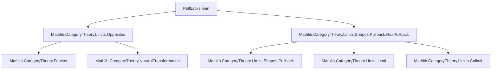

### Technical Brief: Pullbacks and Pushouts in Opposite Categories

---

#### **1. Key Definitions & Theorems**

| Name | Type / Signature | Purpose |
|------|------------------|---------|
| `hasPullbacks_opposite` | `[HasPushouts C] → HasPullbacks Cᵒᵖ` | Constructs pullbacks in $C^\mathrm{op}$ from pushouts in $C$. |
| `hasPushouts_opposite` | `[HasPullbacks C] → HasPushouts Cᵒᵖ` | Constructs pushouts in $C^\mathrm{op}$ from pullbacks in $C$. |
| `spanOp` | `span f.op g.op ≅ walkingCospanOpEquiv.inverse ⋙ (cospan f g).op` | Canonical iso between span in $C^\mathrm{op}$ and cospan in $C$ (op). |
| `opCospan` | `(cospan f g).op ≅ walkingCospanOpEquiv.functor ⋙ span f.op g.op` | Inverse iso of `spanOp`. |
| `cospanOp` | `cospan f.op g.op ≅ walkingSpanOpEquiv.inverse ⋙ (span f g).op` | Canonical iso between cospan in $C^\mathrm{op}$ and span in $C$ (op). |
| `opSpan` | `(span f g).op ≅ walkingSpanOpEquiv.functor ⋙ cospan f.op g.op` | Inverse iso of `cospanOp`. |
| `PushoutCocone.unop` | `PushoutCocone f g → PullbackCone f.unop g.unop` | Maps pushout cocones in $C^\mathrm{op}$ to pullback cones in $C$. |
| `PushoutCocone.op` | `PushoutCocone f g → PullbackCone f.op g.op` | Maps pushout cocones in $C$ to pullback cones in $C^\mathrm{op}$. |
| `PullbackCone.unop` | `PullbackCone f g → PushoutCocone f.unop g.unop` | Maps pullback cones in $C^\mathrm{op}$ to pushout cocones in $C$. |
| `PullbackCone.op` | `PullbackCone f g → PushoutCocone f.op g.op` | Maps pullback cones in $C$ to pushout cocones in $C^\mathrm{op}$. |
| `isColimitEquivIsLimitOp` | `IsColimit c ≃ IsLimit c.op` | Equivalence: pushout cocone is colimit iff its opposite is limit. |
| `isColimitEquivIsLimitUnop` | `IsColimit c ≃ IsLimit c.unop` | Equivalence: pushout cocone in $C^\mathrm{op}$ is colimit iff its unop is limit. |
| `isLimitEquivIsColimitOp` | `IsLimit c ≃ IsColimit c.op` | Equivalence: pullback cone is limit iff its opposite is colimit. |
| `isLimitEquivIsColimitUnop` | `IsLimit c ≃ IsColimit c.unop` | Equivalence: pullback cone in $C^\mathrm{op}$ is limit iff its unop is colimit. |
| `pullbackIsoUnopPushout` | `pullback f g ≅ unop (pushout f.op g.op)` | Pullback in $C$ ≅ unop of pushout in $C^\mathrm{op}$. |
| `pullbackIsoOpPushout` | `pullback f g ≅ op (pushout f.unop g.unop)` | Pullback in $C^\mathrm{op}$ ≅ op of pushout in $C$. |
| `pushoutIsoUnopPullback` | `pushout f g ≅ unop (pullback f.op g.op)` | Pushout in $C$ ≅ unop of pullback in $C^\mathrm{op}$. |
| `pushoutIsoOpPullback` | `pushout f g ≅ op (pullback f.unop g.unop)` | Pushout in $C^\mathrm{op}$ ≅ op of pullback in $C$. |
| `coneOp`, `coconeOp`, `coneUnop`, `coconeUnop` | `CommSq → ... ≅ ...` | Relate cones/cocones of a commutative square and its flip under op/unop. |

---

#### **2. Naming Conventions**

- **Prefixes**:
  - `op`: Opposite construction (e.g., `op`, `op_fst`, `op_inl`).
  - `unop`: Opposite-unop (i.e., lifting from $C^\mathrm{op}$ to $C$).
  - `isLimit`, `isColimit`: Properties of cones/cocones.
  - `Iso`: Isomorphism-related definitions (`opUnopIso`, `unopOpIso`).
- **Suffixes**:
  - `Op`: Construction in $C^\mathrm{op}$ (e.g., `spanOp`, `cospanOp`).
  - `Unop`: Construction from $C^\mathrm{op}$ to $C$ (e.g., `pullbackIsoUnopPushout`).
  - `Iso`: Isomorphism between constructions (e.g., `pullbackIsoUnopPushout`).
- **Pattern**: `Xop` ↔ `X` in $C^\mathrm{op}$; `Xunop` ↔ `X` in $C$.

---

#### **3. Tactic Stack**

- **Core tactics**:
  - `intro`, `cases`, `rintro`, `exact`, `refine`, `apply`, `convert`
  - `simp`, `simp_rw`, `rw`, `assumption`
  - `cat_disch`, `cat_tac` (custom category theory tactics)
  - `isoWhiskerLeft`, `isoWhiskerRight`, `Functor.associator`
  - `NatIso.ofComponents`, `PullbackCone.ext`, `PushoutCocone.ext`
  - `equivOfSubsingletonOfSubsingleton` (for equivalence proofs)
  - `limit.isLimit`, `colimit.isColimit`, `IsLimit.postcomposeHomEquiv`, etc.

- **Pattern**: Most proofs use `simp` + structural induction on diagram shapes (`none`, `left`, `right`) + `cat_disch`.

---

#### **4. Proof Logic**

- **Structure**:
  1. **Construct canonical isomorphisms** between diagram shapes in $C$ and $C^\mathrm{op}$ (`spanOp`, `cospanOp`, etc.).
  2. **Define functors** between cones/cocones using whiskering and pre/post-composition with these isomorphisms.
  3. **Prove component equalities** (e.g., `unop_fst`, `op_snd`) via `simp` and `cases`.
  4. **Show isomorphism properties** (`opUnopIso`, `unopOpIso`) using extensionality lemmas (`PullbackCone.ext`, `PushoutCocone.ext`).
  5. **Relate limit/colimit properties** via equivalences (`isColimitEquivIsLimitOp`, etc.), using:
     - `equivOfSubsingletonOfSubsingleton` (since `IsLimit`/`IsColimit` are subsingletons).
     - Whiskering, post/pre-composition, and iso transport.
  6. **Relate universal objects** (pullback/pushout objects) via `conePointUniqueUpToIso`.

- **Induction pattern**: Rarely induction on natural numbers; mostly structural reasoning on diagram shapes (e.g., `walkingSpan`, `walkingCospan`).

---

#### **5. Imports**

- `Mathlib.CategoryTheory.Limits.Opposites`: Opposite categories, `op`, `unop`, `op_id`, etc.
- `Mathlib.CategoryTheory.Limits.Shapes.Pullback.HasPullback`: Pullbacks and their universal property.

---

#### **6. Mermaid Diagrams**

##### **Dependency Graph (Module Level)**



##### **Conceptual Overview (Theory Flow)**

```mermaid
graph LR
  C[Category C] -->|op| C_op[Cᵒᵖ]
  C -->|hasPushouts| C_op[HasPullbacks Cᵒᵖ]
  C_op -->|hasPullbacks| C[HasPushouts C]

  subgraph Cones
    P[PullbackCone f g] -->|op| P_op[PullbackCone f.op g.op]
    P -->|unop| P_unop[PullbackCone f.unop g.unop]
    Q[PushoutCocone f g] -->|op| Q_op[PushoutCocone f.op g.op]
    Q -->|unop| Q_unop[PushoutCocone f.unop g.unop]
  end

  subgraph Equivalences
    P <-->|isLimit ↔| Q_op
    P_unop <-->|isLimit ↔| Q
    Q <-->|isColimit ↔| P_op
    Q_unop <-->|isColimit ↔| P
  end

  subgraph Objects
    pullback f g <-->|iso| unop (pushout f.op g.op)
    pushout f g <-->|iso| unop (pullback f.op g.op)
  end
```

##### **Diagram Shape Isomorphisms**

```mermaid
graph LR
  span f.op g.op <-->|spanOp| (cospan f g).op
  (cospan f g).op <-->|opCospan| span f.op g.op

  cospan f.op g.op <-->|cospanOp| (span f g).op
  (span f g).op <-->|opSpan| cospan f.op g.op
```

---

#### **7. Summary**

This file formalizes the **duality between pullbacks and pushouts** via the opposite category. It constructs explicit isomorphisms between:
- Diagram shapes (`span` ↔ `cospan.op`, etc.),
- Cones/cocones (`PullbackCone` ↔ `PushoutCocone.op/unop`),
- Universal objects (`pullback` ↔ `unop(pushout.op)`).

It also proves that **limit/colimit properties are preserved under op/unop**, enabling transfer of properties like existence, uniqueness, and universal morphisms across $C$ and $C^\mathrm{op}$. The proofs rely heavily on categorical machinery: whiskering, natural isomorphisms, and cone/unop/universal property lemmas.

This is foundational for developing *duality principles* in category theory, especially in contexts like abelian categories, where pullbacks and pushouts are dual.
