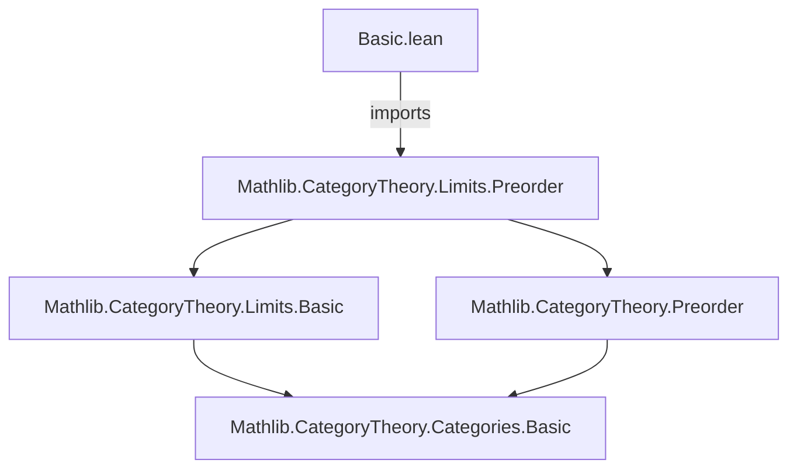
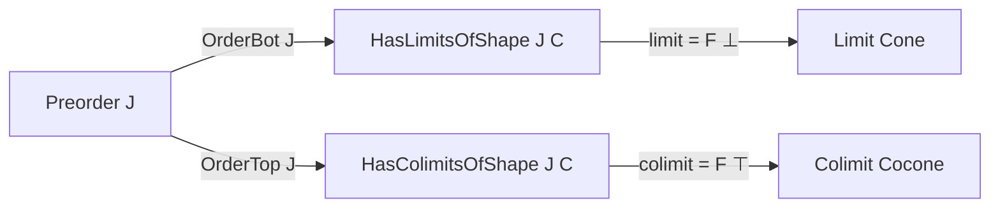
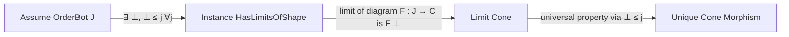

**Technical Brief: Basic.lean — Limits and Colimits over Preorders**

---

### 1. **Key Definitions & Theorems**

| Name | Type | Purpose |
|------|------|---------|
| `HasLimitsOfShape J C` | `Class` (from `Mathlib.CategoryTheory.Limits.Preorder`) | States that all diagrams indexed by the shape `J` have limits in `C`. |
| `HasColimitsOfShape J C` | `Class` (from `Mathlib.CategoryTheory.Limits.Preorder`) | States that all diagrams indexed by the shape `J` have colimits in `C`. |
| `OrderBot J` | `Class` (`J` has a least element `⊥`) | Hypothesis used to construct all `J`-indexed limits. |
| `OrderTop J` | `Class` (`J` has a greatest element `⊤`) | Hypothesis used to construct all `J`-indexed colimits. |
| `instance : HasLimitsOfShape J C` | `infer_instance` proof under `OrderBot J` | Shows that if `J` has a bottom element, then all `J`-shaped limits exist in any category `C`. |
| `instance : HasColimitsOfShape J C` | `infer_instance` proof under `OrderTop J` | Shows that if `J` has a top element, then all `J`-shaped colimits exist in any category `C`. |

> **Note**: The actual construction of the limit/colimit is delegated to `infer_instance`, implying that `HasLimitsOfShape`/`HasColimitsOfShape` are defined in terms of `OrderBot`/`OrderTop` via existing infrastructure (e.g., via `LimitPreservesFunctors` or `ColimitPreservesFunctors` in `Preorder`-indexed cases).

---

### 2. **Naming Conventions**

- **Prefixes**:
  - `is_` — *not used here*, but common elsewhere in Mathlib for properties (e.g., `is_limit`, `is_colimit`).
  - `Has_` — used for existence classes (`HasLimitsOfShape`, `HasColimitsOfShape`).
- **Suffixes**:
  - `OfShape` — indicates indexing by a specific shape (`J`).
- **Module/namespace**:
  - `Preorder` — namespace grouping results specific to preorder-indexed limits/colimits.

---

### 3. **Tactic Stack**

- `infer_instance` — primary tactic used to discharge existence instances.
- `by` — minimal tactic block (used to defer proof to typeclass resolution).
- No explicit use of `simp`, `ring`, `aesop`, or induction tactics — the proofs are purely typeclass-based.

---

### 4. **Proof Logic**

- **Logical flow**:
  1. Assume `J` is a preordered type.
  2. Add assumption `OrderBot J` (i.e., ∃ `⊥ : J`, `∀ j, ⊥ ≤ j`).
  3. Use typeclass inference to construct `HasLimitsOfShape J C`.
  4. Dually, assume `OrderTop J` (i.e., ∃ `⊤ : J`, `∀ j, j ≤ ⊤`) to get `HasColimitsOfShape J C`.

- **Underlying principle**:
  - A diagram indexed by a preorder with a least element is “constant up to unique cone morphism”, so the limit is just the value at the bottom.
  - Dually, colimits over a preorder with a top element are given by the value at the top.
  - The Lean implementation leverages existing infrastructure in `Mathlib.CategoryTheory.Limits.Preorder` to encode this.

---

### 5. **Imports**

- `Mathlib.CategoryTheory.Limits.Preorder` — main dependency; provides:
  - Definitions of `HasLimitsOfShape`, `HasColimitsOfShape` for preorder shapes.
  - Instances linking `OrderBot`/`OrderTop` to existence of limits/colimits.

> No other imports are used in this file.

---

### 6. **Mermaid Diagrams**

#### Dependency Graph (File-level)

#### Overview of Theoretical Flow

#### Conceptual Proof Sketch

---

### 7. **Summary**

This file formalizes a foundational observation: *preorders with a least (resp. greatest) element are “contractible” enough that all diagrams indexed by them admit limits (resp. colimits), regardless of the target category*. The Lean formalization is minimal and elegant, relying entirely on typeclass inference and existing infrastructure in `Mathlib.CategoryTheory.Limits.Preorder`.
