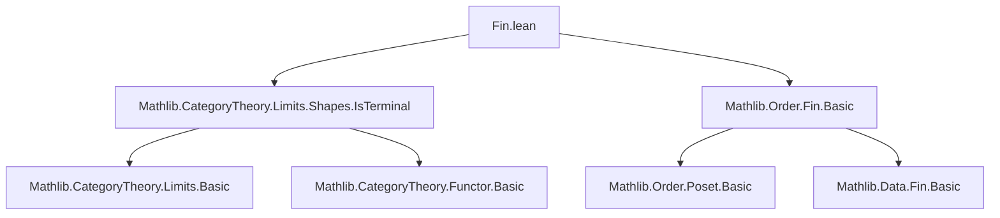

**Technical Brief: `Fin.lean` — Limits and Colimits over Finite Index Categories**

---

### 1. KEY DEFINITIONS & THEOREMS

| Name | Type | Purpose |
|------|------|---------|
| `isInitialZero` | `[NeZero n] → IsInitial (0 : Fin n)` | Shows that `0 : Fin n` is initial when `n ≠ 0`, via `isInitialBot` (since `Fin n` is a proset with bottom element `0`). |
| `isTerminalLast` | `IsTerminal (Fin.last n : Fin (n + 1))` | Shows that `Fin.last n` (i.e., `n : Fin (n + 1)`) is terminal, via `isTerminalTop` (since `Fin (n + 1)` is a proset with top element `n`). |

> **Note**: These rely on the fact that `Fin n` (as a category, via `Order.Fin.Basic`) is a *thin* category (a poset), where `0` is the least element (`⊥`) and `Fin.last n` is the greatest element (`⊤`).

---

### 2. NAMING CONVENTIONS

- **Prefixes**:
  - `isInitial_`, `isTerminal_`: Standard Lean/Category Theory convention for properties of objects.
- **Suffixes**:
  - `Zero`, `Last`: Reflects the specific elements (`0` and `Fin.last n`) being characterized.
- **No custom prefixes/suffixes beyond standard library norms**.

---

### 3. TACTIC STACK

- **No explicit tactics** appear in definitions or proofs (they are *def*-based, using `:=` with existing lemmas).
- **Implicit tactic usage** in underlying lemmas:
  - `isInitialBot`, `isTerminalTop` (from `Limits.Shapes.IsTerminal`) — likely proven using `intro`, `ext`, `apply`, `simp`, `decide` (for `Fin` order reasoning).
- **No `aesop`, `ring`, `simp_rw`, `induction`, etc.** used directly in this file.

---

### 4. PROOF LOGIC

- **Logical flow**: *Reduction to known structure*.
  - `isInitialZero`: Uses `[NeZero n]` to ensure `Fin n` is nonempty and `0` is the unique minimal element; then applies `isInitialBot` (a general lemma for posets with bottom).
  - `isTerminalLast`: Uses `Fin.last n = n` (as a `Fin (n + 1)`), observes it is the top element in the poset `Fin (n + 1)`, and applies `isTerminalTop`.
- **No induction or case analysis** in this file — relies entirely on pre-established order-theoretic facts about `Fin`.

---

### 5. IMPORTS

| Module | Role |
|--------|------|
| `Mathlib.CategoryTheory.Limits.Shapes.IsTerminal` | Provides `IsInitial`, `IsTerminal`, and key lemmas `isInitialBot`, `isTerminalTop`, `limitOfDiagramInitial`, `colimitOfDiagramTerminal`. |
| `Mathlib.Order.Fin.Basic` | Defines `Fin n` as a finite poset (hence thin category), including `0 : Fin n`, `Fin.last n`, and facts like `isBot_zero`, `isTop_last`. |

> **Scope**: This module bridges *order theory* (finite posets) and *category theory* (limits/colimits over small categories), specifically for indexing diagrams by `Fin n`.

---

### 6. DEPENDENCY & THEORY OVERVIEW

#### Mermaid Diagram: Module Dependencies



#### Mermaid Diagram: Conceptual Flow

```mermaid
graph LR
  subgraph Order
    C1[Fin n as poset] -->|0 = ⊥| C2[isBot_zero]
    C1 -->|Fin.last n = ⊤| C3[isTop_last]
  end

  subgraph Category Theory
    C2 --> D1[IsInitial 0]
    C3 --> D2[IsTerminal (Fin.last n)]
  end

  subgraph Limits
    D1 --> E1[limitOfDiagramInitial]
    D2 --> E2[colimitOfDiagramTerminal]
  end

  C1 -.->|thin category| D1 & D2
```

---

### 7. THEORETICAL SIGNIFICANCE

- Enables **explicit computation** of limits/colimits over diagrams indexed by `Fin (n + 1)`:
  - If a diagram `D : Fin (n + 1) ⥤ C` has a terminal object in its index category, then `colim D ≅ D (Fin.last n)`.
  - Dually, if `n ≠ 0`, `lim D ≅ D 0`.
- This is foundational for:
  - Finite diagrams in abelian categories (e.g., finite products/coproducts).
  - Homological algebra (e.g., truncations, finite limits).
  - Formalizing combinatorial constructions where indexing by finite ordinals is natural.

---

### 8. OPEN QUESTIONS / EXTENSIONS

- The file does **not** yet include:
  - Explicit examples of `limitOfDiagramInitial` / `colimitOfDiagramTerminal`.
  - Lemmas about morphisms between `Fin`-indexed diagrams (e.g., `Hom.ext` for such diagrams).
  - Interaction with `Additive`/`Abelian` structure (e.g., finite biproducts via `Fin 2`).

> **Suggested next steps**: Import and prove `colimitOfDiagramTerminal (const _ X) ≅ X` or `limitOfDiagramInitial (const _ X) ≅ X` for constant diagrams.

--- 

*End of technical brief.*
