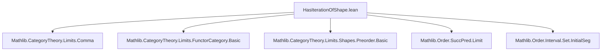
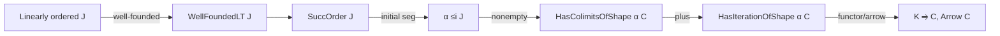

Here is the structured technical brief extracted from `HasIterationOfShape.lean`:

---

### **1. Key Definitions & Theorems**

| Name | Type / Signature | Purpose |
|------|------------------|---------|
| `HasIterationOfShape` | `class (J : Type w) [LinearOrder J] (C : Type u) [Category C] → Prop` | A typeclass asserting existence of colimits of shape `J` and of all initial segments `Set.Iio j` for `j : J`. Enables transfinite induction constructions in `C` indexed by `J`. |
| `hasColimitsOfShape_of_isSuccLimit` | `lemma` | Given `j : J` a *successor limit* (i.e., limit ordinal), provides colimits of shape `Set.Iio j`. |
| `hasColimitsOfShape_of_isSuccLimit'` | `lemma` | Extends colimit existence to any `α ≤i J` (initial segment) when `α` is order-isomorphic to some `Set.Iio j`. |
| `hasColimitsOfShape_of_initialSeg` | `lemma` | Proves colimit existence for any nonempty initial segment `α ≤i J`, assuming `J` is well-founded and has successor structure. |
| `hasIterationOfShape_of_initialSeg` | `lemma` | Lifts `HasIterationOfShape` from `J` to any initial segment `α ≤i J`. |
| `instance : HasIterationOfShape J (Arrow C)` | `instance` | Shows arrow category inherits iteration structure from `C`. |
| `instance : HasIterationOfShape J (K ⥤ C)` | `instance` | Functor category inherits iteration structure. |
| `instance (j : J) : HasIterationOfShape (Set.Iic j) C` | `instance` | Upper-closed intervals `Set.Iic j` inherit iteration structure via initial segment embedding. |

---

### **2. Naming Conventions**

- **Prefixes**:
  - `hasColimitsOfShape_`: asserts existence of colimits of a given shape.
  - `hasIterationOfShape_`: constructs or lifts the `HasIterationOfShape` typeclass.
- **Suffixes**:
  - `_of_isSuccLimit`: applies when the index is a *successor limit* (i.e., a limit ordinal that is not a successor).
  - `_of_initialSeg`: applies when the index is an initial segment of `J`.
  - `_of_equivalence`: uses an equivalence of indexing categories to transport colimit existence.
- **Variables**:
  - `J`: linearly ordered indexing type (typically a well-ordered ordinal-like type).
  - `C`, `K`: categories where colimits are taken.
  - `α`: auxiliary indexing type, often an initial segment or preorder.

---

### **3. Tactic Stack**

Frequently used tactics in proofs:
- `by infer_instance`: to discharge typeclass goals automatically.
- `induction ... using SuccOrder.limitRecOn`: transfinite induction over well-founded `J`.
- `rw`, `simpa`, `subst`: for rewriting and simplifying equalities involving order embeddings and segments.
- `exact`, `intro`, `cases`: basic proof structure.
- `have := ...; exact ...`: modular proof assembly.
- `by_cases hf : Function.Surjective f`: case analysis on surjectivity of an embedding.

---

### **4. Proof Logic**

The proofs follow a **transfinite induction schema** adapted to well-founded linear orders:

1. **Base case (`isMin`)**: Handles minimal elements; often leads to contradiction if nonempty.
2. **Successor step (`succ`)**: Uses properties of successor ordinals and principal segments to reduce to finite or simpler cases.
3. **Limit step (`isSuccLimit`)**: Uses the `hasColimitsOfShape_of_isSuccLimit` assumption to construct colimits over `Set.Iio j`.

Key logical flow:
- Use `SuccOrder.limitRecOn` to induct on elements of `J`.
- For non-surjective embeddings `f : α ≤i J`, construct a *principal segment* `s` and analyze its top element via induction.
- For surjective embeddings, use order isomorphism to transfer colimit existence.
- For functor/arrow categories, lift colimits pointwise.

---

### **5. Imports**

| Module | Purpose |
|--------|---------|
| `Mathlib.CategoryTheory.Limits.Comma` | Comma categories, used implicitly in arrow category constructions. |
| `Mathlib.CategoryTheory.Limits.FunctorCategory.Basic` | Basic theory of functor categories `K ⥤ C`. |
| `Mathlib.CategoryTheory.Limits.Shapes.Preorder.Basic` | Colimits over preorders, used for `Set.Iio j`, `Set.Iic j`. |
| `Mathlib.Order.SuccPred.Limit` | Theory of successor/limit ordinals and `SuccOrder`, `Limit` classes. |
| `Mathlib.Order.Interval.Set.InitialSeg` | Initial segments, principal segments, and their order-theoretic properties. |

---

### **6. Mermaid Diagrams**

#### **Dependency Graph (Module-Level)**



#### **Conceptual Overview of `HasIterationOfShape`**



#### **Inductive Construction of Colimits over Initial Segments**

```mermaid
flowchart TD
  A[α ≤i J, Nonempty α] --> B{Surjective f?}
  B -->|Yes| C[OrderIso α ≅ Iio j]
  B -->|No| D[PrincipalSeg s]
  D --> E[Top(s) = i]
  E --> F[Induction on i]
  F --> G1[isMin: contradiction]
  F --> G2[succ: reduce to a ∈ α]
  F --> G3[isSuccLimit: use hasColimitsOfShape_of_isSuccLimit]
  C --> H[Transfer colimits via equivalence]
  G2 --> H
  G3 --> H
  H --> I[HasColimitsOfShape α C]
```

---

This module formalizes the *categorical foundation* for transfinite induction in general categories, enabling constructions like the small object argument (as indicated in the docstring). It leverages order-theoretic structure (`J` as a well-ordered type) and categorical limits to ensure inductive steps are valid.
