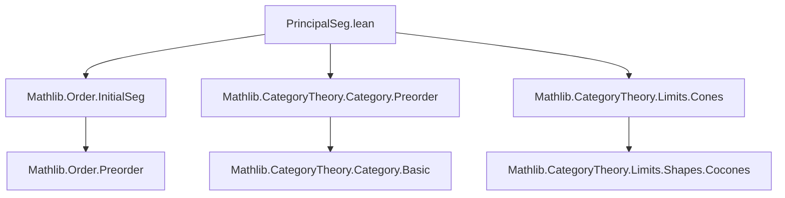

**Technical Brief: `PrincipalSeg.lean`**

---

### 1. **Key Definitions & Theorems**

| Name | Type / Signature | Purpose |
|------|------------------|---------|
| `PrincipalSeg.cocone` | `{α β : Type*} [PartialOrder α] [PartialOrder β] → (f : α <i β) → {C : Type*} [Category* C] → (F : β ⥤ C) → Cocone (f.monotone.functor ⋙ F)` | Constructs a cocone over the composite functor `f.monotone.functor ⋙ F`, with apex `F.obj f.top`. The cone leg at `i : α` is the image under `F` of the unique morphism `f.top ≥ f i` in `β`. |

- **No named theorems** are present in this file; the focus is on constructing the cocone.

---

### 2. **Naming Conventions**

- **Prefixes**:
  - `cocone` — standard category-theoretic construction naming.
  - `homOfLE` — standard Mathlib convention for constructing a morphism from a proof of `≤` in a preorder category.
- **Suffixes**:
  - None prominent here; the definition is named descriptively (`cocone`) and qualified under the `PrincipalSeg` namespace (implied by module name).
- **Structure**:
  - Uses `@[simps]` to generate projection lemmas automatically (e.g., `cocone.pt`, `cocone.ι.app`).

---

### 3. **Tactic Stack**

- **`dsimp`** — simplifies definitions (e.g., unfolding `cocone.ι.app`).
- **`rw [← F.map_comp, comp_id]`** — rewrites using functoriality and identity laws.
- **`rfl`** — closes trivial equalities (here, after rewriting, the diagram commutes by definition).

No heavy automation (e.g., `aesop`, `tauto`, `linarith`) is used — the proof is purely definitional.

---

### 4. **Proof Logic**

- **Construction-first approach**: The cocone is defined explicitly.
- **Verification of naturality**:
  - For `i ≤ j` in `α`, one must show:
    $$
    F(\text{homOfLE}(f.\text{lt\_top}\ j).le) \circ F(\text{homOfLE}(f.\text{lt\_top}\ i).le)^\sharp = F(\text{homOfLE}(f.\text{lt\_top}\ i).le)
    $$
    where the arrow direction is induced by monotonicity of `f`.
  - The proof uses:
    - Functoriality: `F.map (g ∘ h) = F.map g ∘ F.map h`
    - Identity law: `F.map id = id`
    - The fact that in a preorder category, composition is unique when it exists.

- **No induction or case analysis** is needed — the naturality square commutes *by definition* of the preorder morphisms and functoriality.

---

### 5. **Imports**

| Import | Role |
|--------|------|
| `Mathlib.Order.InitialSeg` | Provides `α <i β` (initial segments), `f.top`, `f.monotone`, `f.lt_top`, `homOfLE`, etc. |
| `Mathlib.CategoryTheory.Category.Preorder` | Interprets preorders as categories; defines morphisms `homOfLE`, composition, identities. |
| `Mathlib.CategoryTheory.Limits.Cones` | Provides `Cocone`, `Cocone.mk`, `Cocone.ι`, `Cocone.pt`, and related infrastructure. |

---

### 6. **Mermaid Diagrams**

#### **Dependency Graph (Module-Level)**



#### **Conceptual Overview of `PrincipalSeg.cocone`**

```mermaid
graph LR
  subgraph α
    i[ i : α ]
    j[ j : α ]
    i -- f.monotone --> f_i[f i]
    j -- f.monotone --> f_j[f j]
    i -- ≤ --> j
  end

  subgraph β
    f_i -- ≤ --> f_top[f.top]
    f_j -- ≤ --> f_top
  end

  subgraph C
    F_i[F.obj (f i)]
    F_j[F.obj (f j)]
    F_top[F.obj f.top]
    F_i -- F.map(homOfLE) --> F_top
    F_j -- F.map(homOfLE) --> F_top
    F_i -- F.map(f.map _) --> F_j
  end

  F_top -.->|ι_j| F_j
  F_top -.->|ι_i| F_i
  style F_top fill:#f9f,stroke:#333
```

- The cone legs `ι_i : F.obj (f i) → F.obj f.top` are induced by the unique maps `f i ≤ f.top` in `β`.
- Naturality: for `i ≤ j`, the triangle `F_i → F_j → F_top` equals `F_i → F_top`.

---

### 7. **Summary**

This file formalizes a basic but important construction: given a **principal segment** `f : α <i β` (i.e., an initial segment with a top element), and a functor `F : β → C`, one can canonically extend `F ∘ f` to a **cocone** over the diagram `α → β → C`, with apex `F(f.top)`. This is foundational for colimit computations in categories of presheaves or sheaves, especially when dealing with directed colimits or filtered colimits indexed by ordinals or well-orders.

The construction is minimal, definitional, and leverages Lean’s `@[simps]` and category-theoretic infrastructure in Mathlib.
