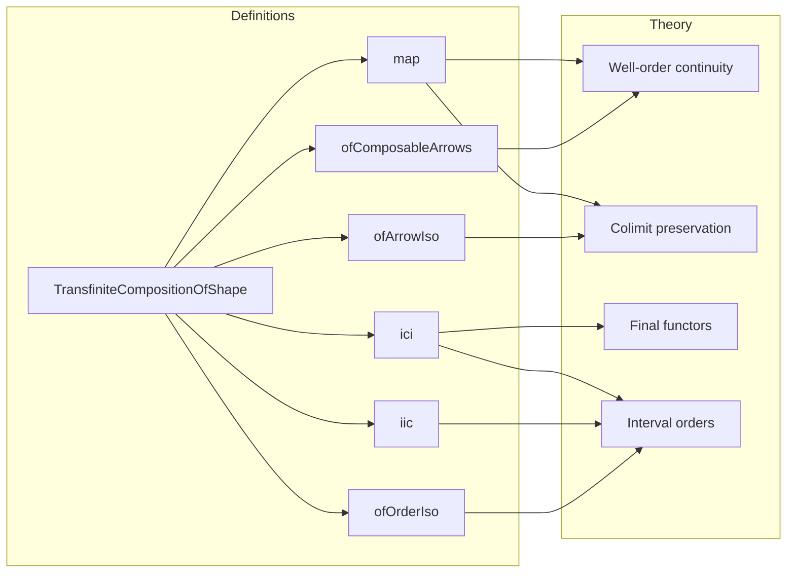

Here is the structured technical brief for `TransfiniteCompositionOfShape.lean`:

---

### **1. Key Definitions & Theorems**

| Name | Type | Purpose |
|------|------|---------|
| `TransfiniteCompositionOfShape` | `structure` | Encodes that a morphism `f : X ⟶ Y` is a transfinite composition indexed by a well-ordered type `J`. Requires: a well-order continuous functor `F : J ⥤ C`, an iso `F.obj ⊥ ≅ X`, a colimit cocone at `Y`, and compatibility `f = isoBot.inv ≫ incl.app ⊥`. |
| `ofArrowIso` | `def` | Shows transfinite composition is invariant under isomorphism of arrows: if `f ≅ f'`, then `f'` inherits the structure. |
| `ofComposableArrows` | `def` | Every finite composable chain `G : ComposableArrows C n` gives a transfinite composition of shape `Fin (n+1)`. |
| `ofOrderIso` | `def` | Transfinite composition is stable under order isomorphism of indexing types: `J' ≃o J ⇒ TC(J, f) ⇒ TC(J', f)`. |
| `map` | `noncomputable def` | If `F : C ⥤ D` preserves `J`-shaped colimits and well-order continuity, then `F.map f` inherits the transfinite composition structure. |
| `iic` | `noncomputable def` | Restricts a transfinite composition along `Set.Iic j` (down-set of `j`) to get a transfinite composition ending at `F.obj j`. |
| `ici` | `noncomputable def` | Restricts along `Set.Ici j` (up-set of `j`) to get a transfinite composition starting at `F.obj j`. |

---

### **2. Naming Conventions**

- **Prefixes**:
  - `of_`: Construction of a new instance from existing data (`ofArrowIso`, `ofComposableArrows`, `ofOrderIso`).
  - `iic`, `ici`: Abbreviations for *initial interval* (`Iic`) and *initial co-interval* (`Ici`).
- **Suffixes**:
  - `_continuous`: Indicates preservation of well-order continuity (e.g., `isWellOrderContinuous`).
  - `_colimit`: Used in `isColimit`, `colimitOfDiagramTerminal`.
- **Structure fields**:
  - `F`, `isoBot`, `incl`, `isColimit`, `fac`: Standardized naming for components of the structure.

---

### **3. Tactic Stack**

Frequent tactics used in proofs and constructions:

| Tactic | Usage |
|--------|-------|
| `infer_instance` | To fill in `[WellFoundedLT J]` and `[SuccOrder J]` instances automatically. |
| `cat_disch` | In `fac` field definition — closes diagrammatic commutativity goals in categories. |
| `simp` / `simp_rw` | In `map fac`, `ofArrowIso`, `ofComposableArrows`, `map`, `iic`, `ici`. |
| `rw`, `dsimp`, `rfl` | In `iic` naturality proof. |
| `cat_disch`, `simp`, `rw` | In `fac` and naturality proofs. |
| `apply`, `exact`, `refine` | Implicit in `def` bodies via `by` blocks. |
| `IsColimit.ofIsoColimit`, `IsColimit.whiskerEquivalence` | To transport colimit structures along isomorphisms or equivalences. |

---

### **4. Proof Logic**

- **Structure definition**: Relies on categorical colimit theory and well-order continuity.
- **Construction proofs**:
  - **Inductive/structural**: `ofComposableArrows` uses `colimitOfDiagramTerminal` on terminal object in `Fin (n+1)`.
  - **Transport along equivalences**: `ofArrowIso`, `ofOrderIso`, `map`, `iic`, `ici` all use:
    - Functor composition (`⟦`, ` whiskerLeft`, `whiskerRight`)
    - Colimit transport lemmas (`IsColimit.ofIsoColimit`, `IsColimit.whiskerEquivalence`)
    - Natural transformation whiskering and cocone extension lemmas.
- **Verification**:
  - Commutativity of diagrams is often discharged by `simp` + `cat_disch`.
  - Naturality and factorization conditions (`fac`) are proven by simplifying using ` Functor.map_comp`, `Category.id_comp`, etc.

---

### **5. Imports**

| Module | Purpose |
|--------|---------|
| `Mathlib.CategoryTheory.ComposableArrows.Basic` | Finite composable chains (`ComposableArrows`). |
| `Mathlib.CategoryTheory.Limits.Shapes.Preorder.WellOrderContinuous` | Well-order continuous functors. |
| `Mathlib.CategoryTheory.Limits.Shapes.Preorder.Fin` | Finite preorders, especially `Fin`. |
| `Mathlib.CategoryTheory.Limits.Final` | Final functors and colimit preservation. |
| `Mathlib.CategoryTheory.Filtered.Final` | Final functors in filtered contexts. |
| `Mathlib.CategoryTheory.Limits.Preserves.Shapes.Preorder` | Preservation of preorder-shaped colimits. |
| `Mathlib.Data.Fin.SuccPredOrder` | Successor/predecessor structure on `Fin`. |
| `Mathlib.Order.LatticeIntervals` | Interval orders (`Iic`, `Ici`). |
| `Mathlib.Order.Interval.Set.Final` | Finality of interval inclusions. |

---

### **6. Mermaid Diagrams**

#### **Dependency Graph (Module-Level)**

```mermaid
graph TD
  A[TransfiniteCompositionOfShape] --> B[Mathlib.CategoryTheory.ComposableArrows.Basic]
  A --> C[Mathlib.CategoryTheory.Limits.Shapes.Preorder.WellOrderContinuous]
  A --> D[Mathlib.CategoryTheory.Limits.Shapes.Preorder.Fin]
  A --> E[Mathlib.CategoryTheory.Limits.Final]
  A --> F[Mathlib.CategoryTheory.Filtered.Final]
  A --> G[Mathlib.CategoryTheory.Limits.Preserves.Shapes.Preorder]
  A --> H[Mathlib.Data.Fin.SuccPredOrder]
  A --> I[Mathlib.Order.LatticeIntervals]
  A --> J[Mathlib.Order.Interval.Set.Final]
```

#### **Overview of File Structure**

---

### **7. Theory Scope**

- **Core idea**: Formalize *transfinite compositions* as colimits over well-ordered indexing categories.
- **Applications**:
  - Used in `MorphismProperty.TransfiniteComposition` (see file comment).
  - Enables inductive arguments over transfinite sequences (e.g., for small object arguments).
- **Key abstractions**:
  - `TransfiniteCompositionOfShape` as a *property* (not data-heavy) — extensible for future refinements.
  - Stability under:
    - Arrow isomorphism
    - Order isomorphism
    - Functorial image (under colimit preservation)
    - Interval restriction (`Iic`, `Ici`)

--- 

Let me know if you'd like a formalization roadmap or a sketch of how this integrates with `MorphismProperty.TransfiniteComposition`.
