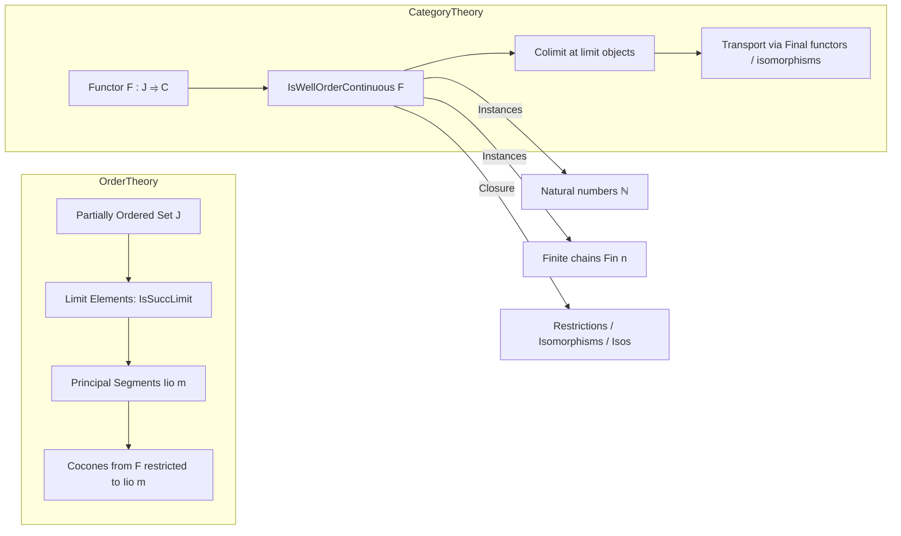

**Technical Brief: `WellOrderContinuous.lean`**

---

### 1. **Key Definitions & Theorems**

| Name | Type | Purpose |
|------|------|---------|
| `IsWellOrderContinuous` | `class (F : J ⥤ C) : Prop` | Defines that for every *limit element* `m : J`, `F.obj m` is a colimit of the diagram `F` restricted to `j < m`. |
| `isColimitOfIsWellOrderContinuous` | `F.IsWellOrderContinuous → m : J → Order.IsSuccLimit m → IsColimit ((Set.principalSegIio m).cocone F)` | Constructs the colimit cocone at a limit object using the class witness. |
| `isColimitOfIsWellOrderContinuous'` | `F.IsWellOrderContinuous → f : α <i J → Order.IsSuccLimit f.top → IsColimit (f.cocone F)` | Extends the colimit property to any principal segment whose top is a limit element. |
| `isWellOrderContinuous_of_iso` | `F ≅ G → F.IsWellOrderContinuous → G.IsWellOrderContinuous` | Shows the property is invariant under natural isomorphism. |
| `restriction_setIci` | `F.IsWellOrderContinuous → ((Subtype.mono_coe (Set.Ici j)).functor ⋙ F).IsWellOrderContinuous` | Shows that restriction to a tail `Ici j` preserves well-order continuity (requires `LinearOrder J`). |
| `instance (F : ℕ ⥤ C)` | `F.IsWellOrderContinuous` | Every functor from `ℕ` is well-order continuous (since no natural number is a limit in the succ-pred sense). |
| `instance {n : ℕ} (F : Fin n ⥤ C)` | `F.IsWellOrderContinuous` | Every functor from a finite chain is well-order continuous (no limit elements exist). |

---

### 2. **Naming Conventions**

- **Prefixes**:
  - `is_`: Predicate definitions (`isColimitOfIsWellOrderContinuous`, `isWellOrderContinuous_of_iso`)
  - `nonempty_`: Class field names (`nonempty_isColimit`)
- **Suffixes**:
  - `_of_`: Derivation from assumptions (`isColimitOfIsWellOrderContinuous`, `isWellOrderContinuous_of_iso`)
  - `_restr_` / `_restriction_`: Restriction functors (`restriction_setIci`)
- **Pattern**: `isXOfY` for constructing `X` from `Y`; `X_of_Y` for proving `X` assuming `Y`.

---

### 3. **Tactic Stack**

Frequent tactics used in proofs:
- `simp at hm` / `simp only [...]` — simplification of hypotheses and goals, especially for `Order.IsSuccLimit`.
- `by_contra` — for contradiction arguments (e.g., in `restriction_setIci`).
- `rw [Monotone.final_functor_iff]` — rewriting using categorical characterizations.
- `push _ ∈ _ at hj'` — set membership manipulation.
- `by_cases!` — case analysis on decidable propositions.
- `refine ⟨…, h⟩` — constructing witnesses for existential goals.
- `dsimp only [f]` — definitional simplification.
- `exact` / `rfl` — finalizing equalities or identities.
- `apply` / `rintro` / `intro` — standard intro/elimination.

No heavy automation (`aesop`, `linarith`, `tauto`) is used — proofs are mostly constructive and rely on order-theoretic reasoning.

---

### 4. **Proof Logic**

- **Core strategy**:  
  - Use the definition of `IsSuccLimit` (a limit element is neither bottom nor a successor).
  - For `ℕ` and `Fin n`, show there are *no* limit elements → vacuous satisfaction.
  - For general `J`, construct colimits via:
    - `principalSegIio m`: the principal segment `j < m`.
    - `Set.principalSegIio m).cocone F`: the induced cocone.
    - Use `Nonempty` elimination (`.some`) to pick a specific colimit structure.
  - For restriction along monotone maps or order isomorphisms:
    - Show the preimage of a limit is a limit (via `simpa` or `by simpa`).
    - Use `whiskerEquivalence`, `Final.isColimitWhiskerEquiv`, or `ofIsoColimit` to transport colimit structures.

- **Inductive/structural reasoning**:  
  - Not induction on `n`, but *case analysis* on whether an element is a successor or limit.
  - Use of `Order.IsSuccLimit` elimination lemmas (e.g., `Set.Ici.isSuccLimit_coe`, `hf.functor.Final`).

---

### 5. **Imports**

| Module | Purpose |
|--------|---------|
| `Mathlib.CategoryTheory.Limits.IsLimit` | General limit/colimit theory. |
| `Mathlib.CategoryTheory.Limits.Shapes.Preorder.PrincipalSeg` | Principal segments in preorders, cocones from them. |
| `Mathlib.CategoryTheory.Limits.Final` | Final functors and their effect on colimits. |
| `Mathlib.CategoryTheory.Filtered.Final` | Finality in filtered categories. |
| `Mathlib.Data.Nat.SuccPred` | Successor/predecessor structure on `ℕ`. |
| `Mathlib.Data.Fin.SuccPredOrder` | Successor/predecessor on `Fin n`. |
| `Mathlib.Order.Interval.Set.*` | Intervals (`Iio`, `Ici`, `principalSeg`) and their order-theoretic properties. |
| `Mathlib.Order.SuccPred.*` | General theory of successor/predecessor in ordered types. |
| `Mathlib.Order.SuccPred.LinearLocallyFinite` | Local finiteness assumptions for succ/pred. |

→ **Scope**: Categorical colimits over well-ordered (or more generally, partially ordered) index categories, with emphasis on *successor-limit* decomposition.

---

### 8. **Mermaid Diagrams**

#### **Dependency Graph (Module-Level)**

```mermaid
graph TD
  A[WellOrderContinuous.lean] --> B[Mathlib.CategoryTheory.Limits.IsLimit]
  A --> C[Mathlib.CategoryTheory.Limits.Shapes.Preorder.PrincipalSeg]
  A --> D[Mathlib.CategoryTheory.Limits.Final]
  A --> E[Mathlib.CategoryTheory.Filtered.Final]
  A --> F[Mathlib.Data.Nat.SuccPred]
  A --> G[Mathlib.Data.Fin.SuccPredOrder]
  A --> H[Mathlib.Order.Interval.Set.InitialSeg]
  A --> I[Mathlib.Order.Interval.Set.Limit]
  A --> J[Mathlib.Order.SuccPred.InitialSeg]
  A --> K[Mathlib.Order.SuccPred.Limit]
  A --> L[Mathlib.Order.SuccPred.LinearLocallyFinite]
```



#### **Conceptual Overview (Theory Flow)**



#### **Proof Structure (High-Level)**

```mermaid
flowchart TD
  Start[Define IsWellOrderContinuous] --> Inst1[Instance for ℕ]
  Start --> Inst2[Instance for Fin n]
  Start --> Closure1[Isomorphism invariance]
  Start --> Closure2[Restriction along monotone maps]
  Start --> Closure3[Restriction along order isomorphisms]
  Start --> Closure4[Restriction to Ici j (LinearOrder case)]
  
  Inst1 & Inst2 --> Verif[No limit elements → vacuous]
  Closure1 --> Iso[Use isoWhisker & ofIsoColimit]
  Closure2 --> Monotone[Use principalSeg.transInitial]
  Closure3 --> IsoEquiv[Use equivalence.functor]
  Closure4 --> Final[Use Finality of monotone map]
```

--- 

**Summary**: This module formalizes a categorical continuity condition tailored to well-ordered (or linearly ordered) index categories, where continuity is defined at *limit ordinals* (in the succ/pred sense). It leverages order-theoretic tools (`principalSeg`, `Iio`, `IsSuccLimit`) and categorical machinery (`Final`, `cocone`, `whiskering`) to prove stability under standard categorical constructions.
