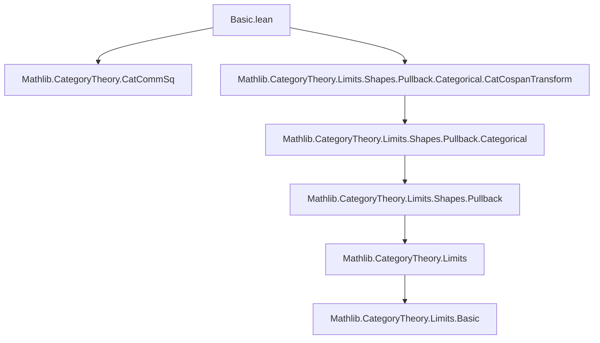
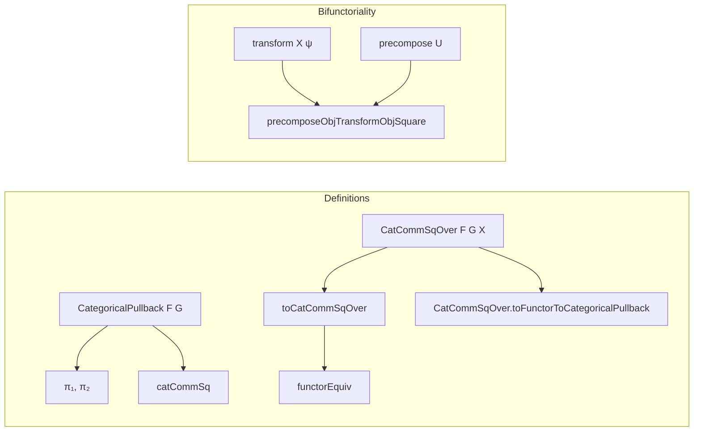

Here is the structured technical brief extracted from `Basic.lean`:

---

### **1. Key Definitions & Theorems**

| Name | Type / Signature | Purpose |
|------|------------------|---------|
| `CategoricalPullback F G` | `Type (max u₁ u₃ u₄)` (after category instances) | Category of triples `(a : A, c : C, F a ≅ G c)`; the *categorical pullback* of cospan `F, G`. |
| `CategoricalPullback.Hom x y` | `Type (max v₁ v₂ v₃)` | Morphisms are pairs `(f₁ : x.fst ⟶ y.fst, f₂ : x.snd ⟶ y.snd)` compatible via `F.map f₁ ≫ y.iso.hom = x.iso.hom ≫ G.map f₂`. |
| `π₁ F G : CategoricalPullback F G ⥤ A` | `Functor` | First projection functor. |
| `π₂ F G : CategoricalPullback F G ⥤ C` | `Functor` | Second projection functor. |
| `catCommSq : CatCommSq (π₁ F G) (π₂ F G) F G` | `CatCommSq` | Canonical 2-commutative square exhibiting `CategoricalPullback F G` as a pullback in the (2,1)-category of categories. |
| `CatCommSqOver F G X` | `Type (max u₄ u₁ u₂ u₃)` | Category of “commutative squares over `F, G` with apex `X`”: data `(L : X ⥤ A, R : X ⥤ C, L ⋙ F ≅ R ⋙ G)`. |
| `CatCommSqOver.Hom s t` | `Type (max v₄ v₁ v₂ v₃)` | Morphisms are pairs of natural transformations `(α : L ⇒ L', β : R ⇒ R')` compatible with the structural iso. |
| `toCatCommSqOver F G X : (X ⥤ F ⊡ G) ⥤ CatCommSqOver F G X` | `Functor` | Sends a functor `J : X ⥤ pullback` to `(J ⋙ π₁, J ⋙ π₂, J ⋙ catCommSq.iso)`. |
| `CatCommSqOver.toFunctorToCategoricalPullback F G X : CatCommSqOver F G X ⥤ X ⥤ F ⊡ G` | `Functor` | Sends `(L, R, η)` to the functor `x ↦ (L x, R x, η.app x)`. |
| `functorEquiv F G X : (X ⥤ F ⊡ G) ≌ CatCommSqOver F G X` | `Equivalence` | **Universal property**: functors into the pullback ≃ commutative squares over `F, G` with apex `X`. |
| `mkIso` (for `CategoricalPullback`) | `(eₗ : x.fst ≅ y.fst) → (eᵣ : x.snd ≅ y.snd) → ... → x ≅ y` | Constructor for isomorphisms in the pullback. |
| `mkNatIso` | `(e₁ : J ⋙ π₁ ≅ K ⋙ π₁) → (e₂ : J ⋙ π₂ ≅ K ⋙ π₂) → ... → J ≅ K` | Constructor for natural isomorphisms `J, K : X ⥤ pullback`. |
| `transform X ψ` | `CatCommSqOver F G X ⥤ CatCommSqOver F₁ G₁ X` | Bifunctorial action: whiskering along a `CatCospanTransform ψ : (F,G) ⇒ (F₁,G₁)`. |
| `precompose X Y U` | `CatCommSqOver F G Y ⥤ CatCommSqOver F G X` | Precomposition with `U : X ⥤ Y`. |
| `precomposeObjTransformObjSquare` | `CatCommSq` | Naturality square between `precompose` and `transform`. |

---

### **2. Naming Conventions**

- **Prefixes**:
  - `π₁`, `π₂`: canonical projections.
  - `to...`: direction toward a more structured object (e.g., `toCatCommSqOver`).
  - `...Obj...`: object-level components of pseudofunctorial actions (`transformObjComp`, `precomposeObjId`).
  - `mk...`: constructors for isomorphisms/natural isomorphisms (`mkIso`, `mkNatIso`).
- **Suffixes**:
  - `Hom`: morphism type/structure.
  - `iso`: natural isomorphism component (e.g., `iso_hom_naturality`, `iso_hom_id`).
  - `app`: component at an object (e.g., `iso_hom_naturality₂`, `w_app`).
- **Notation**:
  - `L ⊡ R` for `CategoricalPullback L R`.
  - ` whiskerRight`, `whiskerLeft`, `isoWhiskerLeft`, etc.: standard whiskering notation.

---

### **3. Tactic Stack**

- **Core proof automation**:
  - `simp` (with `!` and `*` variants, e.g., `@[simps!]`, `simp only`, `simp at *`)
  - `ext` (extensionality for morphisms, natural transformations, functors)
  - `congr` / `congr_arg`
  - `rw`, `symm`, `trans`
- **Category-theoretic automation**:
  - `cat_disch`: discharges trivial categorical diagrams (custom tactic).
  - `reassoc`: reassociates compositions (used in `@[reassoc]` attributes).
  - `push`: for push-style rewrites (e.g., `@[simp, push ←]`).
- **Manual but standard**:
  - `apply`, `exact`, `assumption`, `intro`, `cases`, `constructor`.
  - `dsimp`, `unfold`, `change`.
- **Equivalence proofs**:
  - `apply_funext`, `ext`, `congr_arg`, `funext`, `congr_fun`.

---

### **4. Proof Logic**

- **Structure**:
  - **Inductive definitions** via `structure` and `instance`.
  - **Extensionality principles** (`hom_ext`, `natTrans_ext`, `hom_ext`) used early to reduce equality to component-wise equality.
  - **Isomorphism lifting**: `isIso_iff` and `inv_fst`/`inv_snd` lemmas show that isomorphisms in the pullback are exactly pairs of isomorphisms.
- **Equivalence proofs** (`functorEquiv`):
  - Construct unit/counit isomorphisms explicitly using `mkIso`/`mkNatIso`.
  - Verify triangle identities via `simp` and `ext`.
- **Bifunctoriality**:
  - Pseudofunctor laws (associators, unitors, coherence) verified by `ext` + `simp`.
  - Coherence lemmas (`transform_map_associator`, `precompose_map_leftUnitor`, etc.) follow from naturality of associators and unitors.
- **Naturality squares**:
  - Verified by expanding definitions and simplifying using `Functor.associator`, `Functor.leftUnitor`, etc.

---

### **5. Imports**

- `Mathlib.CategoryTheory.CatCommSq`: defines `CatCommSq`, the 2-categorical notion of a commutative square.
- `Mathlib.CategoryTheory.Limits.Shapes.Pullback.Categorical.CatCospanTransform`: defines `CatCospanTransform`, the 2-categorical morphisms between cospans.

These imports define the ambient 2-categorical context (bicategory of categories, functors, natural transformations) and the notion of a cospan transformation, which is essential for the bifunctoriality section.

---

### **6. Mermaid Diagrams**

#### **Dependency Graph (Top-Level)**



#### **Overview of File Structure**



#### **Universal Property (functorEquiv)**

```mermaid
graph LR
  X[X ⥤ F ⊡ G] <-->|functorEquiv| Y[CatCommSqOver F G X]
  X -.->|π₁ ∘ -| A
  X -.->|π₂ ∘ -| C
  Y -.->|fst| A
  Y -.->|snd| C
  A -- F --> B
  C -- G --> B
  X -.->|J ↦ (J ⋙ π₁, J ⋙ π₂, J ⋙ catCommSq.iso)| Y
  Y -.->|(L,R,η) ↦ (x ↦ (Lx,Rx,ηₓ))| X
```

---

This file formalizes the *2-categorical universal property* of the categorical pullback, building on the 2-categorical framework of `CatCommSq` and `CatCospanTransform`. It is foundational for higher-categorical constructions involving pullbacks, such as Grothendieck constructions, fibered categories, and stability properties.
