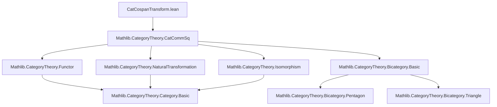
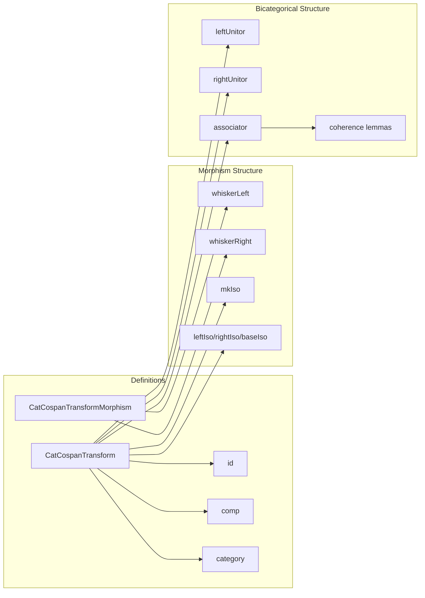

### Technical Brief: `CatCospanTransform.lean`

---

#### **1. Key Definitions & Theorems**

| Name | Type / Structure | Purpose |
|------|------------------|---------|
| `CatCospanTransform` | `structure` | Encodes a morphism between two cospans of functors: a triple of functors `(left, base, right)` equipped with 2-commutativity data (`squareLeft`, `squareRight`) expressed as `CatCommSq`s. |
| `CatCospanTransformMorphism` | `structure` | Morphisms between `CatCospanTransform`s: triples of natural transformations `(left, base, right)` satisfying coherence conditions w.r.t. the 2-commutative squares. |
| `id` | `def` | Identity morphism in the category of `CatCospanTransform`s. |
| `comp` | `def` | Componentwise composition of `CatCospanTransform`s, using `vComp'` on the `CatCommSq`s. |
| `category` | `instance` | Equips `CatCospanTransform F G F' G'` with a category structure. |
| `whiskerLeft`, `whiskerRight` | `def` | Left/right whiskering of morphisms of `CatCospanTransform`s by `CatCospanTransform`s. |
| `mkIso` | `def` | Constructs an isomorphism in `CatCospanTransform` from componentwise isomorphisms satisfying coherence. |
| `leftIso`, `rightIso`, `baseIso` | `def` | Extract componentwise isomorphisms from an isomorphism in `CatCospanTransform`. |
| `leftUnitor`, `rightUnitor`, `associator` | `def` | Unitors and associator for the bicategorical composition of `CatCospanTransform`s. |
| `isIso_iff` | `lemma` | Characterizes isomorphisms in `CatCospanTransform` as those with all component morphisms invertible. |
| `whisker_exchange`, `pentagon`, `triangle`, etc. | `lemma` | coherence laws for whiskering and associators (bicategorical axioms). |

---

#### **2. Naming Conventions**

- **Prefixes**:
  - `isIso_`: Instance proofs of invertibility (e.g., `isIso_left`, `isIso_base`).
  - `inv_`: Lemmas about inverses (e.g., `inv_left`, `inv_whiskerLeft`).
  - `whisker_`: Whiskering operations (`whiskerLeft`, `whiskerRight`, `whisker_exchange`).
  - `left_`, `right_`, `base_`: Component projections (e.g., `leftIso`, `base`, `right_coherence`).
  - `id_`, `comp_`: Identity and composition.

- **Suffixes**:
  - `_app`: Application of natural transformations at an object (e.g., `left_coherence_app`).
  - `_coh`: Coherence conditions (e.g., `left_coherence`, `right_coherence`).
  - `_iso`: Isomorphism-related (e.g., `leftIso`, `rightIso`, `baseIso`).
  - `_hom`, `_inv`: Hom/inv components of isomorphisms.

- **Notation**:
  - `◁` = `whiskerLeft`
  - `▷` = `whiskerRight`
  - `λ_`, `ρ_`, `α_` = unitors and associator.

---

#### **3. Tactic Stack**

- **Core tactics**:
  - `cat_disch`: Used repeatedly to discharge category-theoretic coherence proofs.
  - `simp` / `simp only`: For simplification using `@[simps]`, `@[reassoc]`, and coherence lemmas.
  - `ext`: For extensionality proofs (e.g., `hom_ext`).
  - `aesop_cat`: For automated category-theoretic reasoning (e.g., in `isIso_iff`).
  - `rw`, `congr_app`: For rewriting and congruence on natural transformation components.
  - `dsimp`, `symm`, `apply`, `use`: Standard proof scripting.

- **Pattern**:
  - Prove componentwise properties → verify coherence → use `cat_disch` or `simp` to finish.

---

#### **4. Proof Logic**

- **Structure of proofs**:
  1. **Componentwise construction**: Define morphisms/objects by specifying each component (`left`, `base`, `right`).
  2. **Coherence verification**: Prove naturality/coherence conditions using whiskering identities and `CatCommSq` properties.
  3. **Isomorphism checks**: Show invertibility of components and verify that inverses satisfy coherence (often via `simpa using ...` or `IsIso.eq_inv_of_inv_hom_id`).
  4. **Bicategorical axioms**: Use `cat_disch` or `simp` + `assoc` + `whisker` lemmas to verify pentagon, triangle, etc.

- **Induction**: Not used — all constructions are *strict* (no higher inductive structure).
- **Extensionality**: `hom_ext` is used to prove equality of morphisms via component equality.

---

#### **5. Imports**

- **Primary dependency**:
  ```lean
  import Mathlib.CategoryTheory.CatCommSq
  ```
  - `CatCommSq` provides the 2-commutative square data used in `squareLeft` and `squareRight`.

- **Implicit dependencies** (via `CategoryTheory`):
  - Functors, natural transformations, whiskering, `IsIso`, category axioms.
  - Bicategorical machinery (e.g., `Category.{u}`, `Functor`, `NatTrans`, ` whiskerLeft`, `whiskerRight`).

---

#### **8. Mermaid Diagrams**

##### **Dependency Graph**



##### **Overview of File Structure**



##### **Theoretical Role**

- **Purpose**: Models *2-morphisms* between cospans of functors in `Cat`, enabling the formalization of *2-functoriality* of categorical pullbacks.
- **Context**: Part of a larger effort to formalize *indexed limits*, *2-categorical limits*, and *Grothendieck constructions* in Lean’s `CategoryTheory` library.
- **Relation to other modules**:
  - `CatCommSq` provides the 2-cell data.
  - This file is likely used in `CatPullback` or `IndexedLimits` to encode universal properties in 2D.

--- 

Let me know if you'd like a formalized summary in `lean` docstring format or a high-level specification for a domain-specific agent.
