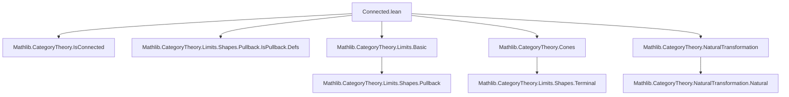
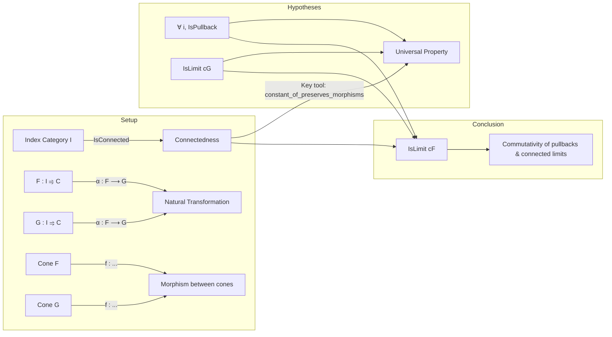

**Technical Brief: Connected.lean — Pullbacks/Pushouts Commute with Connected (Co)limits**

---

### 1. KEY DEFINITIONS & THEOREMS

| Name | Type | Purpose |
|------|------|---------|
| `isLimitOfIsPullbackOfIsConnected` | `{I C : Type*} [Category* I] [IsConnected I] [Category* C] → {F G : I ⥤ C} → (α : F ⟶ G) → (cF : Cone F) → (cG : Cone G) → (f : (Cones.postcompose α).obj cF ⟶ cG) → (∀ i, IsPullback …) → IsLimit cG → IsLimit cF` | Shows that if each component of a cone over `F` is a pullback of the corresponding component over `G` along `α`, and the cone over `G` is a limit, then the cone over `F` is also a limit — *provided the indexing category `I` is connected*. |
| `isColimitOfIsPushoutOfIsConnected` | Dual of above: under analogous hypotheses with pushouts and colimits, shows `IsColimit cG` given `IsColimit cF`. | Dual statement for colimits: if each component of a cocone over `G` is a pushout of the corresponding component over `F`, and the cocone over `F` is a colimit, then the cocone over `G` is a colimit. |

Both theorems formalize the principle:  
> *Connectedness of the indexing category ensures that (co)limits commute with pullbacks (resp. pushouts) along natural transformations.*

---

### 2. NAMING CONVENTIONS

- **Prefixes**:
  - `isLimitOf…`, `isColimitOf…`: indicate construction of (co)limit structure from data.
  - `Cones.postcompose`, `Cocones.precompose`: standard functors for pre/post-composition with natural transformations.
- **Suffixes**:
  - `OfIsConnected`: signals the key hypothesis (`[IsConnected I]`) enabling the result.
  - `OfIsPullback`, `OfIsPushout`: indicate the pointwise (co)limit-like condition (`hf : ∀ i, IsPullback/IsPushout …`).
- **Variable names**:
  - `α`: natural transformation `F ⟶ G`.
  - `cF`, `cG`: cones/cocones over `F`, `G`.
  - `f`: mediating morphism between cones/cocones.
  - `hf`: pointwise universal property (pullback/pushout).
  - `hcG`, `hcF`: (co)limit assumptions on `cG` or `cF`.

---

### 3. TACTIC STACK

| Tactic | Frequency | Role |
|--------|-----------|------|
| `simp` | Very high | Simplify hom-sets, cone/cocone laws, pullback/pushout diagrams. |
| `rw` | High | Rewrite using cone/cocone commutativity, associativity, universal properties. |
| `refine` | Medium | Construct terms using universal properties (e.g., `hf i).lift`, `(hf i).desc`). |
| `change` | Low | Adjust goal shape for clarity before applying `rw`. |
| `aesop` | Not present | Not used — proofs are highly structured and diagrammatic. |
| `ring` | Not present | Not needed (no arithmetic). |
| `hom_ext` | High | Prove equality of morphisms via universal properties of pullbacks/pushouts. |

---

### 4. PROOF LOGIC

**General proof strategy** (for `isLimitOfIsPullbackOfIsConnected`):

1. **Construct the lift**:
   - Use pointwise pullback universal property at an arbitrary index (via `Classical.arbitrary _`) to define `lift s`.
   - Dependence on index is eliminated using connectedness: all such definitions agree.

2. **Prove factorization (`fac`)**:
   - Define `f i` as the lift at index `i`.
   - Show `f i = f j` for all `i, j` using:
     - `constant_of_preserves_morphisms` (a lemma about morphism preservation in connected diagrams).
     - Pullback uniqueness (`hf j₂).hom_ext`).
   - Conclude `fac` by rewriting with this constancy.

3. **Prove uniqueness (`uniq`)**:
   - Use `hf (Classical.arbitrary _)`.hom_ext to reduce to verifying equality of components.
   - Apply `hcG.hom_ext` and simplify using the hypothesis `hg`.

**Dual argument** for `isColimitOfIsPushoutOfIsConnected`, with:
- `desc` instead of `lift`,
- `hf i).desc` instead of `hf i).lift`,
- `Cocone.w` instead of `Cone.w`,
- `Category.assoc` used to rearrange compositions.

**Key logical ingredient**:  
Connectedness of `I` ensures that any two objects are connected by a zigzag of morphisms, allowing uniformity across the diagram — crucial for proving `f i = f j`.

---

### 5. IMPORTS

| Module | Purpose |
|--------|---------|
| `Mathlib.CategoryTheory.IsConnected` | Provides `IsConnected I`, `constant_of_preserves_morphisms`, and related lemmas. |
| `Mathlib.CategoryTheory.Limits.Shapes.Pullback.IsPullback.Defs` | Defines `IsPullback`, `IsPushout`, and their universal properties (`lift`, `desc`, `hom_ext`). |

> *Note*: Implicit use of `Cones.postcompose`, `Cocones.precompose`, `Cone.w`, `Cocone.w`, `IsLimit`, `IsColimit`, etc., from core limit theory libraries (not explicitly imported here, but available via `CategoryTheory.Limits` namespace).

---

### 6. MERMAID DIAGRAMS

#### Dependency Graph (Top-Level)

#### Overview of Theoretical Flow

#### Dual Flow (Colimits / Pushouts)

Same structure, with arrows reversed:
- `Cocone` instead of `Cone`
- `IsPushout` instead of `IsPullback`
- `IsColimit` instead of `IsLimit`
- `desc` instead of `lift`

---

### 7. SUMMARY

This file establishes a foundational result in categorical limit theory:  
> *In a connected diagram, pullbacks (resp. pushouts) commute with limits (resp. colimits) along natural transformations.*

It leverages:
- **Connectedness** to ensure uniformity across the diagram,
- **Pointwise universal properties** (pullback/pushout) to build global (co)limits,
- **Hom-extension lemmas** (`hom_ext`) to verify uniqueness.

The result is a categorical generalization of the familiar set-theoretic fact:  
> *If a diagram of sets is connected and each square is a pullback, then the total space is the pullback of the limits.*

This underpins many constructions in homotopy theory, sheaf theory, and descent theory.

--- 

Let me know if you'd like a formalized version of the `constant_of_preserves_morphisms` lemma or a worked example (e.g., in `Type*` or `Mod_R`).
