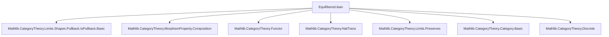
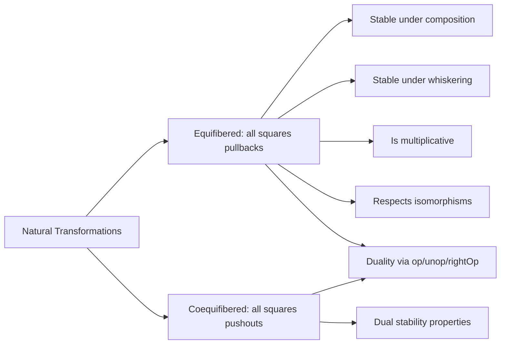

**Technical Brief: Equifibered Natural Transformations in Lean 4 (Mathlib)**  
*Based on `Equifibered.lean` (Copyright 2022 Andrew Yang)*

---

### 1. Key Definitions & Theorems

| Name | Type | Purpose |
|------|------|---------|
| `Equifibered` | `MorphismProperty (J ⥤ C)` | A natural transformation `α : F ⟶ G` is *equifibered* if for all `f : i ⟶ j`, the square `(F.map f, α.app i, α.app j, G.map f)` is a pullback. |
| `Coequifibered` | `MorphismProperty (J ⥤ C)` | Dual: `α` is *coequifibered* if the same square is a pushout. |
| `Equifibered.of_isIso` | `[IsIso α] → Equifibered α` | Any isomorphism of natural transformations is equifibered. |
| `Equifibered.comp` | `Equifibered α → Equifibered β → Equifibered (α ≫ β)` | Equifiberedness is preserved under vertical composition. |
| `Coequifibered.comp` | `Coequifibered α → Coequifibered β → Coequifibered (α ≫ β)` | Dual for pushouts. |
| `Equifibered.whiskerRight` | Preserves equifiberedness under post-composition with a functor `H : C ⥤ D`, assuming `H` preserves the relevant pullback limit. |
| `Equifibered.whiskerLeft` | Preserves equifiberedness under pre-composition with `H : K ⥤ J`. |
| `Equifibered.of_discrete` | `Equifibered α` for functors from a discrete category. |
| `Coequifibered.op`, `Equifibered.op`, `Coequifibered.unop`, `Equifibered.unop` | Relate equifibered/coequifibered via opposite/unop constructions. |
| `coequifibered_op_iff`, `equifibered_op_iff`, etc. | Biconditionals showing duality via `op`/`unop`. |

---

### 2. Naming Conventions

- **Prefixes**:
  - `Equifibered` / `Coequifibered`: Main predicate names.
  - `of_`: Constructive introduction rules (e.g., `of_isIso`, `of_discrete`).
  - `comp`: Composition stability.
  - `whiskerLeft` / `whiskerRight`: Functors acting on domain/codomain of natural transformations.
- **Suffixes**:
  - `_iff`: Biconditional lemmas (e.g., `coequifibered_op_iff`).
  - `_op`, `_unop`: Opposite/unop variants.
  - `rightOp`: Right-op variant for mixed variance.

---

### 3. Tactic Stack

Frequently used tactics in proofs:
- `intro`, `rintro`, `cases`: For destructuring quantifiers and equalities.
- `simp only [...]`: Simplification with specific lemmas (e.g., `Discrete.functor_map_id`).
- `rw [...]`: Rewriting using identities like `Category.id_comp`, `Category.comp_id`.
- `exact`: Final step using known facts (e.g., `IsPullback.of_horiz_isIso`).
- `apply`: For applying lemmas like `IsPullback.of_vert_isIso`.
- `exact ...` + `naturality`: Used to justify commutativity of squares.

No heavy automation (e.g., `aesop`, `ring`, `linarith`) is used—proofs are mostly direct and structural.

---

### 4. Proof Logic

- **Structure**: Proofs follow a *pointwise* strategy:
  1. Introduce arbitrary `i j : J` and `f : i ⟶ j`.
  2. Reduce goal to showing a (co)limit property of the associated square.
  3. Apply known lemmas (`of_isIso`, `of_horiz_isIso`, `paste_vert`, `map`, etc.).
- **Induction**: Not used—proofs are pointwise and rely on categorical properties.
- **Duality**: Opposite/unop lemmas use `op`/`unop` to transfer between pullback/pushout cases.

---

### 5. Imports & Dependencies

**Primary imports**:
- `Mathlib.CategoryTheory.Limits.Shapes.Pullback.IsPullback.Basic`
- `Mathlib.CategoryTheory.MorphismProperty.Composition`

**Implicit dependencies**:
- `CategoryTheory.Functor`
- `CategoryTheory.NatTrans`
- `CategoryTheory.Limits.Preserves`
- `CategoryTheory.Category.Basic`
- `CategoryTheory.Discrete`

These provide:
- `IsPullback`, `IsPushout`, `MorphismProperty`, `whiskerLeft`, `whiskerRight`, `op`, `unop`, `rightOp`, `PreservesLimit`, `PreservesColimit`.

---

### 6. Mermaid Diagrams

#### Dependency Graph (High-Level)

#### Overview of Theory Flow

---

### 7. Summary

This module formalizes *equifibered* and *coequifibered* natural transformations as *MorphismProperty*s, emphasizing their categorical stability properties (composition, whiskering, isomorphism invariance). It leverages Lean’s `MorphismProperty` infrastructure and connects to limit/preserves-limit machinery. The dual relationship between equifibered and coequifibered is fully captured via opposite categories and `op`/`unop` constructions.

The theory is foundational for higher-categorical and homotopical applications (e.g., in homotopy type theory or ∞-category theory), where pullback/pushout stability of natural transformations encodes “homotopy coherence” or “fiberwise structure.”
