**Technical Brief: `EquifiberedLimits.lean`**

---

### 1. **Key Definitions & Theorems**

| Name | Type / Signature | Purpose |
|------|------------------|---------|
| `Equifibered` | `f.hom.Equifibered` (property of a morphism in an over category) | States that a morphism $f : X \to F(A)$ in $\mathrm{Over}\,F$ is *equifibered* if its underlying map is a pullback of the unit of the over-category adjunction — i.e., all fibers are isomorphic. |
| `Coequifibered` | `f.hom.Coequifibered` (dual property in under category) | Dual notion: a morphism $f : F(A) \to X$ in $\mathrm{Under}\,F$ is coequifibered if its dual in $\mathrm{Over}\,F^{\mathrm{op}}$ is equifibered. |
| `IsClosedUnderLimitsOfShape` | `IsClosedUnderLimitsOfShape P J` | Predicate asserting that $J$-shaped limits of diagrams whose objects satisfy property $P$ also satisfy $P$. |
| `IsClosedUnderColimitsOfShape` | `IsClosedUnderColimitsOfShape P J` | Dual: closure under $J$-shaped colimits. |
| Main Theorem (Limit case) | `instance (F : C ⥤ D) [∀ a b, HasCoproductsOfShape (a ⟶ b) D] : IsClosedUnderLimitsOfShape (fun f : Over F ↦ f.hom.Equifibered) J` | If $D$ has coproducts indexed by arrows in $C$, then the class of equifibered morphisms over $F : C \to D$ is closed under $J$-shaped limits, assuming $J$ is connected. |
| Main Theorem (Colimit case) | `instance (F : C ⥤ D) [∀ a b, HasProductsOfShape (a ⟶ b) D] : IsClosedUnderColimitsOfShape (fun f : Under F ↦ f.hom.Coequifibered) J` | Dual: under product assumptions, coequifibered morphisms over $F$ are closed under $J$-shaped colimits. |

---

### 2. **Naming Conventions**

- **Property predicates**:  
  - `Equifibered`, `Coequifibered`: morphism properties in over/under categories.  
  - `isClosedUnderLimitsOfShape`, `isClosedUnderColimitsOfShape`: closure predicates.

- **Morphism constructions**:  
  - `Over.mkIdTerminal`, `WithTerminal.liftToTerminal`: canonical morphisms in over/under categories.  
  - `Over.forget`, `Under.forget`: forgetful functors.

- **Limit/colimit data**:  
  - `isLimitOfReflects`, `isLimitOfPreserves`, `Limits.PullbackCone.isLimitAux'`: standard limit construction helpers.

- **Tactic-driven naming**:  
  - `hJ`, `hα`, `hc`, `hcᵢ`, `hcⱼ`: hypotheses named after their role (e.g., `hc` = cone is limit).  
  - `inst`, `e`, `l`: intermediate constructions.

- **Suffixes**:  
  - `_of_`, `_assoc`, `_ext`, `_ofNatIso`: standard Lean category theory suffixes.

---

### 3. **Tactic Stack**

| Tactic | Frequency | Role |
|--------|-----------|------|
| `wlog` | High | Symmetry reduction (e.g., assume $J$ connected). |
| `refine` | Very High | Goal-directed construction of instances/limits. |
| `simp` / `dsimp` | Very High | Simplify hom-sets, naturality, cone conditions. |
| `rw` | Medium | Rewrite using equivalences, e.g., `e`, `coequifibered_unop_iff`. |
| `exact` / `assumption` | Medium | Finalizing proofs with known facts. |
| `casesOn` | Medium | Handle `WithTerminal J` cases (`i | _`). |
| `hom_ext` | High | Extensionality for natural transformations / cone morphisms. |
| `isLimit.equivOfNatIsoOfIso` | Medium | Transfer limits along natural isomorphisms. |
| `convert` | Medium | Adjust typeclass instances via definitional equality. |
| `rintro` / `intro` | Medium | Intro + destruct patterns. |
| `reassoc_of%` | Low | Custom reassociation lemma (likely from `Mathlib`). |

---

### 4. **Proof Logic**

- **Limit case**:
  1. **WLOG**: Assume $J$ is connected (via `wlog hJ : IsConnected J`).
  2. Reduce to showing closure under limits of *connected* diagrams.
  3. Construct the limit cone in $\mathrm{Over}\,F$ using:
     - Terminal extension (`WithTerminal.liftToTerminal`) to handle empty diagrams.
     - A cone over $F$ built from the original limit cone $c$ and the equifibered structure $\alpha$.
     - Show this cone is a limit using `isLimitOfReflects` (reflects limits along `Over.forget`).
  4. Use `isLimit.equivOfNatIsoOfIso` to relate limits in $\mathrm{Over}\,F$ and $\mathrm{Over}\,F$ via natural isomorphisms.
  5. Verify naturality and uniqueness via `hom_ext` and `simp`.

- **Colimit case**:
  1. Reduce to limit case via duality:
     - Use equivalence `e : Over F.op ≌ (Under F)ᵒᵖ` (from `postEquiv`, `opEquivOpUnder`).
     - Apply `isClosedUnderColimitsOfShape_iff_op`.
     - Translate `Coequifibered` to `Equifibered` via `coequifibered_unop_iff`.
  2. Apply the already-proven limit-closure instance for `Over F.op`.

- **Core logical pattern**:
  > *Induction on diagram shape (via connectedness), then use reflection/creation of limits along forgetful functors, naturality of structure maps, and isomorphism-invariance of the property.*

---

### 5. **Imports**

| Module | Role |
|--------|------|
| `Mathlib.CategoryTheory.Limits.Shapes.Products` | Products, coproducts, shape-indexed (co)limits. |
| `Mathlib.CategoryTheory.Limits.Shapes.Pullback.Equifibered` | Definition and basic properties of equifibered morphisms. |
| `Mathlib.CategoryTheory.ObjectProperty.ColimitsOfShape` | Closure under colimits of shape $J$. |
| `Mathlib.CategoryTheory.Adjunction.Evaluation` | Evaluation functor, used in `isLimitOfPreserves`. |
| `Mathlib.CategoryTheory.Limits.Constructions.Over.Connected` | Connectedness in over categories, terminal objects. |
| `Mathlib.CategoryTheory.Limits.Preserves.Opposites` | Duality for limit/colimit preservation. |
| `Mathlib.CategoryTheory.Limits.Shapes.Opposites.Products` | Opposite of product diagrams. |
| `Mathlib.CategoryTheory.WithTerminal.Cone` | Cones over diagrams with added terminal object. |

---

### 6. **Mermaid Diagrams**

#### **Dependency Graph (Module-Level)**

```mermaid
graph TD
  EquifiberedLimits["EquifiberedLimits.lean"]
  Products["Limits.Shapes.Products"]
  Equifibered["Limits.Shapes.Pullback.Equifibered"]
  ColimitsOfShape["ObjectProperty.ColimitsOfShape"]
  Evaluation["Adjunction.Evaluation"]
  OverConnected["Limits.Constructions.Over.Connected"]
  OppositesPreserves["Limits.Preserves.Opposites"]
  OppositesProducts["Limits.Shapes.Opposites.Products"]
  WithTerminalCone["WithTerminal.Cone"]

  EquifiberedLimits --> Products
  EquifiberedLimits --> Equifibered
  EquifiberedLimits --> ColimitsOfShape
  EquifiberedLimits --> Evaluation
  EquifiberedLimits --> OverConnected
  EquifiberedLimits --> OppositesPreserves
  EquifiberedLimits --> OppositesProducts
  EquifiberedLimits --> WithTerminalCone
```



#### **Theoretical Overview (Conceptual Flow)**

```mermaid
flowchart LR
  A["Over Category Over F"] -->|Equifibered morphisms| B["Closure under limits"]
  C["Under Category Under F"] -->|Coequifibered morphisms| D["Closure under colimits"]

  B -->|Duality via e : Over F.op ≌ (Under F)ᵒᵖ| D
  B -->|Connectedness + reflection along Over.forget| E["Limit construction"]
  D -->|Dual: product assumptions + coequifibered cancellation| F["Colimit construction"]

  E --> G["WithTerminal J trick"]
  F --> H["Opposite diagram + equivalence"]
```

---

### 7. **Summary**

This file establishes that **equifibered morphisms over a fixed functor $F : C \to D$ are closed under connected limits**, provided $D$ has coproducts indexed by arrows in $C$. Dually, **coequifibered morphisms over $F$ are closed under connected colimits** if $D$ has products over arrows in $C$. The proofs rely heavily on:
- Reflection/creation of limits along the forgetful functor $\mathrm{Over}\,F \to [J, C]$,
- The `WithTerminal` trick to handle possibly empty diagrams,
- Duality via the equivalence $\mathrm{Over}\,F^{\mathrm{op}} \simeq (\mathrm{Under}\,F)^{\mathrm{op}}$.

The formalization is typical of modern `Mathlib` style: high-level categorical reasoning, minimal manual computation, and heavy use of `simp`-based automation.
