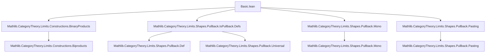

### Technical Brief: `Basic.lean` — Pullbacks, Pushouts, and Related Lemmas in Lean 4 / Mathlib

---

#### **1. Key Definitions & Theorems**

| Name | Type / Signature | Purpose |
|------|------------------|---------|
| `IsPullback` | `CommSq f g h i → Prop` | Predicate asserting that a commuting square is a pullback square (i.e., a limit over a cospan). |
| `IsPushout` | `CommSq f g h i → Prop` | Predicate asserting that a commuting square is a pushout square (i.e., a colimit over a span). |
| `of_is_product` | `IsLimit (BinaryFan X Y) → IsTerminal Z → IsPullback fst snd (t.from _) (t.from _)` | Constructs a pullback from a limiting binary product cone and terminal object. |
| `of_horiz_isIso_mono` | `[IsIso fst] → [Mono g] → CommSq fst snd f g → IsPullback fst snd f g` | Proves a square is a pullback if the horizontal morphism is iso and the vertical is mono. |
| `of_iso` | `IsPullback fst snd f g → (P ≅ P') → (X ≅ X') → (Y ≅ Y') → (Z ≅ Z') → IsPullback fst' snd' f' g'` | Pullbacks are stable under isomorphism of diagrams. |
| `paste_vert` | `IsPullback h₁₁ v₁₁ v₁₂ h₂₁ → IsPullback h₂₁ v₂₁ v₂₂ h₃₁ → IsPullback h₁₁ (v₁₁ ≫ v₂₁) (v₁₂ ≫ v₂₂) h₃₁` | Vertical pasting of pullback squares. |
| `paste_horiz` | `IsPullback h₁₁ v₁₁ v₁₂ h₂₁ → IsPullback h₁₂ v₁₂ v₁₃ h₂₂ → IsPullback (h₁₁ ≫ h₁₂) v₁₁ v₁₃ (h₂₁ ≫ h₂₂)` | Horizontal pasting of pullback squares. |
| `of_bot`, `of_right`, `of_bot'`, `of_right'` | Various variants of pullback detection from composite squares. | Used to deduce that a sub-square is a pullback when part of a larger pullback. |
| `of_prod_fst_with_id` | `[HasBinaryProduct A X] → [HasBinaryProduct B X] → IsPullback prod.fst (prod.map f (𝟙 X)) f prod.fst` | Standard pullback square induced by product with identity. |
| `IsPullback.isLimitFork` | `IsPullback f f g g' → IsLimit (Fork.ofι f H.w)` | A pullback of `f` along itself along equal arrows gives the equalizer fork. |
| `of_is_coproduct`, `of_is_coproduct'` | Dually for pushouts from binary coproducts and initial object. | Dual of `of_is_product`. |
| `paste_vert`, `paste_horiz` (for `IsPushout`) | Pushout pasting lemmas. | Dual to pullback pasting. |
| `of_coprod_inl_with_id` | `[HasBinaryCoproduct A X] → [HasBinaryCoproduct B X] → IsPushout coprod.inl f (coprod.map f (𝟙 X)) coprod.inl` | Standard pushout square induced by coproduct with identity. |
| `Functor.map_isPullback` | `[PreservesLimit (cospan h i) F] → IsPullback f g h i → IsPullback (F.map f) (F.map g) (F.map h) (F.map i)` | Functors preserving the relevant limit map pullbacks to pullbacks. |
| `IsPullback.map_iff` | `[PreservesLimit (cospan h i) F] → [ReflectsLimit (cospan h i) F] → IsPullback (F.map f) ... ↔ IsPullback f ...` | Characterization of pullbacks via conservative/limit-preserving functors. |

---

#### **2. Naming Conventions**

- **Predicates**: `IsPullback`, `IsPushout`, `IsLimit`, `IsColimit`, `IsTerminal`, `IsInitial`, `Mono`, `Epi`, `IsIso`.
- **Constructors / Intro rules**:
  - `of_*`: Introduce a pullback/pushout from universal properties or known limits/colimits.
  - `of_iso`, `of_iso'`: Use diagram isomorphisms.
  - `of_horiz_*`, `of_vert_*`: Use properties of horizontal/vertical maps.
  - `of_id_*`, `id_*`: Special cases with identities.
- **Elimination / Projection**:
  - `flip`: Swap horizontal/vertical axes (duality).
  - `lift`, `desc`: Universal morphisms from pullback/pushout.
  - `cone`, `cocone`: Access underlying cone/cocone data.
- **Auxiliary**:
  - `hasPullback`, `hasPushout`: Instances for existence.
  - `isoPullback_hom_*`, `inl_isoPushout_*`: Accessors for canonical iso to actual pullback/pushout objects.

---

#### **3. Tactic Stack**

- **Core proof automation**:
  - `simp`, `simp only`, `dsimp`
  - `rw`, `rwa`, `change`, `reassoc_of%`
  - `ext`, `congr`
  - `intro`, `apply`, `refine`, `exact`
- **Category-specific automation**:
  - `cat_disch`: Discharge category-theoretic goals.
  - `infer_instance`: For typeclass resolution.
  - `cancel_mono`, `cancel_epi`: Cancel monos/epis in equations.
- **Limit/Colimit reasoning**:
  - `IsLimit.mk`, `IsColimit.mk`, `of_isLimit`, `of_isColimit`
  - `IsLimit.ofIsoLimit`, `IsColimit.ofIsoColimit`
  - `PasteHorizIsPullback`, `PasteHorizIsPushout`, `leftSquareIsPullback`, `rightSquareIsPushout`
- **Isomorphism handling**:
  - `Iso.refl`, `Iso.symm`, `Iso.inv_hom_id`, `Iso.comp_inv_eq`
  - `Iso.hom_inv_id_assoc`, `Iso.inv_hom_id_assoc`

---

#### **4. Proof Logic**

- **Inductive structure**: Most proofs follow a pattern:
  1. **Construct a cone/cocone** (e.g., `PullbackCone.mk`, `PushoutCocone.mk`).
  2. **Show it’s limiting/colimiting** via:
     - `of_isLimit'` / `of_isColimit'`: Use universal property.
     - `ofIsoLimit` / `ofIsoColimit`: Transfer via isomorphism.
     - `mk` + explicit universal morphism + uniqueness proof.
- **Common proof patterns**:
  - **Isomorphism stability**: Use `of_iso` / `of_iso'` with diagram isomorphisms.
  - **Pasting**: Use `paste_vert` / `paste_horiz` and their converses (`paste_vert_iff`, `of_bot`, `of_right`, etc.).
  - **Mono/epi + iso ⇒ pullback/pushout**: Use `of_horiz_isIso_mono`, `of_vert_isIso_epi`, etc.
  - **Functoriality**: Use `map_isPullback` / `map_isPushout` and `map_iff` for conservative functors.
  - **Equalizer/coequalizer connection**: `isLimitFork`, `isLimitFork` for pushouts.

---

#### **5. Imports & Dependencies**

```lean
import Mathlib.CategoryTheory.Limits.Constructions.BinaryProducts
import Mathlib.CategoryTheory.Limits.Shapes.Pullback.IsPullback.Defs
import Mathlib.CategoryTheory.Limits.Shapes.Pullback.Mono
import Mathlib.CategoryTheory.Limits.Shapes.Pullback.Pasting
```

- **Scope**: Core category theory in `Mathlib`, specifically:
  - Binary products and terminal objects.
  - Pullbacks, their universal properties, and pasting lemmas.
  - Monomorphisms, isomorphisms, and their interaction with pullbacks.
- **No explicit pushout imports** — but `IsPushout` is defined and used, implying `Mathlib.CategoryTheory.Limits.Shapes.Pushout.*` is transitively imported (likely via `Limits` namespace).

---

#### **6. Mermaid Diagrams**

##### **Dependency Graph (Module-Level)**



##### **Overview of Theory Flow**

```mermaid
flowchart LR
  subgraph Definitions
    P[IsPullback]
    Q[IsPushout]
    L[IsLimit]
    C[IsColimit]
  end

  subgraph Intro Rules
    OIP[of_is_product]
    OHI[of_horiz_isIso_mono]
    OI[of_iso]
    PV[paste_vert]
    PH[paste_horiz]
  end

  subgraph Elimination / Applications
    OF[of_bot, of_right]
    F[Functor.map]
    EF[Equalizer/Fork]
  end

  P --> OIP
  P --> OHI
  P --> OI
  P --> PV
  P --> PH
  P --> OF
  P --> F
  P --> EF

  Q --> Dually same as P
```

##### **Pullback ↔ Equalizer Connection**

```mermaid
flowchart LR
  A[IsPullback f f g g'] -->|isLimitFork| B[IsLimit (Fork.ofι f ...)]
  B -->|universal property| C[Equalizer of g, g']
```

##### **Pushout ↔ Coequalizer Connection**

```mermaid
flowchart LR
  A[IsPushout f f' g g] -->|isLimitFork| B[IsColimit (Cofork.ofπ g ...)]
  B -->|universal property| C[Coequalizer of f, f']
```

---

#### **7. Summary**

This file provides a foundational toolkit for reasoning about pullbacks and pushouts in an abstract category `C`, using the `IsPullback`/`IsPushout` predicates. It emphasizes:
- **Stability under isomorphism** (`of_iso`, `of_iso'`)
- **Pasting lemmas** (`paste_vert`, `paste_horiz`, and converses)
- **Special cases** (identity squares, product/coproduct squares)
- **Interaction with mono/epi/iso**
- **Functorial behavior** (preservation/reflection)
- **Connections to equalizers/coequalizers**

It is a core module for higher-level developments in `Mathlib` involving limits, exactness properties, and diagram chasing.

--- 

Let me know if you'd like a formalized dependency graph (e.g., `.dot`), or a summary of proof automation patterns for automation tools.
