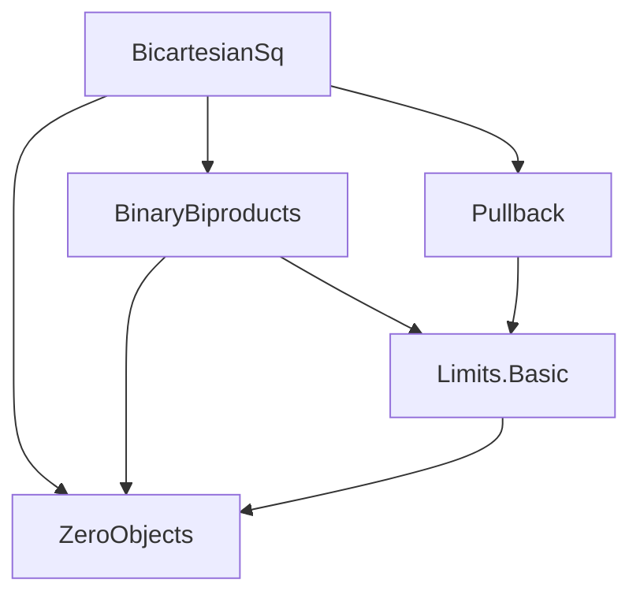
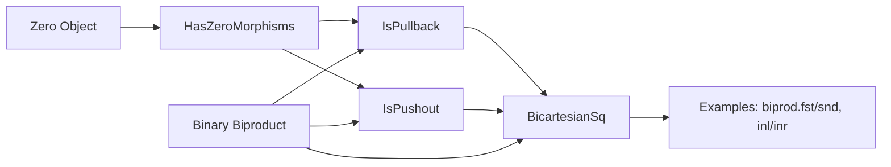

### Technical Brief: `BicartesianSq.lean`

---

#### **1. Key Definitions & Theorems**

| Name | Type / Signature | Purpose |
|------|------------------|---------|
| `BicartesianSq` | `structure BicartesianSq {W X Y Z : C} (f : W ⟶ X) (g : W ⟶ Y) (h : X ⟶ Z) (i : Y ⟶ Z) : Prop` | Defines a *bi-Cartesian square*: a commutative square that is both a pullback and a pushout. Extends `IsPullback` and `IsPushout`. |
| `IsPullback.of_hasBinaryProduct` | `IsPullback prod.fst prod.snd 0 0` | Shows the canonical square from a binary product with zero morphisms is a pullback. |
| `IsPullback.zero_left`, `zero_top`, `zero_right`, `zero_bot` | `IsPullback (0 : _) (0 : _) (𝟙 _) (0 : _)` etc. | Prove trivial pullback squares involving zero objects and identities. |
| `IsPullback.of_isBilimit` | `IsPullback b.fst b.snd 0 0` | Pullback from a binary bicone that is a bilimit (i.e., biproduct). |
| `IsPullback.of_has_biproduct` | `IsPullback biprod.fst biprod.snd 0 0` | Specialization of `of_isBilimit` for biproducts. |
| `IsPullback.inl_snd`, `inr_fst` | `IsPullback biprod.inl 0 biprod.snd 0`, etc. | Prove pullback squares involving biproduct injections/projections and zero morphisms. |
| `IsPushout.of_hasBinaryCoproduct` | `IsPushout 0 0 coprod.inl coprod.inr` | Dual to `of_hasBinaryProduct`: coproduct + zero morphisms ⇒ pushout. |
| `IsPushout.zero_left`, `zero_top`, `zero_right`, `zero_bot` | `IsPushout (0 : _) (0 : _) (𝟙 _) (0 : _)` etc. | Trivial pushout squares involving zero objects. |
| `IsPushout.of_isBilimit` | `IsPushout 0 0 b.inl b.inr` | Pushout from a bilimit bicone. |
| `IsPushout.of_has_biproduct` | `IsPushout 0 0 biprod.inl biprod.inr` | Specialization for biproducts. |
| `IsPushout.inl_snd`, `inr_fst` | `IsPushout biprod.inl 0 biprod.snd 0`, etc. | Pushout squares involving biproduct structure. |
| `BicartesianSq.of_isPullback_isPushout` | `IsPullback f g h i → IsPushout f g h i → BicartesianSq f g h i` | Constructs a bi-Cartesian square from its two components. |
| `BicartesianSq.flip` | `BicartesianSq f g h i → BicartesianSq g f i h` | Flips the square (swap rows/columns). |
| `BicartesianSq.of_is_biproduct₁`, `of_is_biproduct₂` | `BicartesianSq b.fst b.snd 0 0`, `BicartesianSq 0 0 b.inl b.inr` | Biproduct-induced bi-Cartesian squares. |
| `BicartesianSq.of_has_biproduct₁`, `of_has_biproduct₂` | `[HasBinaryBiproduct X Y] → BicartesianSq biprod.fst biprod.snd 0 0`, etc. | Specialized versions for biproducts. |

---

#### **2. Naming Conventions**

- **Prefixes**:
  - `zero_`: squares involving only zero morphisms and identities.
  - `of_`: constructions from structural assumptions (e.g., `of_has_biproduct`, `of_isBilimit`).
  - `inl_`, `inr_`, `fst`, `snd`: biproduct component names.
- **Suffixes**:
  - `'` (prime): variants of theorems for general bicones (`of_isBilimit'`) vs biproducts (`of_has_biproduct`).
  - `₁`, `₂`: distinguish between two canonical bi-Cartesian squares associated to a biproduct.
- **Structure**:
  - `BicartesianSq` extends both `IsPullback` and `IsPushout`.
  - `IsPullback`/`IsPushout` fields are accessed via `.toIsPullback`, `.toIsPushout`.

---

#### **3. Tactic Stack**

Frequently used tactics in proofs:
- `simp`: for simplifying zero morphisms, identities, and universal properties.
- `convert`: to reuse existing universal property lemmas (e.g., `limit.isLimit`, `colimit.isColimit`).
- `subsingleton`: to resolve propositional equality goals in subsingleton types (e.g., `IsPullback`, `IsPushout` are propositions).
- `refine`: to construct proofs with holes, filled later.
- `flip`: to swap rows/columns in squares.
- `of_iso_pullback`, `of_iso_pushout`: to transport (iso-induced) pullback/pushout properties.
- `dsimp`, `simpa`: for definitional simplification and substitution.

---

#### **4. Proof Logic**

- **Induction/Case Analysis**: Not used directly; instead, proofs rely on:
  - **Universal properties**: `limit.isLimit`, `colimit.isColimit`, `limit.isLimit'`, `colimit.isColimit'`.
  - **Iso-based transport**: Leveraging `isoLimitCone`, `isoColimitCocone`, and isomorphisms like `pullbackZeroZeroIso`, `coprodZeroIso`.
- **Structure of proofs**:
  1. Reduce to known universal properties (product/coproduct ⇒ pullback/pushout).
  2. Use `subsingleton` to close propositional goals.
  3. For biproducts, use `BinaryBiproduct.isBilimit` (a bilimit = product + coproduct + compatibility).
  4. Flip or iso-transport to handle symmetric cases.

---

#### **5. Imports**

| Module | Purpose |
|--------|---------|
| `Mathlib.CategoryTheory.Limits.Constructions.ZeroObjects` | Zero objects, zero morphisms, `HasZeroObject`, `HasZeroMorphisms`. |
| `Mathlib.CategoryTheory.Limits.Shapes.BinaryBiproducts` | Biproducts, biproduct injections (`inl`, `inr`), projections (`fst`, `snd`), `BinaryBiproduct.isBilimit`. |
| `Mathlib.CategoryTheory.Limits.Shapes.Pullback.IsPullback.Basic` | Pullbacks, `IsPullback`, universal property lemmas. |

> **Note**: Pushout theory is imported transitively via `Limits` (likely via `Limits.Shapes.Pushout`).

---

#### **6. Mermaid Diagrams**

##### **Dependency Graph (Module Level)**



##### **Conceptual Overview of `BicartesianSq` Theory**



##### **Square Structure**

```
    W ──f──► X
    │        │
    g        h
    ▼        ▼
    Y ──i──► Z
```

- **Pullback**: $W \cong X \times_Z Y$
- **Pushout**: $Z \cong X \sqcup_W Y$
- **Bi-Cartesian**: Both hold simultaneously.

---

#### **7. Key Lemmas Summary**

| Lemma | Square Type | Significance |
|-------|-------------|--------------|
| `of_has_biproduct₁` | `biprod.fst`, `biprod.snd`, `0`, `0` | Biproduct projections form a bi-Cartesian square with zeros. |
| `of_has_biproduct₂` | `0`, `0`, `biprod.inl`, `biprod.inr` | Biproduct injections form a bi-Cartesian square with zeros. |
| `pullbackBiprodInlBiprodInr` | `pullback inl inr ≅ 0` | Pullback of biproduct injections is zero object. |
| `pushoutBiprodFstBiprodSnd` | `pushout fst snd ≅ 0` | Pushout of biproduct projections is zero object. |

These show that biproducts are *exactly* the context where pullback and pushout squares coincide — a hallmark of additive categories.

--- 

Let me know if you'd like a formalized summary in Lean or a formal theory graph.
