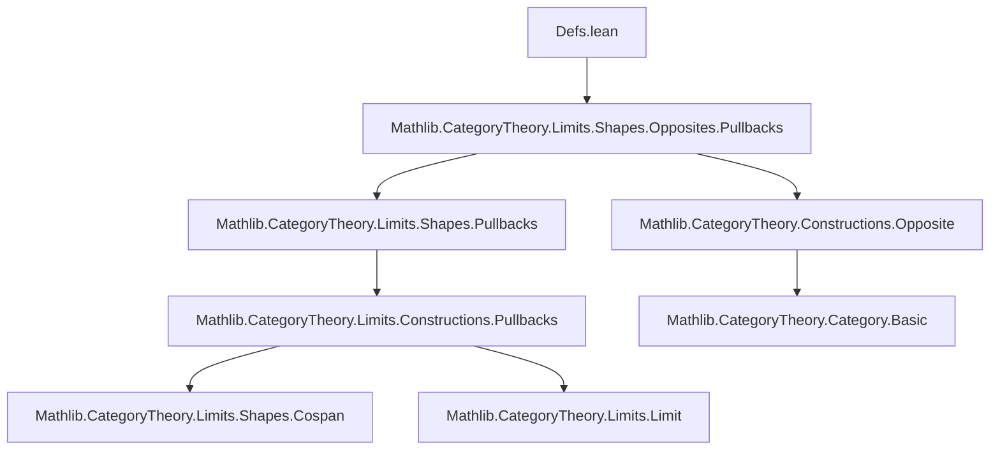
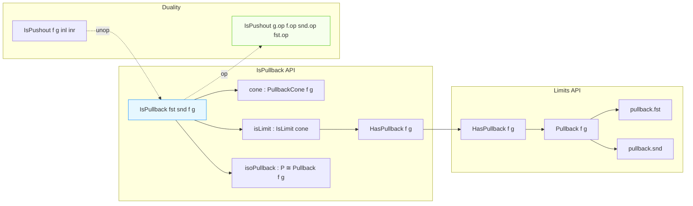

### Technical Brief: `Defs.lean` — Pullback and Pushout Squares in Lean 4 / Mathlib

---

#### **1. Key Definitions & Theorems**

| Name | Type / Signature | Purpose |
|------|------------------|---------|
| `IsPullback` | `structure IsPullback (fst : P ⟶ X) (snd : P ⟶ Y) (f : X ⟶ Z) (g : Y ⟶ Z) : Prop` | Proposition that the square with legs `fst`, `snd` and base `f`, `g` is a pullback (i.e., a limit cone over the cospan). Extends `CommSq` and asserts existence of a limiting cone. |
| `IsPushout` | `structure IsPushout (f : Z ⟶ X) (g : Z ⟶ Y) (inl : X ⟶ P) (inr : Y ⟶ P) : Prop` | Proposition that the square with legs `f`, `g` and cobase `inl`, `inr` is a pushout (i.e., a colimit cocone over the span). Extends `CommSq` and asserts existence of a colimiting cocone. |
| `cone` / `cocone` | `h.cone : PullbackCone f g`, `h.cocone : PushoutCocone f g` | Extracts the underlying cone/cocone from an `IsPullback`/`IsPushout`. |
| `isLimit` / `isColimit` | `h.isLimit : IsLimit h.cone`, `h.isColimit : IsColimit h.cocone` | Extracts the limiting/colimiting witness. |
| `lift` / `desc` | `h.lift h k w : W ⟶ P`, `h.desc h k w : P ⟶ W` | Universal morphisms from/to the pullback/pushout, induced by a commuting square. |
| `lift_fst`, `lift_snd`, `inl_desc`, `inr_desc` | `simp`-reassoc lemmas | Projection properties of `lift`/`desc`. |
| `hom_ext` | `k = l` if projections agree | Uniqueness of mediating morphisms (pullback/pushout universal property). |
| `of_isLimit` / `of_isColimit` | `IsLimit c → IsPullback …`, `IsColimit c → IsPushout …` | Converts a limiting cone/cocone into an `IsPullback`/`IsPushout`. |
| `of_hasPullback` / `of_hasPushout` | `[HasPullback f g] → IsPullback (pullback.fst f g) (pullback.snd f g) f g` | Connects `IsPullback`/`IsPushout` to the standard `HasLimit`/`HasColimit` API. |
| `isoIsPullback` / `isoIsPushout` | `P ≅ P'` for any two pullback/pushout objects | Uniqueness up to unique isomorphism of pullback/pushout objects. |
| `isoPullback` / `isoPushout` | `P ≅ pullback f g`, `P ≅ pushout f g` | Any pullback/pushout object is iso to the canonical one from `HasPullback`/`HasPushout`. |
| `flip` | `IsPullback fst snd f g ↔ IsPullback snd fst g f`, `IsPushout f g inl inr ↔ IsPushout g f inr inl` | Symmetry of pullback/pushout squares. |
| `op` / `unop` | `IsPullback → IsPushout.op`, `IsPushout → IsPullback.unop` | Duality: pullbacks in `C` ↔ pushouts in `Cᵒᵖ`, and vice versa. |

---

#### **2. Naming Conventions**

- **Prefixes**:
  - `isLimit'`, `isColimit'`: internal witness of limit/colimit (noncomputable extraction via `.some`).
  - `cone_`, `cocone_`: projections of the underlying cone/cocone.
  - `lift_`, `desc_`, `hom_ext`: universal property lemmas.
  - `isoIsPullback`, `isoPullback`, `isoPushout`: canonical isomorphisms.
  - `of_…`: constructions from standard limit/colimit API.
- **Suffixes**:
  - `_hom_fst`, `_hom_snd`, `_inv_fst`, `_inv_snd`: behavior of isomorphism components under projections.
  - `_iff`: equivalence versions of properties (e.g., `flip_iff`).
  - `op`, `unop`: dualities via opposite category.
- **Structure fields**:
  - `w`: the commutativity witness (`fst ≫ f = snd ≫ g`).
  - `isLimit'` / `isColimit'`: propositional truncation of the limit/colimit witness.

---

#### **3. Tactic Stack**

Frequently used tactics in proofs:

| Tactic | Usage |
|--------|-------|
| `simp` / `simp only` | Simplify projections, compositions, and isomorphism laws (`Iso.comp_inv_eq`, `Iso.inv_comp_eq`). |
| `dsimp` | Simplify definitions (e.g., unfolding `isoPullback`, `cone`, `CommSq.cone`). |
| `rw` / `simp_rw` | Rewrite using naturality or cone/cocone conditions. |
| `aesop` | Not explicitly used here, but `simp` + `reassoc` handles most automation. |
| ` rfl` / `by simp` | Trivial equalities (e.g., `cone_fst`, `cone_snd`). |
| `exact` / `apply` | Often used with `of_isLimit'`, `of_isColimit'`. |
| `cases` | Rare; structure fields are accessed via projections. |

---

#### **4. Proof Logic**

- **Structure of proofs**:
  1. **Construct cone/cocone** from `IsPullback`/`IsPushout`.
  2. **Extract limit/colimit witness** (`isLimit`, `isColimit`) via `.some`.
  3. **Apply standard limit/colimit API** (`PullbackCone.IsLimit.lift`, `PushoutCocone.IsColimit.desc`, `hom_ext`).
  4. **Use `of_isLimit`/`of_isColimit`** to go from a limiting cone to `IsPullback`.
  5. **Prove uniqueness up to iso** via `IsLimit.conePointUniqueUpToIso` / `IsColimit.coconePointUniqueUpToIso`.
  6. **Relate to canonical constructions** (`pullback`, `pushout`) via `isoPullback`, `isoPushout`.
  7. **Duality via `op`/`unop`**: use `PullbackCone.isLimitEquivIsColimitOp` and naturality to switch between pullbacks and pushouts in opposite categories.

- **Typical proof pattern**:
  ```lean
  -- Prove IsPullback from a limiting cone
  of_isLimit h_limit

  -- Prove iso between two pullbacks
  isoIsPullback h h'

  -- Prove iso to canonical pullback
  isoPullback h
  ```

---

#### **5. Imports**

- **Primary dependency**:
  ```lean
  import Mathlib.CategoryTheory.Limits.Shapes.Opposites.Pullbacks
  ```
- **Implicit imports** (via `CategoryTheory`, `Limits`):
  - `Mathlib.CategoryTheory.Limits.Constructions.Pullbacks`
  - `Mathlib.CategoryTheory.Limits.Shapes.Cospan`
  - `Mathlib.CategoryTheory.Limits.Shapes.Span`
  - `Mathlib.CategoryTheory.Limits.Preserves`
  - `Mathlib.CategoryTheory.Constructions.Opposite`
  - `Mathlib.CategoryTheory.Limits.Shapes.WalkingCospan`, `WalkingSpan`

---

#### **6. Mermaid Diagrams**

##### **Dependency Graph (Module-Level)**



##### **Conceptual Overview of Theory**



##### **Universal Property Flow**

```mermaid
flowchart LR
  W[W] -->|h| X[X]
  W -->|k| Y[Y]
  X -->|f| Z[Z]
  Y -->|g| Z[Z]
  W -.->|∃! l| P[P]
  P -->|fst| X
  P -->|snd| Y
  P -.->|!| Pullback f g
  style P fill:#ffe58f,stroke:#faad14
```

---

#### **7. Summary**

This module provides a **self-contained, API-compatible interface** for pullbacks and pushouts, bridging the abstract `IsLimit`/`IsColimit` framework with concrete square diagrams. It emphasizes:

- **Canonical isomorphisms** between any pullback/pushout and the one from `HasPullback`/`HasPushout`.
- **Duality** via `op`/`unop`, enabling reuse of proofs across limits/colimits.
- **Simp-normalized projections** (`lift_fst`, `inl_desc`, etc.) for easy reasoning.
- **Uniform treatment** of pullbacks and pushouts as (co)limit cones over `WalkingCospan`/`WalkingSpan`.

It is designed for **practical use in diagrammatic reasoning**, especially in contexts like fiber products, base change, and homotopy limits.
