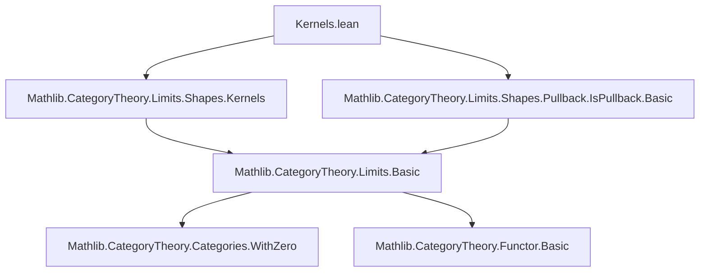
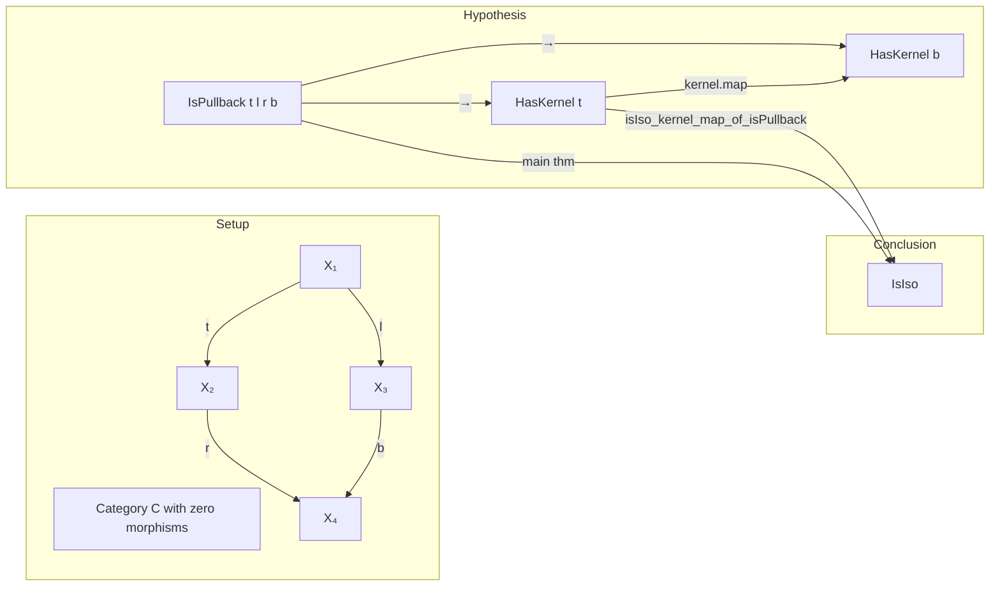

**Technical Brief: `Kernels.lean` (Horizontal Maps in Pullback/Pushout Squares)**

---

### 1. **Key Definitions & Theorems**

| Name | Type | Purpose |
|------|------|---------|
| `IsPullback t l r b` | `Prop` | States that the square with legs `t : X₁ → X₂`, `l : X₁ → X₃`, `r : X₂ → X₄`, `b : X₃ → X₄` is a pullback. |
| `IsPushout t l r b` | `Prop` | States that the same square is a pushout. |
| `kernel.map _ _ _ _ sq.w` | `kernel t ⟶ kernel b` | The canonical map induced by the commutativity of the square (`sq.w`) on kernels. |
| `cokernel.map _ _ _ _ sq.w` | `cokernel t ⟶ cokernel b` | The canonical map induced on cokernels. |
| `kernel.lift _ _ _` | `kernel.lift f g h` | Universal property of kernels: given `f : Z → X₁`, `g : Z → X₃` with `t ∘ f = l ∘ g`, produces `Z ⟶ kernel t`. |
| `cokernel.desc _ _ _` | `cokernel.desc f g h` | Universal property of cokernels: given `f : X₂ → Z`, `g : X₄ → Z` with `f ∘ r = g ∘ b`, produces `cokernel t ⟶ Z`. |
| `isIso_kernel_map_of_isPullback` | `IsIso (kernel.map _ _ _ _ sq.w)` | If the square is a pullback, then the induced map on kernels is an isomorphism. |
| `isIso_cokernel_map_of_isPushout` | `IsIso (cokernel.map _ _ _ _ sq.w)` | If the square is a pushout, then the induced map on cokernels is an isomorphism. |

---

### 2. **Naming Conventions**

- **Prefixes**:
  - `isIso_`: asserts that a morphism is an isomorphism.
  - `kernel.map`, `cokernel.map`: canonical maps induced on (co)kernels by a square.
  - `kernel.lift`, `cokernel.desc`: universal morphisms from/to (co)kernels.
- **Suffixes**:
  - `_of_isPullback`, `_of_isPushout`: indicates the hypothesis type (pullback/pushout square).
- **Variables**:
  - `t`, `l`, `r`, `b`: standard notation for the four legs of a square (`t` = top, `l` = left, `r` = right, `b` = bottom).
  - `sq`: a proof term for `IsPullback` or `IsPushout`.

---

### 3. **Tactic Stack**

- `by simp`: used repeatedly to simplify compositions using zero morphism axioms and (co)kernel equations.
- `by cat_disch`: a custom tactic (likely from `CategoryTheory` infrastructure) to discharge categorical diagram-chasing goals using universal properties.
- `ext`: extensionality for morphisms (used in proving inverses are mutual).
- `exact`: direct proof application.
- `⟨…, …, …⟩`: constructor for `IsIso`, providing inverse and two-sided inverse proofs.

---

### 4. **Proof Logic**

- **Structure**: Both lemmas follow a standard categorical pattern:
  1. **Construct candidate inverse** using universal properties:
     - For kernels: use `kernel.lift` with the kernel inclusion `kernel b ⟶ X₃` and zero map `0 : kernel b ⟶ X₁`, justified by `sq.w` (commutativity).
     - For cokernels: use `cokernel.desc` with zero map and cokernel projection.
  2. **Verify two-sided inverse**:
     - One direction uses `ext` + `sq.hom_ext` (hom-extensionality for pullbacks/pushouts), reducing to two component equations.
     - The other direction uses `by cat_disch`, leveraging the universal property again.

- **Inductive/Case Analysis**: Not used; relies purely on universal properties and extensionality.

---

### 5. **Imports**

| Import | Purpose |
|--------|---------|
| `Mathlib.CategoryTheory.Limits.Shapes.Kernels` | Defines kernels, their universal property, and induced maps. |
| `Mathlib.CategoryTheory.Limits.Shapes.Pullback.IsPullback.Basic` | Defines pullback squares, their universal property, and basic lemmas (e.g., `hom_ext`). |

> **Note**: `HasZeroMorphisms C` is required to define zero morphisms and simplify expressions like `0 ∘ f = 0`.

---

### 6. **Mermaid Diagrams**

#### **Dependency Graph (Module-Level)**

#### **Overview of Theoretical Flow**

> **Dual story** holds for pushouts and cokernels.

---

### 7. **Summary**

This module formalizes a foundational result in abelian/categorical homological algebra: *pullback squares induce isomorphisms on kernels of horizontal maps*, and dually, *pushout squares induce isomorphisms on cokernels*. The proofs are concise and rely on the universal properties of (co)kernels and pullbacks/pushouts, implemented using Lean’s `cat_disch`-style tactics for diagram chasing. The file is part of the `CategoryTheory.Limits` hierarchy and assumes a category with zero morphisms and appropriate (co)kernel limits.
