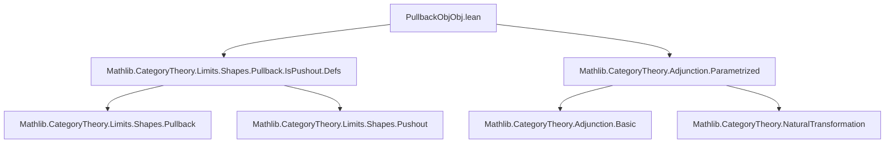
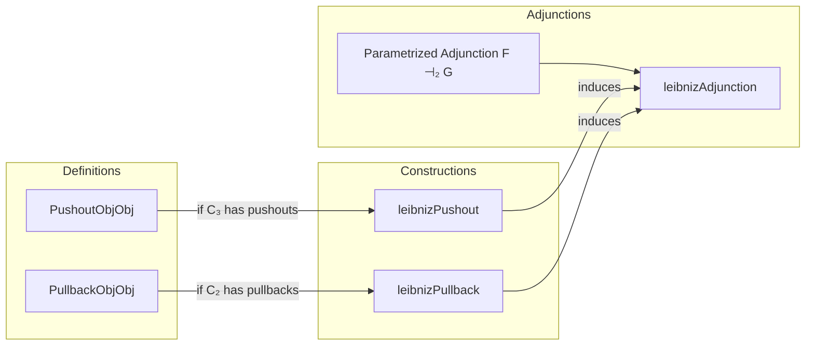

Here is the structured technical brief extracted from `PullbackObjObj.lean`:

---

### **1. Key Definitions & Theorems**

| Name | Type / Structure | Purpose |
|------|------------------|---------|
| `PushoutObjObj` | `structure` | Encodes the data of a pushout of `(F.obj Y₁).obj X₂` and `(F.obj X₁).obj Y₂` along `(F.obj X₁).obj X₂`. |
| `PushoutObjObj.ofHasPushout` | `noncomputable def` | Constructs `PushoutObjObj` using the `HasPushout` API when pushouts exist. |
| `PushoutObjObj.ι` | `noncomputable def` | Canonical morphism `sq.pt ⟶ (F.obj Y₁).obj Y₂` induced by the pushout universal property. |
| `PushoutObjObj.flip` | `def` | Flips a pushout square to get a pushout for the flipped bifunctor `F.flip`. |
| `PushoutObjObj.mapArrowLeft`, `PushoutObjObj.mapArrowRight` | `def`s | Induce morphisms between pushout maps under morphisms of input arrows. |
| `PushoutObjObj.ι_iso_of_iso_left`, `PushoutObjObj.ι_iso_of_iso_right` | `def`s | Induce isomorphisms between pushout maps under isomorphisms of input arrows. |
| `leibnizPushout` | `noncomputable def` | Bifunctor `Arrow C₁ ⥤ Arrow C₂ ⥤ Arrow C₃` sending `(f₁, f₂)` to the Leibniz pushout (pushout-product) `ι : pushout → (F.obj Y₁).obj Y₂`. |
| `PullbackObjObj` | `structure` | Encodes the data of a pullback of `(G.obj (op X₁)).obj X₃` and `(G.obj (op Y₁)).obj Y₃` over `(G.obj (op X₁)).obj Y₃`. |
| `PullbackObjObj.ofHasPullback` | `noncomputable def` | Constructs `PullbackObjObj` using `HasPullback` when pullbacks exist. |
| `PullbackObjObj.π` | `noncomputable def` | Canonical morphism `(G.obj (op Y₁)).obj X₃ ⟶ sq.pt` induced by the pullback universal property. |
| `PullbackObjObj.mapArrowLeft`, `PullbackObjObj.mapArrowRight` | `def`s | Induce morphisms between pullback maps under morphisms of input arrows. |
| `PullbackObjObj.π_iso_of_iso_left`, `PullbackObjObj.π_iso_of_iso_right` | `def`s | Induce isomorphisms between pullback maps under isomorphisms of input arrows. |
| `leibnizPullback` | `noncomputable def` | Bifunctor `(Arrow C₁)ᵒᵖ ⥤ Arrow C₃ ⥤ Arrow C₂` sending `(f₁, f₃)` to the Leibniz pullback (pullback-power) `π : (G.obj (op Y₁)).obj X₃ → pullback`. |
| `LeibnizAdjunction.adj` | `def` | For fixed `X₁ : Arrow C₁`, the induced adjunction `F.leibnizPushout.obj X₁ ⊣ G.leibnizPullback.obj (op X₁)` from a parametrized adjunction `F ⊣₂ G`. |
| `leibnizAdjunction` | `def` | The global parametrized adjunction `F.leibnizPushout ⊣₂ G.leibnizPullback` induced by `F ⊣₂ G`. |

---

### **2. Naming Conventions**

- **Prefixes**:
  - `PushoutObjObj.` / `PullbackObjObj.`: Namespace for structures and operations on pushout/pullback data.
  - `leibniz`: Prefix for constructions named after Leibniz (pushout-product / pullback-power).
  - `mapArrowLeft`, `mapArrowRight`: Morphism actions on left/right argument of the bifunctor.
  - `ι`, `π`: Canonical maps from pushout/pullback object to target (inclusion/projection).
  - `ofHasPushout`, `ofHasPullback`: Constructors using existence assumptions.

- **Suffixes**:
  - `Obj`: Indicates dependence on objects/morphisms in the base categories (e.g., `f₁`, `f₂`).
  - `flip`: For symmetry operations (e.g., `flip`, `flip_obj_map`).
  - `iso`: For isomorphism variants (e.g., `ι_iso_of_iso_left`).

- **Notable patterns**:
  - `hom_ext`: Extensionality lemmas for morphisms out of pushout/pullback.
  - `naturality` lemmas: Prove naturality of unit/counit components.
  - `triangle_components`: Verify triangle identities for adjunctions.

---

### **3. Tactic Stack**

- **Core tactics**:
  - `simp`: Heavily used, especially with `reassoc` and `ext` attributes.
  - `ext`: For extensionality (e.g., `pushout.hom_ext`, `pullback.hom_ext`).
  - `apply ... hom_ext`: To reduce equality proofs to component-wise equalities.
  - `cat_disch`: Category-theoretic automation (likely custom or from `Mathlib.CategoryTheory`).
  - `grind`: Custom simplifier for naturality/wedge conditions (used in `w` fields).
  - `rw`, `simp only`, `change`: For rewriting and simplification in proofs.

- **Key lemmas used**:
  - `homEquiv_naturality_*`: Naturality of the parametrized adjunction hom-equivalence.
  - `pushout.condition`, `pullback.condition`: Commutativity of the pushout/pullback squares.
  - `map_comp`, `comp_app`, `op_comp`: Basic functoriality and naturality identities.

---

### **4. Proof Logic**

- **Structure-based reasoning**:
  - Proofs often proceed by:
    1. Constructing candidates using universal properties (`pushout.desc`, `pullback.lift`).
    2. Verifying commutativity/wedge conditions via `simp` and naturality lemmas.
    3. Using `hom_ext` to reduce morphism equalities to component equalities.
    4. Applying `ext` for arrow extensionality.

- **Inductive/parametric structure**:
  - Bifunctoriality of `leibnizPushout`/`leibnizPullback` is shown by defining `map` on arrows and verifying identity/compatibility.
  - Adjunction proofs use the hom-equivalence of the parametrized adjunction `F ⊣₂ G`, and verify unit/counit naturality and triangle identities.

- **Common pattern**:
  ```lean
  apply hom_ext
  · simp [← homEquiv_naturality_*, ...]
  · simp [← homEquiv_naturality_*, ...]
  ```

---

### **5. Imports**

- `Mathlib.CategoryTheory.Limits.Shapes.Pullback.IsPushout.Defs`: Core definitions for pushouts/pullbacks and `IsPushout`/`IsPullback`.
- `Mathlib.CategoryTheory.Adjunction.Parametrized`: Parametrized adjunctions (`⊣₂`) and their hom-equivalence naturality.

---

### **6. Mermaid Diagrams**

#### **Dependency Graph (Module-Level)**



#### **Overview of Theory Flow**



#### **Leibniz Pushout Square (Diagram)**

```
(F.obj X₁).obj X₂ ──(F.map f₁).app X₂──> (F.obj Y₁).obj X₂
      │                                       │
      │(F.obj X₁).map f₂                     │(F.obj Y₁).map f₂
      ▼                                       ▼
(F.obj X₁).obj Y₂ ──(F.map f₁).app Y₂──> (F.obj Y₁).obj Y₂
```
→ Induces `ι : pushout → (F.obj Y₁).obj Y₂`.

#### **Leibniz Pullback Square (Diagram)**

```
(G.obj (op Y₁)).obj X₃ ──(G.obj (op Y₁)).map f₃──> (G.obj (op Y₁)).obj Y₃
        │                                          │
        │(G.map f₁.op).app X₃                     │(G.map f₁.op).app Y₃
        ▼                                          ▼
(G.obj (op X₁)).obj X₃ ──(G.obj (op X₁)).map f₃──> (G.obj (op X₁)).obj Y₃
```
→ Induces `π : (G.obj (op Y₁)).obj X₃ → pullback`.

---

Let me know if you'd like a formalized dependency graph (e.g., for `leanproject`), or a summary of the `leibnizAdjunction` triangle identities.
