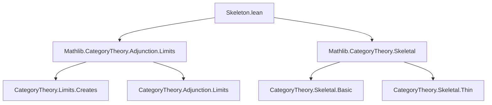
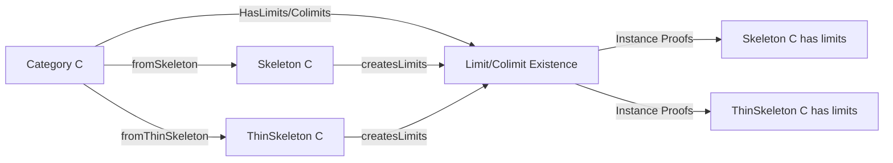

**Technical Brief: `Skeleton.lean` — (Co)limits of the Skeleton of a Category**

---

### 1. **Key Definitions & Theorems**

| Name | Type / Signature | Purpose |
|------|------------------|---------|
| `hasLimitsOfShape_skeleton` | `[HasLimitsOfShape J C] → HasLimitsOfShape J (Skeleton C)` | Lifts limits of shape `J` from `C` to its skeleton `Skeleton C` via the forgetful functor `fromSkeleton C`. |
| `hasLimitsOfSize_skeleton` | `[HasLimitsOfSize.{w, w'} C] → HasLimitsOfSize.{w, w'} (Skeleton C)` | Lifts all small limits (by size) from `C` to `Skeleton C`. |
| `hasColimitsOfShape_skeleton` | `[HasColimitsOfShape J C] → HasColimitsOfShape J (Skeleton C)` | Dual to `hasLimitsOfShape_skeleton`, for colimits. |
| `hasColimitsOfSize_skeleton` | `[HasColimitsOfSize.{w, w'} C] → HasColimitsOfSize.{w, w'} (Skeleton C)` | Dual to `hasLimitsOfSize_skeleton`, for colimits. |
| `hasLimitsOfShape_thinSkeleton` | `[Quiver.IsThin C] → [HasLimitsOfShape J C] → HasLimitsOfShape J (ThinSkeleton C)` | Same as above, but for the *thin* skeleton (i.e., the preorder reflection). |
| `hasLimitsOfSize_thinSkeleton` | `[Quiver.IsThin C] → [HasLimitsOfSize.{w, w'} C] → HasLimitsOfSize.{w, w'} (ThinSkeleton C)` | Lifts small limits to `ThinSkeleton C`. |
| `hasColimitsOfShape_thinSkeleton` | `[Quiver.IsThin C] → [HasColimitsOfShape J C] → HasColimitsOfShape J (ThinSkeleton C)` | Lifts colimits to `ThinSkeleton C`. |
| `hasColimitsOfSize_thinSkeleton` | `[Quiver.IsThin C] → [HasColimitsOfSize.{w, w'} C] → HasColimitsOfSize.{w, w'} (ThinSkeleton C)` | Lifts small colimits to `ThinSkeleton C`. |

All instances are proven using the general principle:  
`hasLimitsOfShape_of_hasLimitsOfShape_createsLimitsOfShape` / `createsLimitsOfShape` for limits, and dually for colimits.

---

### 2. **Naming Conventions**

- **Prefixes**:
  - `hasLimitsOfShape_`, `hasColimitsOfShape_`: indicate existence of limits/colimits of a specific shape.
  - `hasLimitsOfSize_`, `hasColimitsOfSize_`: indicate existence of all small limits/colimits (by universe bounds).
- **Suffixes**:
  - `_skeleton`: for `Skeleton C` (non-thin, categorical skeleton).
  - `_thinSkeleton`: for `ThinSkeleton C` (thin / preorder skeleton).
- **Functor names**:
  - `fromSkeleton C`, `fromThinSkeleton C`: the inclusion functors `Skeleton C ⥤ C`, `ThinSkeleton C ⥤ C`.

---

### 3. **Tactic Stack**

- `infer_instance`: used in the `example` lemmas to discharge `HasLimits` / `HasColimits` goals.
- Implicit use of:
  - `apply_instance`
  - `exact?` (via `infer_instance`)
  - `constructor` (likely in underlying `createsLimitsOfShape` lemmas)
- No explicit tactic usage in this file; relies on `instance` resolution and imported lemmas.

---

### 4. **Proof Logic**

- **Core strategy**: Use the fact that the inclusion functor `fromSkeleton C : Skeleton C ⥤ C` (or `fromThinSkeleton C`) **creates limits/colimits**.
- The proof pattern is uniform:
  1. Assume `C` has limits/colimits of a given shape/size.
  2. Apply the general theorem `hasLimitsOfShape_of_hasLimitsOfShape_createsLimitsOfShape`, which states:
     > If `F : D ⥤ C` creates limits of shape `J`, and `C` has limits of shape `J`, then `D` does too.
  3. Instantiate `F` as `fromSkeleton C` or `fromThinSkeleton C`, and use the fact that these functors are known to create limits (via `createsLimitsOfShape` lemmas in `Mathlib.CategoryTheory.Adjunction.Limits`).
- For `ThinSkeleton C`, an additional hypothesis `[Quiver.IsThin C]` is required to ensure the thin skeleton is well-defined as a category.

---

### 5. **Imports**

| Import | Role |
|--------|------|
| `Mathlib.CategoryTheory.Adjunction.Limits` | Provides `createsLimitsOfShape`, `hasLimitsOfShape_of_hasLimitsOfShape_createsLimitsOfShape`, etc. |
| `Mathlib.CategoryTheory.Skeletal` | Defines `Skeleton`, `ThinSkeleton`, and their inclusion functors (`fromSkeleton`, `fromThinSkeleton`). |

---

### 8. **Mermaid Diagrams**

#### Dependency Graph (Module-Level)

#### Overview of Theory Flow

#### Proof Strategy Flow (for one instance)

---

### Notes

- The comment in the file highlights a subtle **universe mismatch**: `Skeleton C` inherits its category structure from a `Preorder`, and hom-sets live in possibly different universes than those of `C`. Thus, `HasLimits C ↔ HasLimits (Skeleton C)` does *not* hold automatically — only one direction (via the inclusion) is provable.
- The `thinSkeleton` case requires `Quiver.IsThin C` to ensure the hom-types are propositions (i.e., at most one morphism between any two objects), making it a preorder.

--- 

Let me know if you'd like the formalization of `createsLimitsOfShape` for `fromSkeleton` or `fromThinSkeleton` extracted.
