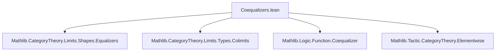

### Technical Brief: Coequalizers in `Type u`

---

#### **1. Key Definitions & Theorems**

| Name | Type / Signature | Purpose |
|------|------------------|---------|
| `coequalizerColimit` | `Limits.ColimitCocone (parallelPair f g)` | Constructs the colimit cocone over the parallel pair `(f, g)` using the set-theoretic coequalizer (i.e., quotient by the equivalence relation generated by `f(x) ~ g(x)`). |
| `coequalizer_preimage_image_eq_of_preimage_eq` | `(π : Y ⟶ Z) → f ≫ π = g ≫ π → IsColimit (...) → U : Set Y → f ⁻¹' U = g ⁻¹' U → π ⁻¹' (π '' U) = U` | Proves a key property of coequalizers: under the condition that `U` is saturated w.r.t. the coequalizer relation (`f⁻¹U = g⁻¹U`), the preimage of the image of `U` under `π` is exactly `U`. |
| `coequalizerIso` | `coequalizer f g ≅ Function.Coequalizer f g` | Shows that the categorical coequalizer (defined via universal property) is isomorphic to the concrete set-theoretic coequalizer (as a quotient type). |
| `coequalizerIso_π_comp_hom` | `coequalizer.π f g ≫ (coequalizerIso f g).hom = Function.Coequalizer.mk f g` | Commutativity of the coequalizer diagram with the isomorphism: the coequalizer morphism factors through the concrete coequalizer map. |
| `coequalizerIso_quot_comp_inv` | `Function.Coequalizer.mk f g ≫ (coequalizerIso f g).inv = coequalizer.π f g` | Inverse direction of the above — confirms compatibility of the inverse isomorphism. |

---

#### **2. Naming Conventions**

- **Prefixes**:
  - `coequalizer*`: for coequalizer-related constructions (`coequalizerColimit`, `coequalizerIso`, `coequalizer_preimage_*`).
  - `quot_*`, `mk`, `desc`, `condition`: inherited from `Function.Coequalizer`.
  - `preimage_*`, `image_*`: standard set-theoretic notation (`⁻¹'`, `''`).
- **Suffixes**:
  - `Iso`: for isomorphisms (`coequalizerIso`).
  - `Colimit`: for colimit-related objects (`coequalizerColimit`).
  - `eq`: for equalities or equivalences (`coequalizer_preimage_image_eq_of_preimage_eq`).

---

#### **3. Tactic Stack**

- **Core tactics**:
  - `aesop`: used for automated reasoning about equivalence relations and set operations.
  - `rw`: rewriting using equalities and definitions (especially `H`, `e`, `condition`).
  - `ext`: extensionality for set equality.
  - `intro`, `rintro`, `exact`, `refl`, `rfl`: basic proof scripting.
  - `dsimp`, `change`, `replace`: for manipulating hypotheses and goals.
  - `Quot.inductionOn`: induction on quotient elements.
  - `mono_iff_injective`: to lift injectivity through equalities.

---

#### **4. Proof Logic**

- **Structure of `coequalizerColimit.isColimit`**:
  - Uses `Cofork.IsColimit.mk` to construct the colimit.
  - The universal morphism is given by `Function.Coequalizer.desc`.
  - Uniqueness is shown via `funext` and `Quot.inductionOn`, leveraging the universal property of quotients.

- **Structure of `coequalizer_preimage_image_eq_of_preimage_eq`**:
  - First proves a lemma `lem` that the relation `Rel f g` preserves membership in `U`.
  - Shows the relation induced by `U` is an equivalence relation.
  - Uses `eqvGen_iff` and `eqvGen_exact` to relate the equivalence closure of `Rel f g` to set membership.
  - Proves inclusion both ways:
    - `π⁻¹(π(U)) ⊆ U`: via lifting elements through the colimit universal property and injectivity of the iso.
    - `U ⊆ π⁻¹(π(U))`: trivial inclusion.

- **Structure of `coequalizerIso`**:
  - Uses `colimit.isoColimitCocone`, which constructs an iso between any colimit cocone and the colimit object.
  - Relies on `coequalizerColimit` being a colimit cocone.

---

#### **5. Imports**

| Import | Purpose |
|--------|---------|
| `Mathlib.CategoryTheory.Limits.Shapes.Equalizers` | Provides `parallelPair`, `Cofork`, and related limit/colimit infrastructure. |
| `Mathlib.CategoryTheory.Limits.Types.Colimits` | Defines colimits in `Type u`, including `ColimitCocone`, `IsColimit`, etc. |
| `Mathlib.Logic.Function.Coequalizer` | Provides the concrete set-theoretic coequalizer (`Function.Coequalizer`, `mk`, `desc`, `condition`, `Rel`). |
| `Mathlib.Tactic.CategoryTheory.Elementwise` | Enables `@[elementwise]` attribute for simplifying morphism equations in elementwise style. |

---

#### **6. Mermaid Diagrams**

##### **Dependency Graph (Module-Level)**



##### **Theoretical Overview (Categorical Context)**

```mermaid
graph LR
  X["X"] -->|f| Y["Y"]
  X -->|g| Y
  Y -->|π| Z["Z"]
  Y -->|mk| Q["quotient"]
  Z <|--|iso| Q
  style Z fill:#f9f,stroke:#333
  style Q fill:#bbf,stroke:#333
  style Y fill:#cfc,stroke:#333
```

- `parallelPair f g` is a diagram: `X ⇉ Y`.
- `coequalizerColimit` constructs a colimit cocone over this diagram via `Function.Coequalizer`.
- `coequalizerIso` shows that the categorical coequalizer (universal colimit) is isomorphic to the concrete quotient.

##### **Proof Flow for `coequalizer_preimage_image_eq_of_preimage_eq`**

```mermaid
graph TD
  A[Assumptions: π is coequalizer, f⁻¹U = g⁻¹U] --> B[Define relation R(x,y) := x ∈ U ↔ y ∈ U]
  B --> C[Show R is equivalence]
  C --> D[Show Rel f g ⊆ R]
  D --> E[Use EquivGen monotonicity]
  E --> F[Rel f g^eqvGen ⊆ R]
  F --> G[Prove π⁻¹(π(U)) ⊆ U]
  G --> H[Prove U ⊆ π⁻¹(π(U))]
  H --> I[Conclude equality]
```

---

#### **7. Summary**

This file formalizes coequalizers in the category `Type u`, showing:
- The categorical coequalizer coincides with the set-theoretic quotient.
- A saturation condition (`f⁻¹U = g⁻¹U`) characterizes subsets whose image under the coequalizer reflects back via preimage.
- The isomorphism between categorical and concrete coequalizers is explicit and compatible with the coequalizer maps.

This is foundational for constructing general colimits in `Type`, and for reasoning about quotient structures in category theory.
