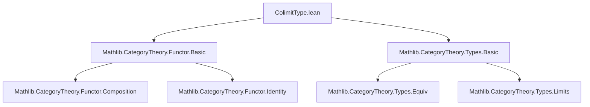
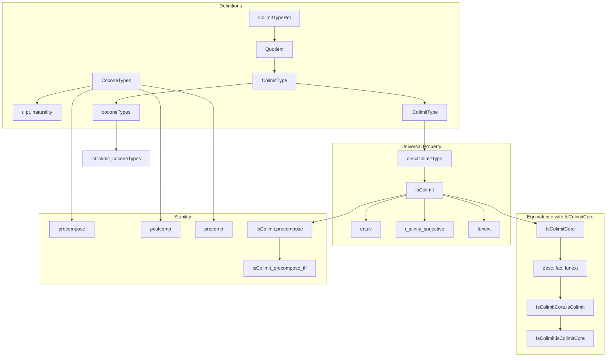

### Technical Brief: `ColimitType.lean`

---

#### **1. Key Definitions & Theorems**

| Name | Type / Structure | Purpose |
|------|------------------|---------|
| `CoconeTypes.{w₁} F` | `Structure` | A cocone for `F : J ⥤ Type w₀` with apex in `Type w₁`. Consists of a type `pt` and a family of maps `ι j : F.obj j → pt`, natural in `j`. |
| `ColimitTypeRel` | `Σ j, F.obj j → Σ j, F.obj j → Prop` | Binary relation generating the equivalence relation whose quotient defines the colimit type. `(j, x) ~ (j', x')` iff ∃ `f : j ⟶ j'` s.t. `x' = F.map f x`. |
| `ColimitType` | `Type (max u w₀)` | Quotient `(Σ j, F.obj j) / ColimitTypeRel`. Represents the colimit object in `Type`. |
| `ιColimitType j x` | `F.ColimitType` | Canonical map `F.obj j → F.ColimitType`, sending `x` to the equivalence class of `⟨j, x⟩`. |
| `coconeTypes` | `F.CoconeTypes` | The canonical cocone structure on `F.ColimitType` with structure maps `ιColimitType`. |
| `descColimitType c` | `F.ColimitType → c.pt` | Universal map from the colimit type to any cocone `c`. Defined via `Quot.lift`. |
| `IsColimit` | `Structure` | Property of a cocone `c`: the canonical map `descColimitType c` is a bijection. |
| `equiv` | `F.ColimitType ≃ c.pt` | Equivalence induced by `IsColimit` (via `Equiv.ofBijective`). |
| `IsColimitCore` | `Structure` | A universe-polymorphic version of the universal property: existence and uniqueness of mediating maps. |
| `isColimit_coconeTypes` | `F.coconeTypes.IsColimit` | Proof that the canonical cocone on `F.ColimitType` is a colimit. |
| `IsColimitCore.isColimit` | `c.IsColimit` | Equivalence between `IsColimitCore` and `IsColimit` under universe assumptions. |

---

#### **2. Naming Conventions**

- **Prefixes**:
  - `ι_`: structure maps of cocones (`ι`, `ιColimitType`, `c.ι`).
  - `desc_`: mediating maps from colimits (`descColimitType`, `hc.desc`).
  - `precompose_`, `postcomp_`: cocone transformations via pre/post-composition.
  - `isColimit_`, `IsColimitCore`: colimit-related properties.

- **Suffixes**:
  - `_type`: types (e.g., `ColimitType`, `CoconeTypes`).
  - `_rel`: relations (`ColimitTypeRel`).
  - `_core`: core universal property without assuming bijectivity.

- **Case**: Mixed `camelCase` and `PascalCase`; `IsColimit` and `IsColimitCore` use `PascalCase`, while `ιColimitType`, `descColimitType` use `camelCase`.

---

#### **3. Tactic Stack**

- **Core tactics**:
  - `aesop`: for naturality, equality of functions, and simple propositional reasoning.
  - `simp`: heavily used with `@[simp]` attributes (e.g., `ι_naturality`, `fac`, `fac_apply`).
  - `congr_fun`, `congr_arg`: for extensionality and function equality.
  - `funext`: for proving function equality.
  - `obtain ⟨…⟩ := …`: destructuring existential quantifiers and products.
  - `convert`, `ext`, ` rfl`: for constructing equivalences and equalities.

- **Advanced**:
  - `Quot.lift`, `Quot.sound`: for defining and reasoning about quotients.
  - `Equiv.ofBijective`: constructing equivalences from bijections.
  - `Function.comp_assoc`, `Function.id_comp`: for manipulating compositions.

---

#### **4. Proof Logic**

- **Quotient-based construction**:
  - Define a relation on `Σ j, F.obj j`.
  - Take quotient → `ColimitType`.
  - Define structure maps `ιColimitType`.
  - Prove universal property via `descColimitType` using `Quot.lift`.

- **Colimit characterization**:
  - `IsColimit` = bijectivity of `descColimitType`.
  - `IsColimitCore` = existence + uniqueness of mediating maps.
  - Prove equivalence: `IsColimit ↔ IsColimitCore` (under universe constraints).

- **Stability under transformations**:
  - `precompose`, `postcomp`, `precomp`: cocone transformations.
  - `IsColimit.precompose`, `isColimit_precompose_iff`: colimit property preserved under natural equivalences.

- **Inductive reasoning**:
  - Use `ιColimitType_jointly_surjective` to reduce proofs to elements of the form `ιColimitType j x`.
  - `funext` + surjectivity of `ι` to prove uniqueness.

---

#### **5. Imports**

- `Mathlib.CategoryTheory.Functor.Basic`
- `Mathlib.CategoryTheory.Types.Basic`

> **Scope**: Works entirely within `Type`-valued functors; no reliance on `CategoryTheory.Limits.Cocone` (explicitly avoids categorical cocones in `Type`).

---

#### **8. Mermaid Diagrams**

##### **Dependency Graph (Module Level)**



##### **Overview of Theory Flow**



##### **Relationship to Categorical Colimits (Future Work)**

```mermaid
graph LR
  subgraph Current Work
    A[ColimitType] --> B[IsColimit]
  end

  subgraph Categorical Colimits (TODO)
    C[Cocone F] --> D[IsColimitCocone]
  end

  B -->|w₁ = w₀| E[Equivalence with D]
```

---

### Summary

This file formalizes the **colimit of a diagram of types** using a concrete quotient construction, avoiding categorical cocones in `Type`. It introduces:
- A universe-polymorphic notion of cocone (`CoconeTypes`),
- A canonical colimit type (`ColimitType`) with universal property,
- Two equivalent characterizations of colimitness (`IsColimit`, `IsColimitCore`),
- Stability under natural equivalences and universe shifts.

The approach is constructive and elementary, relying on `Quot` and function extensionality, and sets the stage for future refactoring of `DirectedSystem` and general colimits in `Type`.
