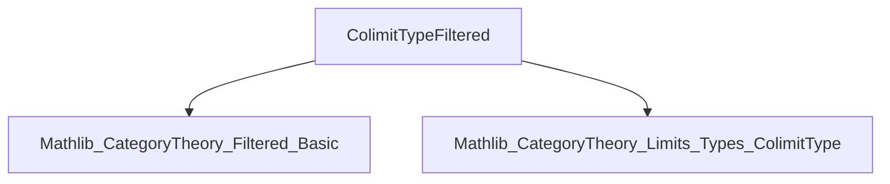
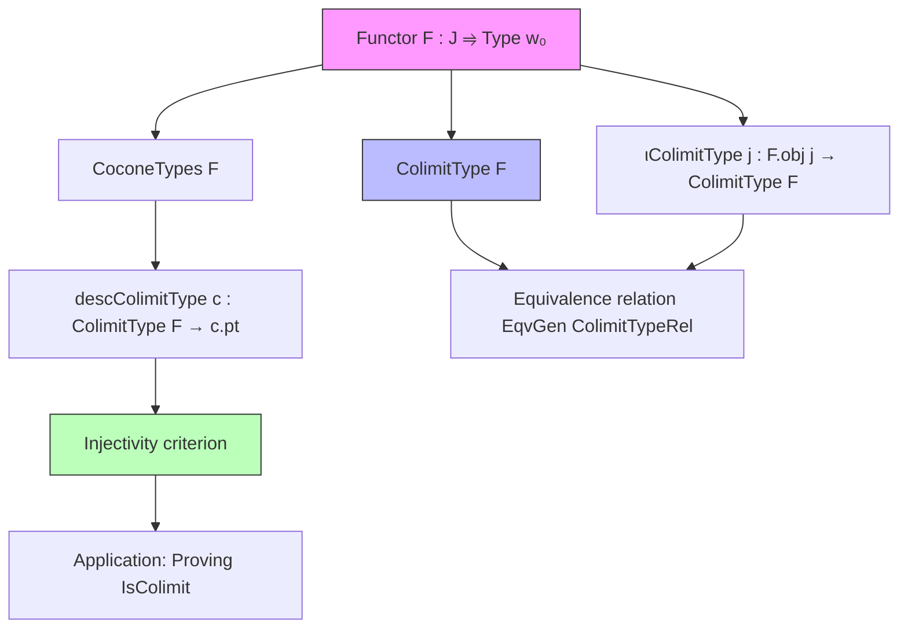
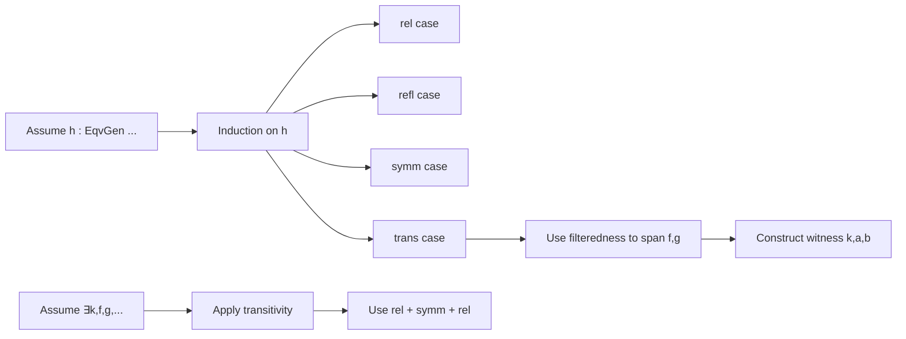

### Technical Brief: `ColimitTypeFiltered.lean`

---

#### **1. Key Definitions & Theorems**

| Name | Type / Signature | Purpose |
|------|------------------|---------|
| `F.ColimitTypeRel` | `Relation on (j : J) × F.obj j` | Base relation generating the equivalence relation for the colimit type in `Type w₀`. |
| `F.ιColimitType j x` | `F.obj j → F.ColimitType` | Canonical map from each component `F.obj j` into the colimit type. |
| `F.descColimitType c` | `F.ColimitType → c.pt` | Mediating map from the colimit type to the cocone vertex. |
| `eqvGen_colimitTypeRel_iff_of_isFiltered` | `Relation.EqvGen F.ColimitTypeRel x y ↔ ∃ k, f, g, F.map f x.2 = F.map g y.2` | Characterizes the equivalence relation generated by `ColimitTypeRel` in a filtered category: two elements are equivalent iff they become equal after mapping along some span. |
| `ιColimitType_eq_iff_of_isFiltered` | `F.ιColimitType j x = F.ιColimitType j' y ↔ ∃ k, f, f', F.map f x = F.map f' y` | Concrete condition for equality of images under the colimit injections. |
| `ιColimitType_eq_iff_of_isFiltered'` | Special case of above when `j = j'`. | Simplifies equality condition when both elements lie in the same component. |
| `descColimitType_injective_iff_of_isFiltered` | `Function.Injective (F.descColimitType c) ↔ ∀ j,j',x,x', c.ι j x = c.ι j' x' → ∃ k,f,f', F.map f x = F.map f' x'` | Gives a necessary and sufficient condition for the mediating map to be injective, crucial for proving that a cocone is a colimit. |
| `descColimitType_injective_iff_of_isFiltered'` | Variant for equal indices `j = j'`. | Used to simplify proofs where both elements come from the same component. |

---

#### **2. Naming Conventions**

- **Prefixes**:
  - `eqvGen_`: Relates to equivalence generation.
  - `ιColimitType_`: Refers to properties of the colimit injection maps.
  - `descColimitType_`: Pertains to the mediating map from the colimit type.
- **Suffixes**:
  - `_iff_of_isFiltered`: Indicates equivalence under the assumption that `J` is filtered.
  - `_iff_of_isFiltered'`: Variant for the case where both inputs share the same index.

---

#### **3. Tactic Stack**

- `induction h with | rel | refl | symm | trans =>`: Structural induction on equivalence generation.
- `rw [...]`, `simp [...]`, `simp only [...]`: Rewriting and simplification using definitions and naturality.
- `exact`, `refine`, `nth_rw`: Precision control in constructing proofs.
- `obtain ⟨...⟩ := ...`: Destructuring existential quantifiers and equalities.
- `have : ... := ...`: Intermediate lemma introduction.
- `rw [coeq_condition]`, `rw [FunctorToTypes.map_comp_apply]`: Category-theoretic simplifications.

---

#### **4. Proof Logic**

- **Inductive characterizations**: Proofs about `Relation.EqvGen` proceed by induction on the equivalence closure.
- **Spanning argument**: In filtered categories, any pair of morphisms `x.1 → k`, `y.1 → k'` can be spanned via some `k → l`, used in the `trans` case.
- **Reduction to common index**: For equal-index variants, use `coeq f f'` and `coeqHom f f'` to construct a common refinement.
- **Injectivity criterion**: Uses joint surjectivity of `ιColimitType` to reduce to checking equality on representatives, then applies the equivalence condition.

---

#### **5. Imports**

- `Mathlib.CategoryTheory.Filtered.Basic`: Provides `IsFiltered` and basic filtered category theory.
- `Mathlib.CategoryTheory.Limits.Types.ColimitType`: Defines `ColimitType`, `ιColimitType`, `descColimitType`, and related constructions.

---

#### **6. Mermaid Diagrams**

##### **Dependency Graph (Module Level)**

##### **Theoretical Overview (File Scope)**

##### **Proof Strategy Flow (for `eqvGen_colimitTypeRel_iff_of_isFiltered`)**

---

#### **7. Summary**

This file formalizes the concrete description of the equivalence relation underlying filtered colimits in `Type`. It provides essential lemmas for reasoning about equality in colimit types and injectivity of mediating maps — foundational for proving that a given cocone is a colimit. The filtered assumption is crucial for the “spanning” property used in transitivity and equality conditions.

--- 

Let me know if you'd like a formalized dependency graph for the entire `Mathlib` or a comparison with other colimit formalizations (e.g., `ColimitType` in non-filtered settings).
