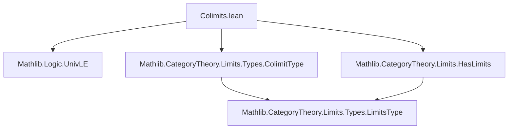
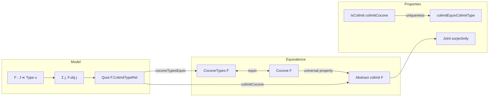

### Technical Brief: Colimits in `Type u`

---

#### **1. Key Definitions & Theorems**

| Name | Type / Signature | Purpose |
|------|------------------|---------|
| `CoconeTypes.{u} F ≃ Cocone F` | `coconeTypesEquiv` | Equivalence between type-theoretic cocones (with points in `Type u`) and categorical cocones. |
| `CoconeTypes.isColimit_iff` | `c.IsColimit ↔ Nonempty (IsColimit (F.coconeTypesEquiv c))` | Relates categorical colimitness of a cocone to its type-theoretic counterpart. |
| `colimitCocone` | `Cocone F` | Concrete colimit cocone for `F : J ⥤ Type u`, implemented via `F.coconeTypesEquiv` and `equivShrink`. |
| `colimitCoconeIsColimit` | `IsColimit (colimitCocone F)` | Proof that the concrete colimit cocone is indeed a colimit. |
| `hasColimit_iff_small_colimitType` | `HasColimit F ↔ Small.{u} F.ColimitType` | Characterizes existence of colimits in `Type u` by smallness of the quotient model `F.ColimitType`. |
| `colimitEquivColimitType` | `colimit F ≃ F.ColimitType` | Equivalence between abstract colimit object and concrete quotient model. |
| `colimit_sound`, `colimit_sound'` | `colimit.ι F j x = colimit.ι F j' x'` under compatibility conditions | Describes equality in the colimit via the generating equivalence relation. |
| `colimit_eq` | `colimit.ι F j x = colimit.ι F j' x' → Relation.EqvGen F.ColimitTypeRel ...` | Converse of `colimit_sound`: equality in colimit implies related in the generating relation. |
| `jointly_surjective`, `jointly_surjective'` | `∃ j y, t.ι.app j y = x` (or for `colimit F`) | Every element of a colimit cocone (or colimit object) is hit by some component of the cocone. |
| `nonempty_of_nonempty_colimit` | `Nonempty (colimit F) → Nonempty J` | If the colimit is inhabited, the index category must be inhabited. |

---

#### **2. Naming Conventions**

- **Prefixes**:
  - `colimit_`: for constructions/properties of the colimit object (`colimitEquivColimitType`, `colimit_sound`, `colimit_eq`, etc.)
  - `coconeTypes_`: for type-theoretic cocones (`coconeTypesEquiv`, `coconeTypes.postcomp`)
  - `isColimit_iff_`: for equivalences involving `IsColimit`
  - `hasColimit_`: for existence criteria (`hasColimit_iff_small_colimitType`)
  - `jointly_surjective`: for surjectivity of the colimiting cocone legs

- **Suffixes**:
  - `_apply`: for lemmas about application of morphisms (`ι_desc_apply`, `w_apply`, `ι_map_apply`)
  - `_symm_apply`: for inverses (`colimitEquivColimitType_symm_apply`)
  - `_iff`: for biconditionals (`isColimit_iff_coconeTypesIsColimit`, `hasColimit_iff_small_colimitType`)

---

#### **3. Tactic Stack**

Frequently used tactics in proofs:

- `aesop`: for automated reasoning in `colimitCoconeIsColimit`
- `simp` / `simp only`: for simplification, especially with `coconeTypesEquiv`, `equivShrink`, and `IsColimit` properties
- `ext`: extensionality for functions/relations
- `congr_fun`, `congr_arg`: for reasoning about equality of functions and applications
- `rw`: rewriting using lemmas like `colimit.w_apply`, `colimit.ι_desc_apply`
- `exact`, `refine`, `intro`: basic proof construction
- `classical`: for classical reasoning in `CoconeTypes.isColimit_iff`
- `nontriviality` / `by_contra` / `simp_rw [not_exists]`: for contradiction arguments in `jointly_surjective_of_isColimit`

---

#### **4. Proof Logic**

- **Main strategy**:
  - Use the *concrete model* `F.ColimitType` (a quotient of `Σ j, F.obj j`) to construct colimits.
  - Prove equivalence between categorical and type-theoretic cocones via `coconeTypesEquiv`.
  - Show that the concrete cocone is a colimit by reducing to `F.isColimit_coconeTypes` (a known result for type-theoretic colimits).
  - Use `equivShrink` to transport the colimit structure to the abstract `colimit F` object.
  - Prove properties (e.g., soundness, surjectivity) by transporting along `colimitEquivColimitType`.

- **Typical proof pattern**:
  1. Define concrete model (`F.ColimitType`, `colimitCocone`).
  2. Prove it satisfies the universal property (`colimitCoconeIsColimit`).
  3. Use uniqueness of colimits to get equivalence with abstract colimit (`colimitEquivColimitType`).
  4. Derive lemmas about `colimit.ι`, `colimit.desc`, etc., via transport and simplification.

- **Induction/quotient reasoning**:
  - Many proofs use `Quot.induction_on` or `Quot.eq` to reason about equality in the quotient.
  - `F.ιColimitType_jointly_surjective` is used to reduce to elements in the image of the colimiting cocone.

---

#### **5. Imports & Dependencies**

- `Mathlib.Logic.UnivLE`: universe level comparisons (`UnivLE.{v, u}`)
- `Mathlib.CategoryTheory.Limits.HasLimits`: general limit/colimit infrastructure
- `Mathlib.CategoryTheory.Limits.Types.ColimitType`: concrete colimit model in `Type u`

> **Scope**: This module formalizes *all* colimits in the category `Type u`, using quotient-based models. It is foundational for constructing colimits in more complex categories via Yoneda or algebraic theories.

---

#### **6. Mermaid Diagrams**

##### **Dependency Graph (Module Level)**



##### **Theoretical Overview (Colimit Construction)**



##### **Proof Flow for `colimitCoconeIsColimit`**

```mermaid
graph TD
  A[HasSmall F.ColimitType] --> B[colimitCocone F]
  B --> C[coconeTypesEquiv (F.coconeTypes.postcomp ...)]
  C --> D[IsColimit of concrete cocone]
  D --> E[IsColimit of colimitCocone]
  E --> F[colimitCoconeIsColimit]
```

---

#### **7. Summary**

This module establishes that **`Type u` has all colimits**, by:
- Providing a concrete model (`F.ColimitType`) as a quotient of a sigma type.
- Proving equivalence between categorical and type-theoretic cocones.
- Showing the concrete model satisfies the universal property.
- Transporting this structure to the abstract colimit object via uniqueness.

It serves as a cornerstone for higher categorical constructions in `Type`, and is used extensively in sheaf theory, homological algebra, and homotopy type theory formalizations.

--- 

*End of Technical Brief.*
