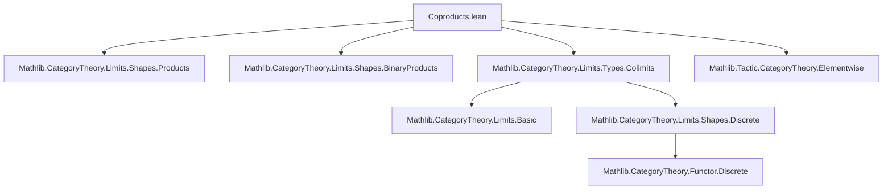
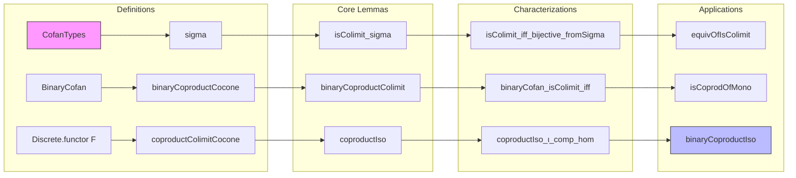
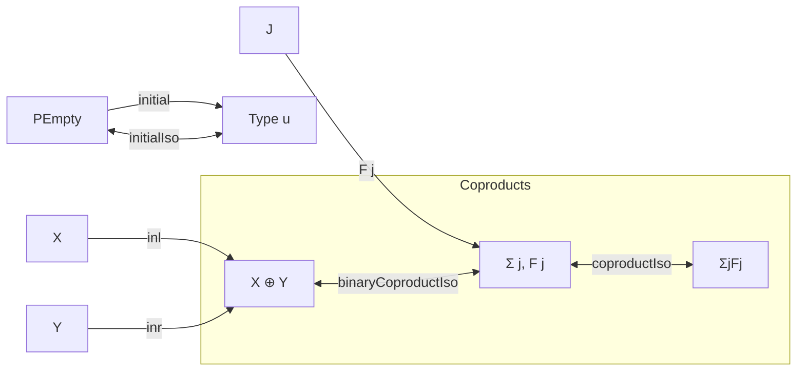

### Technical Brief: Coproducts in `Type` (Lean 4 Formalization)

---

#### **1. Key Definitions & Theorems**

| Name | Type / Signature | Purpose |
|------|------------------|---------|
| `CofanTypes` | `abbrev CofanTypes := Functor.CoconeTypes.{w} (Discrete.functor F)` | Represents a "cofan" (pre-cocone) for a diagram `F : C → Type v`, with apex in `Type w`. |
| `sigma` | `def sigma : CofanTypes F` | Constructs the canonical cofan over `F` with apex `Σ i, F i`. |
| `isColimit_mk` | `lemma isColimit_mk ... : Functor.CoconeTypes.IsColimit c` | Provides a criterion for a cofan to be a colimit: surjectivity of injections, injectivity per component, and disjointness of images. |
| `isColimit_sigma` | `lemma isColimit_sigma : IsColimit (sigma F)` | Proves the sigma-type cofan is a colimit. |
| `fromSigma` | `def fromSigma (c : CofanTypes F) (x : Σ i, F i) : c.pt` | Canonical map from sigma-type to apex of any cofan. |
| `isColimit_iff_bijective_fromSigma` | `lemma isColimit_iff_bijective_fromSigma : c.IsColimit ↔ Function.Bijective c.fromSigma` | Characterizes colimits via bijectivity of `fromSigma`. |
| `equivOfIsColimit` | `noncomputable def equivOfIsColimit : (Σ i, F i) ≃ c.pt` | Equivalence between sigma-type and colimit apex when `c` is a colimit. |
| `initialColimitCocone` | `def initialColimitCocone : ColimitCocone (Functor.empty ...)` | Constructs initial object colimit as `PEmpty`. |
| `initialIso` | `noncomputable def initialIso : ⊥_ Type u ≅ PEmpty` | Identifies initial object in `Type u` with `PEmpty`. |
| `binaryCoproductCocone` | `def binaryCoproductCocone (X Y : Type u) : Cocone (pair X Y)` | Cocone for binary coproduct using `Sum.inl`, `Sum.inr`. |
| `binaryCoproductColimit` | `def binaryCoproductColimit (X Y : Type u) : IsColimit ...` | Proves `X ⊕ Y` is the binary coproduct in `Type`. |
| `binaryCoproductIso` | `noncomputable def binaryCoproductIso : coprod X Y ≅ X ⊕ Y` | Categorical binary coproduct ≅ sum type. |
| `binaryCofan_isColimit_iff` | `theorem binaryCofan_isColimit_iff ...` | Characterizes binary coproducts: injections injective + disjoint ranges. |
| `isCoprodOfMono` | `noncomputable def isCoprodOfMono ...` | Any monomorphism `f : X → Y` in `Type` extends to a coproduct diagram with its complement inclusion. |
| `coproductColimitCocone` | `def coproductColimitCocone {J : Type v} (F : J → Type ...) : ColimitCocone ...` | Constructs colimit cocone for arbitrary diagram `F : J → Type`. |
| `coproductIso` | `noncomputable def coproductIso : ∐ F ≅ Σ j, F j` | Categorical coproduct ≅ sigma type. |

---

#### **2. Naming Conventions**

- **Prefixes**:
  - `isColimit_`: Lemmas about when a cocone is a colimit.
  - `fromSigma`, `equivOfIsColimit`: Maps/ equivalences involving sigma types and colimits.
  - `inj_*`: Properties of injection maps (`inj_injective`, `inj_jointly_surjective`).
  - `binaryCoproduct*`, `coproduct*`: Binary and general coproduct constructions.
  - `initial*`: Initial object constructions.

- **Suffixes**:
  - `_cocone`: Cocone data (pre-colimit).
  - `_colimit`: Full colimit (with `IsColimit` proof).
  - `_iso`: Isomorphism identifying categorical construction with type-theoretic one.

- **`[elementwise]` attributes**: Used for lemmas like `binaryCoproductIso_inl_comp_hom`, enabling element-wise reasoning.

---

#### **3. Tactic Stack**

- **Core tactics**:
  - `aesop`: For automated reasoning in `isColimit_mk` and `isColimit_iff_bijective_fromSigma`.
  - `rw`, `congr_arg`, `funext`: Standard extensionality and rewriting.
  - `cases`, `obtain`, `rcases`: For destructuring existential/universal hypotheses.
  - `simp` / `simp only`: Simplification with `@[simps]` lemmas and `@[elementwise]`.
  - `intro`, `exact`, `refine`: Basic proof construction.
  - `dsimp`, `erw`: Deep simplification and rewrite with definitional equality.

- **Category-theoretic helpers**:
  - `colimit.isoColimitCocone_*`: For reasoning about colimit isomorphisms.
  - `Discrete.eq_of_hom`, `Discrete.recOn`, `Discrete.natTrans`: Reasoning about discrete diagrams.

---

#### **4. Proof Logic**

- **General pattern**:
  1. **Construct candidate colimit** (e.g., `sigma`, `X ⊕ Y`, `PEmpty`).
  2. **Verify universal property**:
     - Define `desc` (mediating map).
     - Prove `fac`: compatibility with injections.
     - Prove `uniq`: uniqueness of mediating map.
  3. **Alternative characterizations**:
     - Use `isColimit_mk` to verify injectivity, surjectivity, and disjointness.
     - Prove equivalence with bijectivity of `fromSigma`.
  4. **Derive isomorphisms** via `colimit.isoColimitCocone`.

- **Binary case**:
  - Use `binaryCofan_isColimit_iff` to reduce to set-theoretic conditions (injectivity + disjoint ranges).
  - Prove via case analysis on membership in ranges.

- **Monomorphism case**:
  - Use `mono_iff_injective` to reduce to injectivity.
  - Show complement inclusion gives coproduct.

- **Elementwise reasoning**:
  - Enabled by `@[elementwise]` attribute and `CategoryTheory.Elementwise` import.
  - Allows reasoning like `f ≫ g = h` to be treated as `∀ x, f x ≫ g = h x`.

---

#### **5. Imports & Dependencies**

| Import | Role |
|--------|------|
| `Mathlib.CategoryTheory.Limits.Shapes.Products` | General product theory (used for duality context). |
| `Mathlib.CategoryTheory.Limits.Shapes.BinaryProducts` | Binary products (dual to coproducts). |
| `Mathlib.CategoryTheory.Limits.Types.Colimits` | Colimits in `Type` (base theory for this file). |
| `Mathlib.Tactic.CategoryTheory.Elementwise` | Enables elementwise reasoning for morphisms. |

---

#### **6. Mermaid Diagrams**

##### **Dependency Graph (Module-Level)**

##### **Overview of Theory Flow**

##### **Categorical Structure Summary**

---

#### **7. Summary**

This file formalizes the concrete description of **coproducts** in the category `Type`:
- General coproducts are sigma types `Σ j, F j`.
- Binary coproducts are sum types `X ⊕ Y`.
- Initial object is `PEmpty`.

It bridges categorical colimits with type-theoretic constructions, providing:
- Explicit constructions (`sigma`, `binaryCoproductCocone`, `coproductColimitCocone`),
- Verification of colimit universal properties (`isColimit_*`),
- Equivalences between categorical and type-theoretic objects (`coproductIso`, `binaryCoproductIso`),
- Useful characterizations (`binaryCofan_isColimit_iff`, `isCoprodOfMono`).

The proofs rely heavily on set-theoretic reasoning (injectivity, disjointness, surjectivity), enabled by Lean’s type theory and the `Elementwise` tactic infrastructure.
