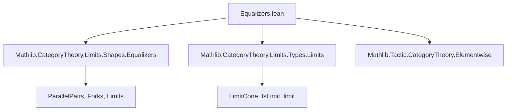
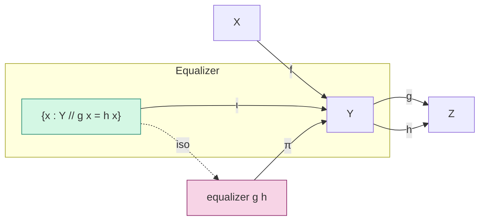

**Technical Brief: Equalizers in `Type` (from `Equalizers.lean`)**

---

### 1. **Key Definitions & Theorems**

| Name | Type / Signature | Purpose |
|------|------------------|---------|
| `typeEqualizerOfUnique` | `(t : ∀ y : Y, g y = h y → ∃! x : X, f x = y) → IsLimit (Fork.ofι _ w)` | Constructs a limiting cone (i.e., an equalizer) from a *uniqueness condition* on elements satisfying $g(y) = h(y)$. |
| `unique_of_type_equalizer` | `(t : IsLimit (Fork.ofι _ w)) → ∀ y, g y = h y → ∃! x, f x = y` | Converse: if the fork is limiting, then every $y$ with $g(y)=h(y)$ lifts uniquely through $f$. |
| `type_equalizer_iff_unique` | `Nonempty (IsLimit (Fork.ofι _ w)) ↔ ∀ y, g y = h y → ∃! x, f x = y` | Equivalence between categorical equalizer existence and the set-theoretic uniqueness condition. |
| `equalizerLimit` | `Limits.LimitCone (parallelPair g h)` | Explicit construction of the limit cone using the subtype $\{x : Y \mid g(x) = h(x)\}$. |
| `equalizerIso` | `equalizer g h ≅ { x : Y // g x = h x }` | Shows the abstract categorical equalizer is isomorphic to the subtype equalizer. |
| `equalizerIso_hom_comp_subtype` | `(equalizerIso g h).hom ≫ Subtype.val = equalizer.ι g h` | Commutativity of the iso with the equalizer morphism (elementwise). |
| `equalizerIso_inv_comp_ι` | `(equalizerIso g h).inv ≫ equalizer.ι g h = Subtype.val` | Dual commutativity (elementwise). |

---

### 2. **Naming Conventions**

- **Prefixes**:
  - `typeEqualizerOfUnique`: `type_` indicates working in `Type u` (i.e., concrete sets/maps).
  - `equalizerIso`: `equalizer_` + `Iso` for isomorphism involving the equalizer.
- **Suffixes**:
  - `_ofUnique`: indicates construction from a uniqueness property.
  - `_iff_unique`: indicates equivalence with a uniqueness condition.
- **Elementwise lemmas**:
  - `equalizerIso_hom_comp_subtype`, `equalizerIso_inv_comp_ι`: use `elementwise` attribute for `simp`-friendly rewriting in element-based reasoning.

---

### 3. **Tactic Stack**

Frequent tactics used in proofs:
- `Classical.choose`, `Classical.choose_spec`: for extracting witnesses and properties from ∃!.
- `funext`: extensionality for functions and dependent functions.
- `congr_fun`: to apply function extensionality to equalities of functions.
- `Fork.IsLimit.mk'`, `Fork.IsLimit.lift'`, `Fork.IsLimit.hom_ext`: constructing/using limits in forks.
- `limit.isoLimitCone`, `limit.isoLimitCone_inv_π`: connecting abstract limits with concrete cones.
- `Subtype.ext`: extensionality for subtypes (equality of pairs).
- `Classical.choice`: for nonempty → choice.

---

### 4. **Proof Logic**

- **Forward direction (`typeEqualizerOfUnique`)**:
  - Given uniqueness of lifts for all $y$ with $g(y)=h(y)$, construct the lift for any cone $s$ by picking the unique $x$ for each $s.ι(i)$.
  - Use `Classical.choose` to get the witness, and `choose_spec` for uniqueness and commutativity.

- **Reverse direction (`unique_of_type_equalizer`)**:
  - Assume the fork is limiting.
  - For a given $y$ with $g(y)=h(y)$, consider the constant map $y' : \text{PUnit} \to Y$.
  - Use the universal property to get a lift $\text{PUnit} \to X$, i.e., an element $x : X$.
  - Show uniqueness via `Fork.IsLimit.hom_ext`.

- **Equivalence (`type_equalizer_iff_unique`)**:
  - Combine both directions using `⟨…, …⟩`.
  - Use `Classical.choice` to get a limit cone from nonempty.

- **Explicit equalizer (`equalizerLimit`)**:
  - Directly define the cone over the subtype.
  - Construct lift: send $i$ to $\langle s.ι(i), s.\text{condition}(i) \rangle$.
  - Show uniqueness via `Subtype.ext`.

- **Isomorphism (`equalizerIso`)**:
  - Use `limit.isoLimitCone` to relate the abstract equalizer (defined via limits) to the concrete `equalizerLimit`.

---

### 5. **Imports & Dependencies**

| Import | Role |
|--------|------|
| `Mathlib.CategoryTheory.Limits.Shapes.Equalizers` | Defines the abstract `equalizer` object and its universal property. |
| `Mathlib.CategoryTheory.Limits.Types.Limits` | Provides infrastructure for limits in `Type u`, including `limit`, `LimitCone`, etc. |
| `Mathlib.Tactic.CategoryTheory.Elementwise` | Enables `@[elementwise]` attribute for rewriting equalities pointwise (e.g., for `simp`). |

---

### 6. **Mermaid Diagrams**

#### **Dependency Graph (Module-Level)**



#### **Conceptual Overview of Equalizer Construction**



#### **Universal Property Flow**

```mermaid
graph TD
  W["W"] -- m --> X
  W -- s.ι --> Y
  Y -- g --> Z
  Y -- h --> Z
  s.ι == g ∘ s.ι = h ∘ s.ι [condition]
  X -- f --> Y
  W -- ∃! lift --> X
  lift -.-> m
  lift -.-> s.ι = f ∘ lift
  style W fill:#f0f0f0,stroke:#aaa
  style X fill:#e6f7ff,stroke:#1890ff
  style Y fill:#fff7e6,stroke:#faad14
  style Z fill:#fff1f0,stroke:#f5222d
```

---

### 7. **Summary**

This file formalizes the concrete description of equalizers in the category `Type u`: the equalizer of $g, h : Y \rightrightarrows Z$ is the subtype $\{x : Y \mid g(x) = h(x)\}$. It proves:
- That this subtype satisfies the universal property (via `equalizerLimit`).
- That the categorical equalizer (abstractly defined) is isomorphic to this subtype (`equalizerIso`).
- A clean equivalence between categorical and set-theoretic characterizations (`type_equalizer_iff_unique`).

The proofs rely heavily on classical choice and elementwise reasoning, enabled by `Elementwise` tactics and `Subtype` machinery.

--- 

Let me know if you'd like a formalized summary in Lean syntax or a visualization of the proof structure.
