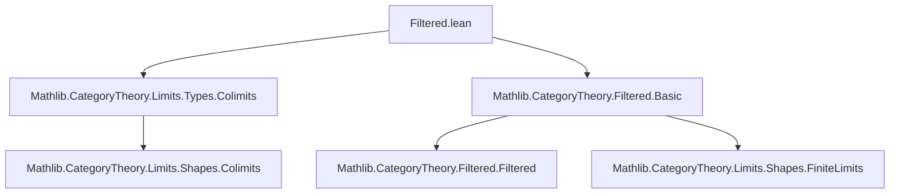

### Technical Brief: `Filtered.lean` — Filtered Colimits in `Type`

---

#### **1. Key Definitions & Theorems**

| Name | Type / Signature | Purpose |
|------|------------------|---------|
| `Rel` | `Rel (x y : Σ j, F.obj j) : Prop` | Defines a *directed* relation: $x = (i, x_i), y = (j, x_j)$ are related iff $\exists k, f: i \to k, g: j \to k$ s.t. $F(f)(x_i) = F(g)(x_j)$. Used to characterize equality in filtered colimits. |
| `rel_of_colimitTypeRel` | `F.ColimitTypeRel x y → Rel F x y` | Shows that the *colimit type relation* (used in `ColimitType`) implies `Rel`. |
| `eqvGen_colimitTypeRel_of_rel` | `Rel F x y → EquivGen(F.ColimitTypeRel) x y` | Shows `Rel` is contained in the equivalence closure of `ColimitTypeRel`. |
| `isColimitOf` | `(t : Cocone F) → (∀ x, ∃ i xi, x = t.ι.app i xi) → (∀ i j xi xj, t.ι.app i xi = t.ι.app j xj → ∃ k f g, F.map f xi = F.map g xj) → IsColimit t` | Universal property: if cocone is jointly surjective and injective *modulo directed identification*, then it’s a colimit. |
| `isColimitOf'` | Slightly weaker injectivity condition: only checks equality *within same index* and uses filteredness to extend. | Easier to verify in practice. |
| `rel_equiv` | `Equivalence (Rel F)` | Proves `Rel` is an equivalence relation (refl, symm, trans), crucial for identifying it with the equivalence closure. |
| `rel_eq_eqvGen_colimitTypeRel` | `Rel F = EquivGen(F.ColimitTypeRel)` | Shows `Rel` coincides with the equivalence relation used to construct the colimit in `Type`. |
| `colimit_eq_iff_aux` | `(colimitCocone F).ι.app i xi = (colimitCocone F).ι.app j xj ↔ Rel F ⟨i, xi⟩ ⟨j, xj⟩` | Intermediate step linking colimit equality to `Rel`. |
| `isColimit_eq_iff` | `t.ι.app i xi = t.ι.app j xj ↔ ∃ k f g, F.map f xi = F.map g xj` | **Main theorem**: equality in *any* colimit cocone is characterized by eventual agreement in the diagram. |
| `isColimit_eq_iff'` | Special case of `isColimit_eq_iff` for equal indices: $x = y$ in cocone iff eventually equal under some $f: i \to j$. | Useful for checking injectivity of structure maps. |
| `colimit_eq_iff` | `colimit.ι F i xi = colimit.ι F j xj ↔ ∃ k f g, F.map f xi = F.map g xj` | Explicit description of equality in the *standard* filtered colimit in `Type`. |
| `jointly_surjective_of_isColimit₂` | `IsColimit t → ∀ x₁ x₂, ∃ j, x₁, x₂$ both in image of $t.ι.app j` | Any two points in a colimit cocone are jointly covered by a single stage — a consequence of filteredness. |

---

#### **2. Naming Conventions**

- **Prefixes**:
  - `Rel`: for binary relations on dependent sums.
  - `isColimitOf` / `isColimitOf'`: criteria for recognizing colimits.
  - `colimit_eq_iff`: characterizations of equality in colimits.
- **Suffixes**:
  - `_aux`: intermediate lemmas.
  - `_iff`: biconditional characterizations.
  - `'` (prime): variant with relaxed assumptions (e.g., `isColimitOf'`).
- **Structure**:
  - `F.ColimitTypeRel`: relation used in `ColimitType` construction.
  - `FilteredColimit.Rel`: new, more convenient relation defined in this file.

---

#### **3. Tactic Stack**

Frequent tactics used:
- `rw`, `simp`, `dsimp`: for rewriting and simplifying naturality, identity, and composition.
- `exact`, `refine`, `convert`: constructing proofs term-by-term.
- `nth_rw`: for targeted rewriting (e.g., `nth_rw 1 [hf x]`).
- `congr_fun`, `congr_arg`: functional extensionality.
- `cases`, `obtain`, `let`: destructuring and introducing witnesses.
- `calc`: chaining equalities (especially in `rel_equiv.trans`).
- `aesop` not used — proofs are mostly manual and categorical.

---

#### **4. Proof Logic**

- **Structure of main proofs**:
  1. **Define a candidate relation** (`Rel`) that is easier to reason with.
  2. **Show it coincides with the equivalence closure** of the standard colimit relation (`ColimitTypeRel`).
  3. **Prove it is an equivalence** (refl, symm, trans) using filteredness (e.g., `IsFiltered.cocone_objs`, `cocone_maps`).
  4. **Leverage universal properties** (`isColimitOf`, `isColimitOf'`) to lift characterizations to arbitrary colimits.
  5. **Use uniqueness of colimits** (`coconePointUniqueUpToIso`) to transfer results from the standard colimit to any colimit.

- **Key logical flow**:
  - *Indirect characterization*: Instead of working directly with quotient types, relate equality to *existence of a common extension*.
  - *Filteredness is essential*: Used to glue indices (`max`, `leftToMax`, `rightToMax`, `coeq`) and ensure diagrams can be made to commute.

---

#### **5. Imports**

- `Mathlib.CategoryTheory.Limits.Types.Colimits`: defines `ColimitType`, `colimitCocone`, `IsColimit`, etc.
- `Mathlib.CategoryTheory.Filtered.Basic`: defines filtered categories (`IsFiltered`), maxima, cocones over finite diagrams.

---

#### **6. Mermaid Diagrams**

##### **Dependency Graph (Module-Level)**



##### **Overview of Theory Flow**

```mermaid
flowchart LR
  subgraph Setup
    J[Category J] -->|Filtered| F[F : J ⥤ Type]
  end

  subgraph Construction
    Rel[Rel on Σj, F.obj j] -->|Equivalence| EqvGen[EquivGen(ColimitTypeRel)]
    EqvGen --> Colim[Colimit in Type]
  end

  subgraph Characterization
    Colim -->|ι_i x = ι_j y| ↔[↔] Rel
    Rel -->|iff| ∃k,f,g, F f x = F g y
  end

  subgraph Applications
    isColimitOf -->|Universal property| Colim
    jointly_surj[Joint surjectivity] -->|Uses filtered max| Colim
  end

  style ↔ fill:#ffe4b2,stroke:#333
  style Rel fill:#e6e6fa,stroke:#333
  style Colim fill:#add8e6,stroke:#333
```

##### **Equality Characterization (Core Lemma)**

```mermaid
flowchart LR
  A[t.ι i x = t.ι j y] -->|ht : IsColimit t| B[∃ k, f: i→k, g: j→k, F f x = F g y]
  B -->|filteredness| C[max(i,j) + cocone maps]
  C -->|naturality| A
```

---

#### **7. Summary**

This file provides a *concrete and usable* description of equality in filtered colimits of types: two elements are equal iff they become equal after mapping forward along some pair of arrows into a common object. This is foundational for working with filtered colimits in `Type`, especially in algebraic contexts (e.g., direct limits of groups, rings, modules), where one needs to reason about when elements become equal in a colimit.

The key insight is that **filteredness allows gluing of indices**, turning the abstract quotient construction into a *directed witness-based* criterion. This is formalized via the `Rel` relation and its equivalence to the standard colimit equivalence.
