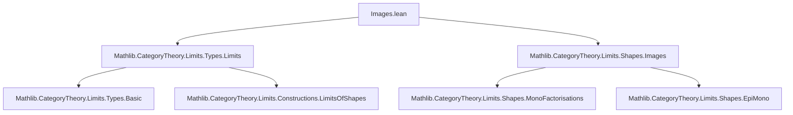
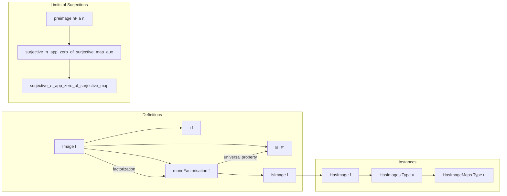

**Technical Brief: Images in the Category of Types (`Images.lean`)**

---

### 1. KEY DEFINITIONS & THEOREMS

| Name | Type / Signature | Purpose |
|------|------------------|---------|
| `Image f` | `Type u` | Represents the categorical image of `f : α ⟶ β` as `Set.range f`. |
| `Image.ι f` | `Image f ⟶ β` | The inclusion (monomorphism) of the image into the codomain. |
| `Image.lift F'` | `Image f ⟶ F'.I` | Universal morphism from `Image f` to any other mono-factor `F'` of `f`. |
| `Image.lift_fac F'` | `Image.lift F' ≫ F'.m = Image.ι f` | Verifies the universal property: the lift commutes with the mono part of the factorization. |
| `monoFactorisation f` | `MonoFactorisation f` | Explicit factorization of `f` as `e ≫ m`, where `m = Image.ι f` is mono and `e = Set.rangeFactorization f` is epi. |
| `isImage f` | `IsImage (monoFactorisation f)` | Shows `monoFactorisation f` satisfies the universal property of a categorical image. |
| `hasImage f` | `HasImage f` | Instance asserting every morphism in `Type u` has an image. |
| `hasImages_Type` | `HasImages (Type u)` | Instance: all morphisms in `Type u` have images. |
| `hasImageMaps_Type` | `HasImageMaps (Type u)` | Instance: images are stable under pullback (i.e., image maps exist for any span with mono). |
| `limitOfSurjectionsSurjective.preimage hF a n` | `F.obj ⟨n⟩` | Auxiliary construction of a compatible sequence in a diagram of surjections. |
| `surjective_π_app_zero_of_surjective_map_aux` | `Function.Surjective ((limitCone F).π.app ⟨0⟩)` | Shows the projection from the limit to the 0-th object is surjective under surjectivity of all connecting maps. |
| `surjective_π_app_zero_of_surjective_map` | `Function.Surjective (c.π.app ⟨0⟩)` | Generalization: any limiting cone over a ωᵒᵖ-diagram of surjections has surjective 0-th projection. |

---

### 2. NAMING CONVENTIONS

- **Prefixes**:
  - `Image.`: for definitions/instances tied to the categorical image object.
  - `limitOfSurjectionsSurjective.`: internal namespace for auxiliary lemmas about limits of surjective diagrams.
- **Suffixes**:
  - `lift`: universal morphism into a factorization.
  - `fac`: factorization property (e.g., `lift_fac`).
  - `ι`: canonical inclusion (Greek iota, standard for monos).
  - `app`: component of a natural transformation/cone at an object.
- **General**:
  - `monoFactorisation`, `isImage`, `hasImage`, `hasImages`, `hasImageMaps`: standard pattern for categorical structure instances.

---

### 3. TACTIC STACK

- `funext`: extensionality for functions (used repeatedly to prove morphism equality).
- `rw`: rewriting using equalities (especially `fac`, `choose_spec`, `ih`).
- `induction`: on natural numbers (for `surjective_π_app_zero_of_surjective_map_aux`).
- `erw`: rewriting with definitional equality (used for `map_id`, `map_comp`).
- `simp only [...] at p`: simplification with explicit lemmas to manipulate functorial action.
- `have`, `replace`: local hypothesis manipulation.
- `infer_instance`: to discharge typeclass goals (`Mono`, `HasImage`, etc.).
- `apply Function.Surjective.comp`: composition of surjections.
- `classical`: implicit via `Classical.indefiniteDescription` and `Classical.choose`.

---

### 4. PROOF LOGIC

- **Image construction**:
  - Define image as `Set.range f`.
  - Show `ι : im f ↪ β` is mono (via injectivity).
  - Construct `lift` using classical choice to pick a preimage in any mono-factor.
  - Prove `lift_fac` by unfolding definitions and using `choose_spec`.
  - Package as `monoFactorisation` and show it satisfies `IsImage`.

- **Stability under pullback** (`hasImageMaps`):
  - Transport image along a span with mono using `HasImageMap.transport`.
  - Define map on components using surjectivity of the span’s legs and `choose`.

- **Limits of surjections**:
  - Construct compatible sequence via dependent recursion (`preimage`).
  - Prove surjectivity of the 0-th cone map by induction on naturality and surjectivity of structure maps.
  - Extend to arbitrary limiting cones via uniqueness of limiting cones.

---

### 5. IMPORTS

- `Mathlib.CategoryTheory.Limits.Types.Limits`: basic limits in `Type`.
- `Mathlib.CategoryTheory.Limits.Shapes.Images`: general theory of images in categories.

These imports provide:
- General categorical limit machinery.
- Abstract definitions of `HasImage`, `IsImage`, `MonoFactorisation`, `HasImageMaps`.
- Tools for reasoning about monos, epis, and factorizations.

---

### 6. MERMAID DIAGRAMS

#### Dependency Graph (Module-Level)

#### Overview of File Structure

---

### 7. SUMMARY

This file establishes that the category `Type u` has all images, and that these coincide with the usual set-theoretic range of a function. It constructs the image as a subtype, proves its universal property, and shows stability under pullback. Additionally, it proves a nontrivial lemma about limits of ωᵒᵖ-diagrams of surjections: the projection to the initial object remains surjective — a key ingredient in descent arguments and in proving that `Type` is a *regular* category.

The proofs rely heavily on classical choice (`Classical.indefiniteDescription`) and standard tactic scripting in Lean’s `mathlib` style: explicit construction, verification via `funext` and `rw`, and induction for infinite diagrams.
