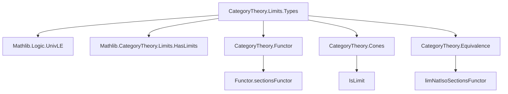
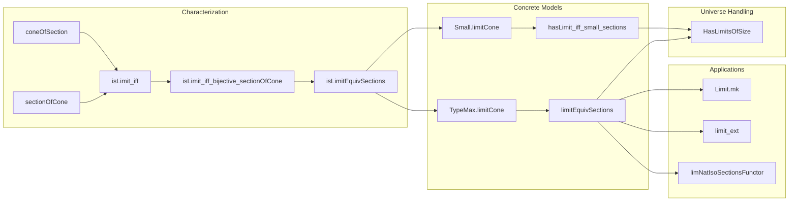

### Technical Brief: Limits in the Category of Types (`Limits.lean`)

---

#### **1. Key Definitions & Theorems**

| Name | Type / Signature | Purpose |
|------|------------------|---------|
| `coneOfSection` | `s ∈ F.sections → Cone F` | Constructs a cone over `F` with cone point `PUnit` from a section of `F`. |
| `sectionOfCone` | `Cone F → c.pt → F.sections` | From a cone and a point in its apex, produces a section of `F`. |
| `isLimit_iff` | `∀ c : Cone F, Nonempty (IsLimit c) ↔ ∀ s ∈ F.sections, ∃! x : c.pt, ∀ j, c.π.app j x = s j` | Characterizes limiting cones via uniqueness of lifts to sections. |
| `isLimit_iff_bijective_sectionOfCone` | `∀ c : Cone F, Nonempty (IsLimit c) ↔ (sectionOfCone c).Bijective` | Equivalence between being a limit and `sectionOfCone` being bijective. |
| `isLimitEquivSections` | `IsLimit c → c.pt ≃ F.sections` | Explicit equivalence between the apex of a limiting cone and the type of sections. |
| `limitCone` (in `Small`) | `[Small F.sections] → Cone F` | Concrete limit cone for small-indexed diagrams, using `Shrink F.sections`. |
| `limitConeIsLimit` (in `Small`) | `[Small F.sections] → IsLimit (limitCone F)` | Proves the above cone is limiting. |
| `hasLimit_iff_small_sections` | `HasLimit F ↔ Small F.sections` | Links existence of limits to smallness of sections. |
| `limitCone` (in `TypeMax`) | `Cone F` (no smallness assumption) | Simpler concrete limit cone: apex = `F.sections`. |
| `limitConeIsLimit` (in `TypeMax`) | `IsLimit (limitCone F)` | Proves this cone is limiting (definitionally). |
| `limitEquivSections` | `limit F ≃ F.sections` | Abstract-concrete equivalence for limits (via `limit.isLimit`). |
| `Limit.mk` | `(x : ∀ j, F.obj j) → (h : coherent) → limit F` | Constructs a limit element from a coherent family. |
| `limit_ext`, `limit_ext'`, `limit_ext_iff'` | Extensionality lemmas for limits | Equality of limit elements is determined by projections. |
| `limNatIsoSectionsFunctor` | `lim ≅ Functor.sectionsFunctor` | Natural isomorphism between limit functor and sections functor. |

---

#### **2. Naming Conventions**

- **Prefixes**:
  - `coneOf_`, `sectionOf_`: Constructions going between cones and sections.
  - `limitCone`, `limitEquiv`, `Limit.mk`: Concrete/abstract limit constructions.
  - `isLimit_`, `hasLimit_`: Properties of limits.
- **Suffixes**:
  - `_apply`: Applied versions of lemmas (e.g., `lift_π_apply`).
  - `_iff`, `_bijective`: Logical equivalences or properties.
  - `_ext`, `_ext'`: Extensionality lemmas (with variants for different universe levels).
- **Namespace prefixes**:
  - `Small.`, `TypeMax.`, `UnivLE.`: Distinguish implementation strategies.

---

#### **3. Tactic Stack**

Frequent tactics used in proofs:

- `ext`: Extensionality (for functions, subtypes, products).
- `funext`, `congr_fun`, `congr_arg`: Functional extensionality and congruence.
- `simp` / `simp_rw`: Simplification with definitional equalities and lemmas.
- `exact`, `refine`, `choose`: Proof construction and choice.
- `conv_rhs`: Rewriting in right-hand side of equations.
- `dsimp`: Definitional simplification.
- `apply`, `symm`, `rw`: Basic proof scripting.
- `aesop`: Not used here — this file is mostly definitional and constructive.

---

#### **4. Proof Logic**

- **Structure**:
  1. **Characterization**: Prove `isLimit_iff` by constructing lifts/uniqueness via `coneOfSection` and `sectionOfCone`.
  2. **Equivalence**: Derive `isLimitEquivSections` from `isLimit_iff`, showing apex ≃ sections.
  3. **Concrete models**:
     - `Small`: Assumes `Small F.sections`, uses `Shrink` to ensure `u`-smallness.
     - `TypeMax`: Works in `Type (max v u)`, avoids `Shrink`, defines limit as `F.sections` directly.
  4. **Universes & Instances**:
     - Use `UnivLE.{v, u}` to ensure `v`-small limits exist in `Type u`.
     - Prove `HasLimitsOfSize` via `hasLimit_iff_small_sections`.
  5. **Lemmas**: Most follow from naturality, extensionality, and the equivalence `limitEquivSections`.

- **Typical proof pattern**:
  - Use `isLimit_iff` or `isLimit_iff_bijective_sectionOfCone` to reduce to section-based reasoning.
  - Prove uniqueness/existence via `choose` + `funext`.
  - Use `@[simps]` to automatically generate projection lemmas.

---

#### **5. Imports**

- `Mathlib.Logic.UnivLE`: Universe level comparisons and `UnivLE` instances.
- `Mathlib.CategoryTheory.Limits.HasLimits`: General limit existence infrastructure.

---

#### **6. Mermaid Diagrams**

##### **Dependency Graph (High-Level)**

##### **Overview of File Structure**

---

#### **7. Theory Scope**

- **Category**: `Type u` (types of universe level `u`).
- **Limits**: All `v`-small limits exist in `Type u` under `UnivLE.{v, u}`.
- **Concrete model**: Limits are *definitionally* sections of the diagram (`F.sections`) in `TypeMax`, or *equivalent* to `Shrink F.sections` in `Small`.
- **Key insight**: The limit of a diagram of types is the type of natural sections — a familiar set-theoretic construction, now internalized categorically.

---

#### **8. Notes & Future Work**

- `TypeMax` construction is preferred for usability (avoids `Shrink`), but may be deprecated if `UnivLE` becomes more robust.
- `Limit.mk` is the canonical way to construct terms of `limit F` from coherent families.
- Extensionality lemmas (`limit_ext`, etc.) are critical for reasoning about limits.
- The natural isomorphism `lim ≅ sectionsFunctor` shows that `lim` is the right Kan extension of `F` along the unique map `J → 1`.

--- 

Let me know if you'd like a formalized summary in Lean or a visualization of the `limitEquivSections` equivalence.
