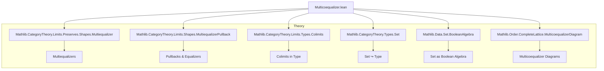
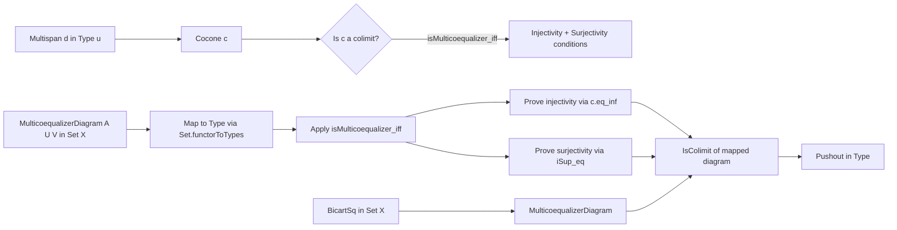

**Technical Brief: Multicoequalizers in `Type u`**

---

### 1. KEY DEFINITIONS & THEOREMS

| Name | Type / Signature | Purpose |
|------|------------------|---------|
| `isMulticoequalizer_iff` | `c.IsColimit ↔ (∀ … , …) ∧ (∀ … , …)` | Characterizes when a cocone `c` over a multispan in `Type u` is a colimit (i.e., a *multicoequalizer*) by explicitly stating injectivity and surjectivity conditions on the colimit cocone structure map `d.multispan.descColimitType c`. |
| `isColimitOfMulticoequalizerDiagram` | `(c : MulticoequalizerDiagram A U V) → IsColimit (c.multicofork.map Set.functorToTypes)` | Shows that any `MulticoequalizerDiagram` in the Boolean algebra `Set X` yields a multicoequalizer (i.e., a colimit) in `Type u` via the embedding `Set.functorToTypes`. |
| `isColimitOfMulticoequalizerDiagram'` | `[LinearOrder ι] → (c : …) → IsColimit (c.multicofork.toLinearOrder.map …)` | Refinement of the above using linear order on indexing type `ι`, reducing the diagram to only `V i j` with `i < j`. |
| `isPushout_of_bicartSq` | `Lattice.BicartSq S₁ S₂ S₃ S₄ → IsPushout …` | Derives that a bicartesian square in `Set X` gives a pushout in `Type u`, via multicoequalizer construction. |

---

### 2. NAMING CONVENTIONS

- **Prefixes**:
  - `is_`: Predicate definitions (e.g., `isMulticoequalizer_iff`, `isColimitOf…`)
  - `descColimitType`, `ιColimitType`: Standard colimit cocone structure maps.
  - `multispan`, `multicofork`, `multicoequalizerDiagram`: Multi-arrow diagram-related terms.
- **Suffixes**:
  - `_iff`: Logical equivalence characterizations.
  - `'` (prime): Alternate or refined version (e.g., `isColimitOfMulticoequalizerDiagram'`).
  - `_map`: Application of a functor to a morphism/diagram.
  - `_toLinearOrder`: Specialization to linearly ordered index.

---

### 3. TACTIC STACK

Frequent tactics used in proofs:
- `rw`, `simp`, `dsimp`: Rewriting and simplification, especially with definitions like `ιColimitType_map`, `c.eq_inf`, `Set.mem_iUnion`.
- `obtain ⟨…⟩ := …`: Destructuring existential/universal quantifiers and equalities.
- `exact`, `refine`: Building proofs stepwise.
- `ext`: Extensionality for sets (used in `isPushout_of_bicartSq`).
- `tauto`: Tautology solver for set-theoretic reasoning.
- `aesop`: Not explicitly used here, but `simp` + `rw` + `tauto` cover similar ground.

---

### 4. PROOF LOGIC

- **Structure of `isMulticoequalizer_iff`**:
  - Proves equivalence by splitting into two directions:
    - **⇒**: Uses `hc.bijective` (from `IsColimit` ⇒ bijective mediating map) to derive injectivity (`h₁`) and surjectivity (`h₂`).
    - **⇐**: Constructs bijectivity of the mediating map from `h₁` (injectivity) and `h₂` (surjectivity), using surjectivity of the colimit cocone components (`ιColimitType_jointly_surjective`).
- **Structure of `isColimitOfMulticoequalizerDiagram`**:
  - Reduces to `Types.isColimit_iff_coconeTypesIsColimit`, then applies `isMulticoequalizer_iff`.
  - Proves injectivity using `c.eq_inf` and naturality of `ιColimitType_map`.
  - Proves surjectivity via `Set.mem_iUnion` and `c.iSup_eq`.
- **Structure of `isPushout_of_bicartSq`**:
  - Uses `Multicofork.IsColimit.isPushout`, reducing pushout verification to verifying a bicartesian square is a multicoequalizer diagram (via `h.multicoequalizerDiagram`), then applies `isColimitOfMulticoequalizerDiagram'`.

---

### 5. IMPORTS (Primary Dependencies)

| Module | Role |
|--------|------|
| `Mathlib.CategoryTheory.Limits.Preserves.Shapes.Multiequalizer` | General theory of multiequalizers (dual to multicoequalizers). |
| `Mathlib.CategoryTheory.Limits.Shapes.MultiequalizerPullback` | Interactions between multiequalizers and pullbacks. |
| `Mathlib.CategoryTheory.Limits.Types.Colimits` | Colimits in `Type u`, especially cocones and their properties. |
| `Mathlib.CategoryTheory.Types.Set` | Embedding `Set X` into `Type u` via `Set.functorToTypes`. |
| `Mathlib.Data.Set.BooleanAlgebra` | Boolean algebra structure on `Set X`, used for lattice operations. |
| `Mathlib.Order.CompleteLattice.MulticoequalizerDiagram` | Definition of `MulticoequalizerDiagram` in a complete lattice (e.g., `Set X`). |

---

### 6. MERMAID DIAGRAMS

#### Dependency Graph (Top-Level)

#### Overview of File Logic Flow

---

### 7. SUMMARY

This file formalizes **multicoequalizers** in the category of types (`Type u`) by:
- Giving an explicit, set-theoretic criterion (`isMulticoequalizer_iff`) for a cocone to be a colimit.
- Showing that **multicoequalizer diagrams in `Set X`** (a complete lattice) give rise to actual colimits in `Type u`.
- Using this to derive that **bicartesian squares in `Set X`** yield **pushouts in `Type u`**, via reduction to multicoequalizers.

The development leverages:
- The embedding `Set X ↪ Type u`,
- Lattice-theoretic structure (`inf`, `iSup`, `iUnion`),
- Naturality and surjectivity properties of colimit cocones.

This is foundational for higher-categorical constructions in homotopy type theory and sheaf theory, where multicoequalizers model descent data.
