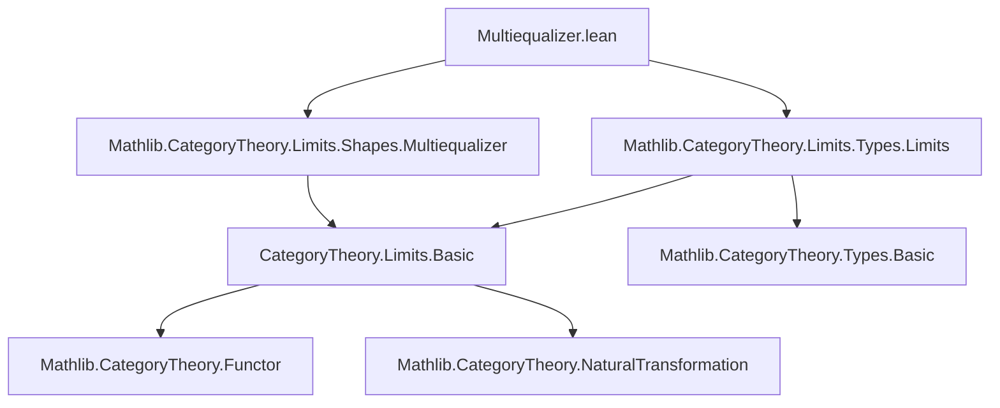
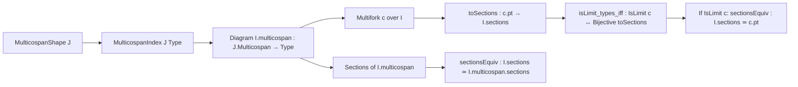

**Technical Brief: `Multiequalizer.lean` (Multiequalizers in `Type`)**  
*Domain: Category Theory (Limits in `Type`)*  
*Author: Joël Riou (2025)*  
*License: Apache 2.0*

---

### 1. KEY DEFINITIONS & THEOREMS

| Name | Type / Signature | Purpose |
|------|------------------|---------|
| `MulticospanIndex.sections` | `Structure` | Represents sections of the diagram `I.multicospan` as a dependent pair: a family `val : J.L → I.left i` satisfying the multiequalizing condition `I.fst r ∘ val = I.snd r ∘ val` for all `r : J.R`. |
| `MulticospanIndex.sectionsEquiv` | `I.sections ≃ I.multicospan.sections` | Explicit equivalence between the syntactic `sections` type and the categorical notion of sections of the diagram `I.multicospan`. |
| `Multifork.toSections` | `c.pt → I.sections` | Canonical map from the apex of a multifork `c` to the section type, sending `x` to the family `(c.ι i x)_i` satisfying the condition by `c.condition`. |
| `Multifork.toSections_fac` | `I.sectionsEquiv.symm ∘ Types.sectionOfCone c = c.toSections` | Relates the categorical `sectionOfCone` (in `Type`) to the syntactic `toSections`. |
| `Multifork.isLimit_types_iff` | `Nonempty (IsLimit c) ↔ Function.Bijective c.toSections` | **Main theorem**: A multifork `c` is a limit (i.e., a multiequalizer) iff `c.toSections` is bijective. |
| `IsLimit.sectionsEquiv` | `I.sections ≃ c.pt` | Noncomputable equivalence induced by bijectivity of `c.toSections` when `c` is a limit. |
| `IsLimit.sectionsEquiv_symm_apply_val` | `((sectionsEquiv hc).symm x).val i = c.ι i x` | Describes the inverse of the equivalence: evaluating at `i` recovers the cone component. |
| `IsLimit.sectionsEquiv_apply_val` | `c.ι i (sectionsEquiv hc s) = s.val i` | Describes the forward direction: applying the equivalence and projecting gives back the section. |

---

### 2. NAMING CONVENTIONS

- **Prefixes**:
  - `MulticospanIndex.`: for constructions tied to the diagram index type.
  - `Multifork.`: for constructions tied to a multifork (cone over the diagram).
  - `IsLimit.`: for constructions assuming a limit cone.
- **Suffixes**:
  - `_sections`: for types or maps involving sections (e.g., `sections`, `toSections`, `sectionsEquiv`).
  - `_val`: for the underlying function/data component of a structured object (e.g., `s.val i`, `x.val`).
  - `_property`: for the coherence condition component (e.g., `s.property r`).
- **Functional suffixes**:
  - `_fac`: for factorization lemmas (`toSections_fac`).
  - `_iff`: for equivalence-of-existence lemmas (`isLimit_types_iff`).

---

### 3. TACTIC STACK

- **Core proof automation**: `rfl`, `ext`, `intro`, `cases`, `exact`, `rw`, `simp`.
- **Equivalence reasoning**: `Equiv.ofBijective`, `EquivLike.comp_bijective`, `Equiv.symm_apply_apply`.
- **Category-theoretic lemmas**: `Types.isLimit_iff_bijective_sectionOfCone`.
- **Dependent type tricks**: `match` on sum types (`.left`, `.right`), `congr_fun`, `trans`, `symm`.

No heavy automation (e.g., `aesop`, `ring`, `linarith`) is used — proofs are mostly direct computation and unfolding of definitions.

---

### 4. PROOF LOGIC

- **Structure**:  
  1. Define `I.sections` as a dependent pair type encoding the multiequalizer condition.  
  2. Construct an explicit equivalence `sections ≃ multicospan.sections`.  
  3. Define `toSections : c.pt → I.sections` from a multifork.  
  4. Show `toSections` factors through `sectionOfCone` via the equivalence (`toSections_fac`).  
  5. Use known result `Types.isLimit_iff_bijective_sectionOfCone` to prove:  
     `c` is limit ⇔ `c.toSections` is bijective.  
  6. When `c` is a limit, extract the equivalence `I.sections ≃ c.pt` from bijectivity.

- **Logical flow**:  
  *Constructive definitions* → *explicit equivalence* → *factorization lemma* → *categorical characterization* → *inverse construction*.

---

### 5. IMPORTS & DEPENDENCIES

| Import | Role |
|--------|------|
| `Mathlib.CategoryTheory.Limits.Shapes.Multiequalizer` | Defines `MulticospanShape`, `MulticospanIndex`, `Multifork`, `IsLimit` for multiequalizers. |
| `Mathlib.CategoryTheory.Limits.Types.Limits` | Provides `Types.isLimit_iff_bijective_sectionOfCone`, `sectionOfCone`, and general limit theory in `Type`. |

**Core dependencies**:  
- `CategoryTheory.Limits.Basic` (implicitly via `Limits`)  
- `CategoryTheory.Types` (for `Types.sectionOfCone`, `IsLimit`)  
- `Data.Equiv.Basic` (for `Equiv`, `Equiv.ofBijective`)  
- `Data.Sum.Basic` (for `MulticospanShape` indexing)

---

### 6. MERMAID DIAGRAMS

#### Dependency Graph (Module-Level)

#### Overview of Theory Flow (Multiequalizers in `Type`)

---

### 7. SUMMARY

This module formalizes the concrete description of multiequalizers in the category `Type`. It shows that a multifork is a limit **iff** its apex bijects with the type of sections defined by the multiequalizing equations — a direct generalization of equalizers to diagrams indexed by a multicospan. The equivalence is fully explicit and verified with `@[simps]`, making it suitable for computational use (e.g., in sheafification or descent constructions).
