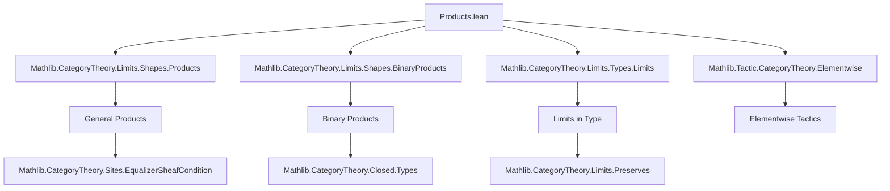
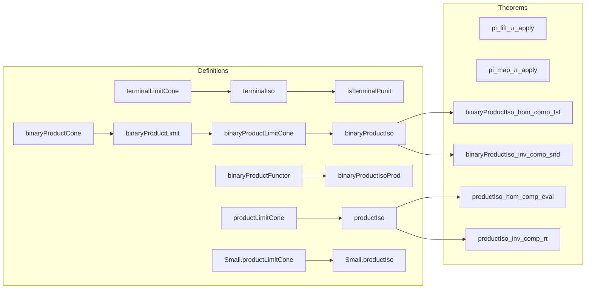

### Technical Brief: `Products.lean` (Category Theory — Products in `Type`)

---

#### **1. Key Definitions & Theorems**

| Name | Type / Signature | Purpose |
|------|------------------|---------|
| `pi_lift_π_apply` | `∀ {β : Type v} [Small.{u} β] (f : β → Type u) (P : Type u) (s : ∀ b, P ⟶ f b) (b : β) (x : P), Pi.π f b (Pi.lift s x) = s b x` | Relates limit cone projection (`π`) and universal property (`lift`) to dependent function application. |
| `pi_lift_π_apply'` | Same as above, but for same universe `v` | Simplified version with `simp`-friendly proof. |
| `pi_map_π_apply` | `∀ {β : Type v} [Small.{u} β] {f g : β → Type u} (α : ∀ j, f j ⟶ g j) (b : β) (x), Pi.π g b (Pi.map α x) = α b (Pi.π f b x)` | Describes how morphism maps act on product elements. |
| `pi_map_π_apply'` | Same as above, same universe | Simplified version. |
| `terminalLimitCone` | `Limits.LimitCone (Functor.empty (Type u))` | Cone over empty diagram with apex `PUnit`. |
| `terminalIso` | `⊤_ (Type u) ≅ PUnit` | Shows terminal object in `Type u` is `PUnit`. |
| `isTerminalPunit` | `IsTerminal (PUnit : Type u)` | Concludes `PUnit` is terminal. |
| `isTerminalEquivUnique` | `IsTerminal X ≃ Unique X` | Characterizes terminal objects as contractible types. |
| `isTerminalEquivIsoPUnit` | `IsTerminal X ≃ (X ≅ PUnit)` | Terminal iff isomorphic to `PUnit`. |
| `binaryProductCone` | `BinaryFan X Y` | The standard product cone using `Prod.fst`, `Prod.snd`. |
| `binaryProductLimit` | `IsLimit (binaryProductCone X Y)` | Proves `X × Y` satisfies the universal property of binary product. |
| `binaryProductLimitCone` | `Limits.LimitCone (pair X Y)` | Lifts `binaryProductLimit` to a limit cone. |
| `binaryProductIso` | `Limits.prod X Y ≅ X × Y` | Identifies categorical binary product with Cartesian product. |
| `binaryProductIso_hom_comp_fst/snd`, `inv_comp_fst/snd` | `hom ≫ fst = prod.fst`, etc. | Elementwise compatibility of iso with projections. |
| `binaryProductFunctor` | `Type u ⥤ Type u ⥤ Type u` | Explicit functor implementing binary product. |
| `binaryProductIsoProd` | `binaryProductFunctor ≅ prod.functor` | Shows explicit functor matches the one from `HasBinaryProducts`. |
| `productLimitCone` | `Limits.LimitCone (Discrete.functor F)` | Cone for arbitrary product `Π j, F j`. |
| `productIso` | `∏ᶜ F ≅ ∀ j, F j` | Categorical product ≃ dependent function type. |
| `productIso_hom_comp_eval`, `productIso_inv_comp_π` | `hom ≫ eval j = Pi.π j`, etc. | Compatibility of iso with evaluation maps. |
| `Small.productLimitCone`, `Small.productIso` | Same as above but for `Small`-indexed families | Handles universe-shifting for indexed products in `Type u`. |

---

#### **2. Naming Conventions**

- **Prefixes**:
  - `pi_`: Relates to dependent product (`Π`) and `Pi.π`, `Pi.lift`, `Pi.map`.
  - `binaryProduct_`: Binary product constructions.
  - `terminal_`: Terminal object constructions.
  - `product_`: General (possibly infinite) product constructions.
  - `iso`: Isomorphisms between categorical and concrete constructions.

- **Suffixes**:
  - `_apply`: When the theorem expresses application of a function to an argument.
  - `_hom_comp_`, `_inv_comp_`: When expressing composition with iso (hom or inv) and a projection.
  - `_cone`: Cone structures (e.g., `binaryProductCone`, `productLimitCone`).
  - `_limit`: Limit cone or isomorphism (e.g., `binaryProductLimit`, `productIso`).
  - `'` (prime): Universe-specialized variant (e.g., `pi_lift_π_apply'`).
  - `Small.`: For variants using `Small` hypothesis to keep result in smaller universe.

---

#### **3. Tactic Stack**

- **`simp` / `simp only`**: Heavily used, especially with `@[simp]` and `@[elementwise (attr := simp)]`.
- **`rfl`**: For definitional equalities (e.g., `binaryProductCone_fst`).
- **`funext`**: To prove function extensionality (e.g., in `binaryProductLimit.uniq`, `productLimitCone.uniq`).
- **`congr_fun`**: To extract pointwise equality from function equality.
- **`ext` / `Prod.ext`**: For extensionality of products.
- **`intro` / `rintro` / `cases`**: For destructuring hypotheses or cones.
- **`apply ... <;> simp`**: Common pattern for projection lemmas.
- **`equivOfSubsingletonOfSubsingleton`**, **`uniqueEquivEquivUnique`**, **`equivEquivIso`**: For constructing equivalences between contractible types.
- **`Limit.map_π_apply`**, **`limit.lift_π`**, **`limit.isoLimitCone_*`**: Core lemmas from `Limits` module.

---

#### **4. Proof Logic**

- **Induction / Recursion on discrete diagrams**: For arbitrary products, proofs use `Discrete.recOn` or `⟨j⟩` indexing.
- **Universal property verification**:
  - `lift` defined pointwise (e.g., `lift s x j := s.π.app ⟨j⟩ x`).
  - `fac` checks that projections commute (often `rfl` or `WalkingPair.casesOn`).
  - `uniq` proves uniqueness via `funext` and projection equalities.
- **Iso construction**:
  - Use `limit.isoLimitCone` to lift isomorphism from limit cone to categorical limit.
  - Projections compatibility via `limit.isoLimitCone_hom_π` / `inv_π`.
- **Subsingleton/unique arguments**:
  - Terminal object uniqueness via `Subsingleton.elim`, `Unique.mk'`, `equivOfSubsingletonOfSubsingleton`.

---

#### **5. Imports**

- `Mathlib.CategoryTheory.Limits.Shapes.Products`: General product definitions.
- `Mathlib.CategoryTheory.Limits.Shapes.BinaryProducts`: Binary product theory.
- `Mathlib.CategoryTheory.Limits.Types.Limits`: Limits in `Type`.
- `Mathlib.Tactic.CategoryTheory.Elementwise`: For `@[elementwise]` attributes and elementwise reasoning.

---

#### **6. Mermaid Diagrams**

##### **Dependency Graph (High-Level)**

##### **Overview of `Products.lean`**

---

#### **7. Theory Context**

This file formalizes the **concrete realization of limits in the category `Type`**:
- **Terminal object** = `PUnit`.
- **Binary products** = Cartesian product `×`.
- **Arbitrary products** = dependent function type `Π j, F j`.
- **Small-indexed products** = `Shrink (∀ j, F j)` to stay in `Type u`.

It bridges **abstract category theory** (limits, cones, universal properties) with **type-theoretic constructions** (`Pi`, `Prod`, `PUnit`, `Shrink`), enabling seamless translation between categorical and computational reasoning.

This is foundational for:
- Sheaf theory (`EqualizerSheafCondition.lean`)
- Closed structure (`Closed/Types.lean`)
- Preservation and reflection of limits
- Internal homs and exponentials.

--- 

Let me know if you'd like a formalized dependency graph in `.dot` format or a summary of how this file interacts with `Sheaves.lean` or `Closed.lean`.
