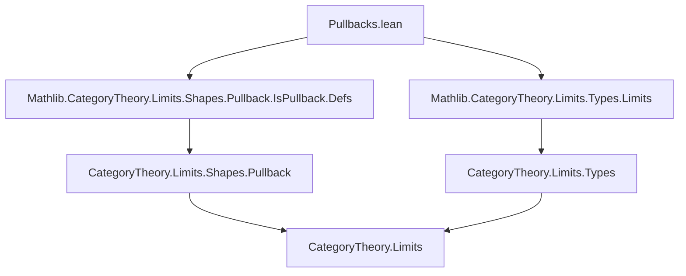
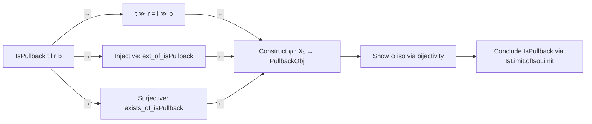

### Technical Brief: Pullbacks in `Type`

---

#### **1. Key Definitions & Theorems**

| Name | Type / Signature | Purpose |
|------|------------------|---------|
| `PullbackObj f g` | `Type u` | Explicit pullback object: subtype `{ p : X × Y // f p.1 = g p.2 }` |
| `pullbackCone f g` | `Limits.PullbackCone f g` | Cone over the cospan `f, g`, with legs `fst`, `snd` and commutativity proof |
| `pullbackLimitCone f g` | `Limits.LimitCone (cospan f g)` | Bundled limit cone: `pullbackCone` + proof it's a limit (`IsLimit`) |
| `equivPullbackObj hc` | `c.pt ≃ PullbackObj f g` | Equivalence between any limit pullback cone `c` and the explicit pullback |
| `toPullbackObj c x` | `PullbackObj f g` | Canonical map from any pullback cone `c` to explicit pullback |
| `isLimitEquivBijective` | `IsLimit c ≃ Function.Bijective (toPullbackObj c)` | Characterizes limit pullback cones via bijectivity of canonical map |
| `pullbackIsoPullback f g` | `pullback f g ≅ PullbackObj f g` | Isomorphism between abstract pullback (from `HasPullbacks`) and explicit one |
| `range_fst_of_isPullback h` | `Set.range fst = f ⁻¹' Set.range g` | Description of range of first leg of a pullback square |
| `range_snd_of_isPullback h` | `Set.range snd = g ⁻¹' Set.range f` | Symmetric version for second leg |
| `range_pullbackFst`, `range_pullbackSnd` | `[simp]` lemmas | Specializations of above to canonical pullback legs |
| `ext_of_isPullback h` | Injectivity criterion | If two points agree under both legs of a pullback square, they are equal |
| `exists_of_isPullback h` | Existence criterion | Given compatible elements in legs, lift to pullback |
| `isPullback_iff` | `IsPullback t l r b ↔ ...` | Full characterization of pullback squares in `Type` as commuting + injective + surjective condition |

---

#### **2. Naming Conventions**

- **Prefixes**:
  - `pullback...`: for constructions related to pullbacks (`pullbackCone`, `pullbackLimitCone`, `pullbackIsoPullback`)
  - `equiv...`: for equivalences (`equivPullbackObj`)
  - `range_...`: for range-related lemmas (`range_fst_of_isPullback`, `range_pullbackFst`)
  - `isPullback...`: for properties of `IsPullback` (`isPullback_iff`, `exists_of_isPullback`, `ext_of_isPullback`)
- **Suffixes**:
  - `_obj`: for underlying objects (`PullbackObj`)
  - `_cone`: for cones (`pullbackCone`)
  - `_limitCone`: for limit cones (`pullbackLimitCone`)
  - `_fst`, `_snd`: for projections (`pullback.fst`, `pullback.snd`, `c.fst`, `c.snd`)
  - `_hom`, `_inv`: for isomorphism components (`pullbackIsoPullback.hom`, `.inv`)
- **`hc` / `h`**: standard variable names for `IsLimit` / `IsPullback` hypotheses.

---

#### **3. Tactic Stack**

- **Core tactics**:
  - `aesop`: used heavily for automation of propositional reasoning and simplification.
  - `simp`: especially with `[simp]` attributes on lemmas.
  - `ext`: extensionality for functions, products, subtypes.
  - `congr_fun`, `congr_arg`: for reasoning about function equality and application.
  - `obtain ⟨x, rfl⟩`: destructuring existential equalities.
  - `rw`, `simp`, `assumption`: standard rewriting and solving.
- **Category-theoretic automation**:
  - `grind`: used in `isPullback_iff` proof to discharge bijectivity goals.
  - `Subtype.ext`, `Prod.ext`: for equality in subtype/product types.
  - `IsLimit.*`, `PullbackCone.*`, `Iso.*`: leveraging bundled limit/isomorphism structure.

---

#### **4. Proof Logic**

- **Explicit construction → universal property**:
  - Define `PullbackObj` as subtype of product.
  - Build `pullbackCone`, then prove it’s a limit via `pullbackLimitCone`.
  - Use `IsLimit.conePointUniqueUpToIso` to relate any limit cone to this explicit one.
- **Characterization of pullback squares**:
  - `IsPullback` is defined as `IsLimit` of the induced cone.
  - Prove equivalence with concrete conditions:
    - Commutativity (`t ≫ r = l ≫ b`)
    - Injectivity (`ext_of_isPullback`)
    - Surjectivity (`exists_of_isPullback`)
  - This yields `isPullback_iff`, a fully elementary characterization.
- **Range lemmas**:
  - Use isomorphism chaining: `h.isoPullback ≪≫ pullbackIsoPullback`.
  - Reduce to known ranges of `Prod.fst`, `Subtype.val`.
  - Apply `Set.range_comp`, `Set.range_eq_univ.mpr`, and surjectivity/injectivity.

---

#### **5. Imports**

- `Mathlib.CategoryTheory.Limits.Shapes.Pullback.IsPullback.Defs`: core definitions of `IsPullback`, `HasPullbacks`.
- `Mathlib.CategoryTheory.Limits.Types.Limits`: infrastructure for limits in `Type`, including `HasPullbacks` instances.

---

#### **6. Mermaid Diagrams**

##### **Dependency Graph (Module-Level)**



##### **Conceptual Overview of Theory Flow**

```mermaid
flowchart LR
  A[Explicit Pullback Obj: {p : X × Y // f p.1 = g p.2}] --> B[PullbackCone]
  B --> C[PullbackLimitCone]
  C --> D[IsLimit proof]
  D --> E[Universal property: any limit cone ≃ PullbackObj]
  E --> F[Range lemmas & injectivity/surjectivity criteria]
  F --> G[isPullback_iff: elementary characterization]
  G --> H[Applications: e.g., pullbackIsoPullback]
```

##### **Structure of `isPullback_iff` Proof**



---

#### **7. Summary**

This file formalizes pullbacks in `Type` both *explicitly* (as a subtype of a product) and *categorically* (as limits), and establishes the equivalence between the two perspectives. It provides:
- A constructive model (`PullbackObj`, `pullbackLimitCone`) for pullbacks.
- A bridge to abstract pullbacks via `equivPullbackObj`, `pullbackIsoPullback`.
- A full elementary characterization of pullback squares (`isPullback_iff`), including range descriptions and lifting/extensivity properties.

The proofs rely on careful use of subtype/product extensionality, `IsLimit` uniqueness, and set-theoretic reasoning (`Set.range`, preimages). The `isPullback_iff` lemma is particularly valuable for reasoning about pullbacks in concrete settings without invoking category-theoretic machinery.
