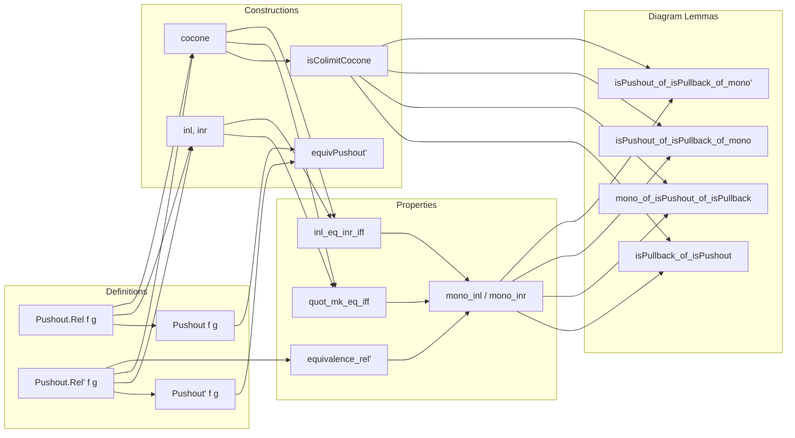

**Technical Brief: Pushouts in `Type` (Lean 4 Formalization)**  
*Based on `Pushouts.lean` (c) 2025 Joël Riou*

---

### 1. KEY DEFINITIONS & THEOREMS

| Name | Type / Signature | Purpose |
|------|------------------|---------|
| `Pushout.Rel f g` | `X₁ ⊕ X₂ → X₁ ⊕ X₂ → Prop` | Generates the equivalence relation identifying `f s` with `g s` for all `s : S`. |
| `Pushout f g` | `Type u` | The pushout object: quotient of `X₁ ⊕ X₂` by `Pushout.Rel f g`. |
| `Pushout.Rel' f g` | `X₁ ⊕ X₂ → X₁ ⊕ X₂ → Prop` | Explicit equivalence relation (reflexive, symmetric, transitive closure of basic identifications), used when `f` is mono. |
| `Pushout' f g` | `Type u` | Alternative construction using `Rel'`. |
| `Pushout.inl f g`, `Pushout.inr f g` | `X₁ ⟶ Pushout f g`, `X₂ ⟶ Pushout f g` | Canonical maps into the pushout. |
| `Pushout.cocone f g` | `PushoutCocone f g` | The canonical cocone under the span `X₁ ← S → X₂`. |
| `Pushout.isColimitCocone f g` | `IsColimit (cocone f g)` | Proves the constructed cocone is a colimit — i.e., the pushout exists. |
| `Pushout.equivPushout' f g` | `Pushout f g ≃ Pushout' f g` | Equivalence between the two constructions (when `f` mono). |
| `Pushout.quot_mk_eq_iff` | `(Quot.mk _ a = Quot.mk _ b) ↔ Rel' a b` | Equality in the quotient characterized by `Rel'`, assuming `f` mono. |
| `Pushout.inl_eq_inr_iff` | `inl x₁ = inr x₂ ↔ ∃ s, f s = x₁ ∧ g s = x₂` | Characterizes when left and right inclusions meet in the pushout. |
| `Pushout.mono_inr` / `mono_inl` | `[Mono f] ⇒ Mono (inr f g)` / `[Mono g] ⇒ Mono (inl f g)` | Stability of monos under pushout (cobase change). |
| `isPullback_of_isPushout` | `IsPushout t l r b → Function.Injective t → IsPullback t l r b` | In `Type`, a pushout square with injective top map is automatically a pullback. |
| `mono_of_isPushout_of_isPullback` | Under assumptions (outer pushout, inner pullback, mono `r'`, injectivity of `b'` off `range l`) ⇒ `Mono k` | A technical lemma for monomorphism stability in composite diagrams. |
| `isPushout_of_isPullback_of_mono` / `isPushout_of_isPullback_of_mono'` | Under pullback + mono + joint surjectivity + injectivity off range ⇒ pushout | Converse: certain pullbacks in `Type` are pushouts. |

---

### 2. NAMING CONVENTIONS

- **Prefixes**:
  - `Pushout.`: All definitions/lemmas about the pushout construction.
  - `inl_`, `inr_`: Properties of the left/right inclusions.
  - `rel'_`: Properties involving the refined relation `Rel'`.
- **Suffixes**:
  - `_iff`: Biconditional characterizations (e.g., `inl_rel'_inl_iff`).
  - `_mono`: Monomorphism statements.
  - `_eq_iff`: Equality criteria in quotients.
  - `_of_isPushout`, `_of_isPullback`: Lemmas deriving pushout/pullback from each other.
- **Function names**:
  - `equivPushout'`, `quot_mk_eq_iff`, `inl_eq_inr_iff`: Descriptive, often ending in `_iff` or `_eq_iff`.

---

### 3. TACTIC STACK

| Tactic | Frequency | Role |
|--------|-----------|------|
| `intro` / `rintro` | High | Introducing hypotheses, destructing existentials. |
| `rw` / `simp` | Very high | Rewriting using definitions, lemmas, and simplification. |
| `exact` / `apply` | High | Finishing goals via known lemmas. |
| `congr` / `congr_arg` | Medium | Congruence reasoning for equality. |
| `subst` | Medium | Substituting equal terms. |
| `obtain` / `cases` | High | Destructing sums, existentials, or inductive types. |
| `ext` | Medium | Extensionality for functions/quotients. |
| `grind` | Low | Custom tactic (likely `aesop`-based) for automated reasoning. |
| `cat_disch` | Low | Category-theoretic tactic (likely from `Mathlib.Tactic.CategoryTheory`). |
| `have`, `set`, `refine`, `convert` | Medium | Intermediate proof steps. |

---

### 4. PROOF LOGIC

- **General pattern**:
  1. **Construction**: Define `Pushout` as a quotient of `X₁ ⊕ X₂`.
  2. **Verification**: Show the cocone satisfies the universal property via `IsColimit.mk`, using `Quot.lift` and case analysis on `Sum`.
  3. **Equality analysis**: Use `quot_mk_eq_iff` (when `f` mono) to reduce equality in the pushout to `Rel'`.
  4. **Monomorphism stability**: Prove `inl`, `inr` mono by reducing to injectivity via `quot_mk_eq_iff` and `Rel'` lemmas.
  5. **Pushout–Pullback equivalence**: In `Type`, use injectivity to turn pushout into pullback (`isPullback_of_isPushout`) and vice versa (`isPushout_of_isPullback_of_mono'`).
  6. **Diagram chasing**: For composite diagrams, decompose elements via `eq_or_eq_of_isPushout'`, then apply pullback/pushout properties case-by-case.

- **Induction / case analysis**:
  - On `Sum` (`inl`, `inr`) and `Rel'` constructors (`refl`, `inl_inl`, `inl_inr`, `inr_inl`).
  - On `Quot` elements (`Quot.mk _ x`).
  - On `IsPushout`/`IsPullback` universal properties.

- **Key logical tool**: When `f` is mono, `Rel'` is an equivalence relation — proven via `Equivalence` instance using `mono_iff_injective`.

---

### 5. IMPORTS & DEPENDENCIES

| Module | Purpose |
|--------|---------|
| `Mathlib.CategoryTheory.Limits.Types.Pullbacks` | Pullbacks in `Type`, foundational for duality arguments. |
| `Mathlib.CategoryTheory.Limits.Shapes.Pullback.IsPullback.Basic` | Basic theory of pullbacks, used in `isPullback_of_isPushout`. |
| Implicit: `Mathlib.CategoryTheory.Limits.Types` | Contains `HasPushouts`, `PushoutCocone`, `IsColimit`, etc. |
| Implicit: `Mathlib.CategoryTheory.Monomorphisms` | Used via `Mono`, `mono_iff_injective`. |
| Implicit: `Mathlib.Data.Quot` | Core quotient machinery. |
| Implicit: `Mathlib.Data.Sum` | For `Sum.inl`, `Sum.inr`. |

---

### 6. MERMAID DIAGRAMS

#### Dependency Graph (Top-Level)

```mermaid
graph TD
  A[CategoryTheory.Limits.Types] --> B[HasPushouts (Type u)]
  A --> C[Pushout f g]
  A --> D[Pushout' f g]
  A --> E[isColimitCocone]
  A --> F[equivPushout']
  A --> G[mono_inl / mono_inr]
  A --> H[isPullback_of_isPushout]
  A --> I[isPushout_of_isPullback_of_mono']
  
  B --> J[Mathlib.CategoryTheory.Limits.Types.Pullbacks]
  C --> K[Mathlib.Data.Quot]
  D --> K
  G --> L[Mathlib.CategoryTheory.Monomorphisms]
  H --> M[Mathlib.CategoryTheory.Adhesive.Basic]  %% implied via similar lemmas
```

#### Overview of File Structure



---

### 7. DOMAIN-SPECIFIC INSIGHTS

- **Quotient-based construction**: Pushouts in `Type` are built via equivalence relations generated by a small set of identifications — a standard pattern in homotopy-theoretic or sheaf-theoretic contexts.
- **Mono stability**: The file proves *cobase change* preserves monos in `Type`, a key property for adhesive categories.
- **Pushout–Pullback duality**: In `Type`, under injectivity, pushouts and pullbacks coincide — a rare and powerful phenomenon (not true in general categories).
- **Effective reasoning**: The `Rel'` relation is used to avoid dealing with the transitive closure of `Rel`, making proofs more concrete and tactic-friendly.

--- 

Let me know if you'd like a formalized summary in `lean` comment style or a dependency graph for `Mathlib` modules.
