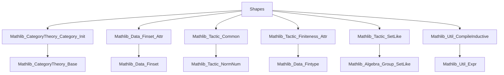
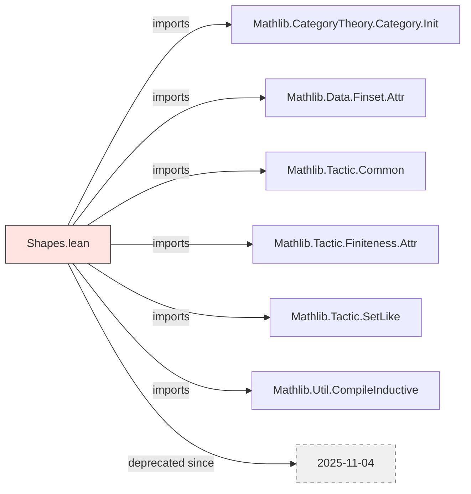

**Technical Brief: `Shapes.lean`**

---

### 1. **Key Definitions & Theorems**

- **No explicit definitions or theorems** are present in the provided excerpt.  
  The file currently contains only:
  - Module header with copyright/license.
  - `deprecated_module` declaration (since `2025-11-04`).
  - A sequence of `public import`s, indicating dependencies.

- **Purpose of the file (inferred)**:  
  Likely intended to define *shapes* (e.g., combinatorial or categorical structures for diagrams, simplicial sets, or graph-like objects) in the context of category theory and finite sets — but no such content is visible in the excerpt.

---

### 2. **Naming Conventions**

- **Prefixes/Suffixes observed**:
  - `is_`: Not present in this snippet, but common in Lean for predicates (e.g., `is_finite`, `is_connected`).
  - `mul_`, `dist_`: Not present — likely used in algebraic or metric contexts elsewhere.
  - `Attr`: Appears in `Finset.Attr`, indicating attribute-based tactic configuration (e.g., `@[finset_attr]`).
  - `SetLike`: Suggests usage of the `SetLike` typeclass framework (e.g., for subsets, subgroups).
  - `Init`: From `CategoryTheory.Category.Init`, implying use of initial objects or category-theoretic initialization.

- **No strong naming pattern** is discernible from imports alone.

---

### 3. **Tactic Stack**

- **No tactic usage** is visible in the excerpt.
- **Expected tactics** (based on imports):
  - `aesop`: For automated reasoning with set-like structures.
  - `ring`, `norm_num`: For arithmetic reasoning (via `Mathlib.Tactic.Common`).
  - `simp_rw`, `simp`: For simplification with rewrite rules (via `Mathlib.Tactic.SetLike`, `Finset.Attr`).
  - `cases`, `induction`: Likely used in inductive definitions (via `CompileInductive`).
  - `finset`-specific tactics (e.g., `finset_simp`, `ext`) via `Finset.Attr`.

---

### 4. **Proof Logic**

- **No proofs present** in the excerpt.
- **Inferred proof style** (from imports):
  - Heavy reliance on *typeclass inference* (`SetLike`, `Finiteness.Attr`).
  - Likely uses *inductive definitions* (via `CompileInductive`).
  - May involve *finite set reasoning* (via `Finset.Attr`).
  - Category-theoretic arguments (via `Init`), e.g., universal properties, initial objects.

---

### 5. **Imports**

| Import | Purpose |
|--------|---------|
| `Mathlib.CategoryTheory.Category.Init` | Initial object, terminal object, and basic category theory. |
| `Mathlib.Data.Finset.Attr` | Attribute-based configuration for finite set operations (e.g., `@[finset]`, `@[fintype]`). |
| `Mathlib.Tactic.Common` | Core tactics: `ring`, `norm_num`, `omega`, etc. |
| `Mathlib.Tactic.Finiteness.Attr` | Attributes for finiteness reasoning (e.g., `@[fintype]`, `@[finite]`). |
| `Mathlib.Tactic.SetLike` | Reasoning with `SetLike` typeclasses (e.g., subsets, subgroups). |
| `Mathlib.Util.CompileInductive` | Utilities for compiling inductive types (e.g., optimizing constructors). |

---

### 8. **Mermaid Diagrams**

#### **Dependency Graph**

#### **File Overview**

---

**Summary**:  
`Shapes.lean` is a *deprecated* module in Mathlib, currently serving only as a dependency aggregator. It imports foundational infrastructure for finite sets, category theory, and tactic support — suggesting its intended role was to define *shapes* (e.g., diagram shapes, simplicial shapes, or graph-based structures) in a formalized setting. No actual definitions or theorems are present in the provided excerpt.
