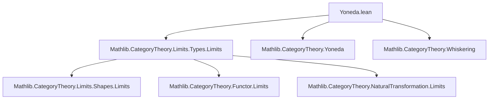

### Technical Brief: `Yoneda.lean` — Cones, Cocones, and Yoneda Embeddings

---

#### **1. Key Definitions & Theorems**

| Name | Type | Purpose |
|------|------|---------|
| `compCoyonedaSectionsEquiv` | `(F ⋙ coyoneda.obj (op X)).sections ≃ ((const J).obj X ⟶ F)` | Identifies sections of the composite functor $F \circ \mathcal{Y}^\mathrm{op}(X)$ with natural transformations $X \Rightarrow F$ (i.e., cones with apex $X$). |
| `opCompYonedaSectionsEquiv` | `(F.op ⋙ yoneda.obj X).sections ≃ (F ⟶ (const J).obj X)` | Identifies sections of $F^\mathrm{op} \circ \mathcal{Y}(X)$ with natural transformations $F \Rightarrow X$ (i.e., cocones with apex $X$). |
| `compYonedaSectionsEquiv` | `(F ⋙ yoneda.obj X).sections ≃ ((const J).obj (op X) ⟶ F)` | Variant for $F : J \to C^\mathrm{op}$, identifying sections with natural transformations $X^\mathrm{op} \Rightarrow F$. |
| `limitCompCoyonedaIsoCone` | `limit (F ⋙ coyoneda.obj (op X)) ≅ ((const J).obj X ⟶ F)` | Natural isomorphism between the limit of the hom-functor $\mathrm{Hom}(X, F{-})$ and the cone space $\mathrm{Cone}(X, F)$. |
| `coyonedaCompLimIsoCones` | `coyoneda ⋙ whiskeringLeft … ⋙ lim ≅ F.cones` | Natural isomorphism (in $X$) between $\mathcal{Y}^\mathrm{op} \circ F \circ \lim$ and the functor of cones over $F$. |
| `whiskeringLimYonedaIsoCones` | `whiskeringLeft … ⋙ whiskeringRight … ⋙ lim ⋙ coyoneda ≅ cones J C` | Full naturality in both $F$ and $X$: cones over $F$ are naturally isomorphic to $\lim \mathrm{Hom}(X, F{-})$. |
| `limitCompYonedaIsoCocone` | `limit (F.op ⋙ yoneda.obj X) ≅ (F ⟶ (const J).obj X)` | Dual to `limitCompCoyonedaIsoCone`: cocones with apex $X$ correspond to $\lim \mathrm{Hom}(F{-}, X)$. |
| `yonedaCompLimIsoCocones` | `yoneda ⋙ whiskeringLeft … ⋙ lim ≅ F.cocones` | Naturality in $X$ for cocones. |
| `opHomCompWhiskeringLimYonedaIsoCocones` | `opHom … ⋙ whiskeringLeft … ⋙ whiskeringRight … ⋙ lim ⋙ yoneda ≅ cocones J C` | Full naturality in $F$ and $X$ for cocones. |

---

#### **2. Naming Conventions**

- **Prefixes**:
  - `compCoyoneda` / `opCompYoneda` / `compYoneda`: indicate composition with co/Yoneda embedding.
  - `limitComp…`: limit of a composite functor.
  - `whiskering…`: involve whiskering (pre/post-composition with functors).
  - `coyoneda` / `yoneda`: reference to co/Yoneda embeddings.
- **Suffixes**:
  - `SectionsEquiv`: equivalence between sections and natural transformations.
  - `IsoCone` / `IsoCocone`: isomorphism identifying limits with cones/cocones.
  - `IsoCones` / `IsoCocones`: natural isomorphisms of functors of cones/cocones.
- **`simps!` attribute**: ensures simplification lemmas for projections (e.g., `app`, `val`) hold definitionally.

---

#### **3. Tactic Stack**

- `simp`, `simpa`: used repeatedly to simplify hom-components and naturality conditions.
- `rw [Category.id_comp]`, `rw [Category.comp_id]`: basic category-theoretic rewrites.
- `dsimp`: used to unfold definitions before rewriting.
- `Quiver.Hom.unop_inj`, `Quiver.Hom.op_inj`: injectivity of `op`/`unop` for equality reasoning in $C^\mathrm{op}$.
- `Types.limitEquivSections`: imported from `Mathlib.CategoryTheory.Limits.Types.Limits`, used to relate limits in `Type` to sections.
- `NatIso.ofComponents`: constructs natural isomorphisms from componentwise isomorphisms.

---

#### **4. Proof Logic**

- **Core idea**: Use the universal property of limits in `Type` (via `Types.limitEquivSections`) to reduce cone/cocone data to sections of a hom-functor.
- **Structure of proofs**:
  1. Define explicit equivalences (`equiv`) between sections and natural transformations (e.g., `compCoyonedaSectionsEquiv`).
  2. Prove naturality by unfolding definitions and applying naturality of the transformation.
  3. Use `trans` to compose `Types.limitEquivSections` with the above equivalences.
  4. Promote isomorphisms of objects to natural isomorphisms of functors via `NatIso.ofComponents`.
- **Naturality checks**:
  - Done componentwise; no explicit coherence diagrams are proven (handled by `NatIso.ofComponents`).
  - Opposites (`op`, `unop`) are managed via injectivity lemmas (`op_inj`, `unop_inj`).

---

#### **5. Imports**

- `Mathlib.CategoryTheory.Limits.Types.Limits`: provides `Types.limitEquivSections`, the foundational equivalence between limits in `Type` and sections.

---

#### **6. Mermaid Diagrams**

##### **Dependency Graph (Module-Level)**



##### **Conceptual Overview (Data Flow)**

```mermaid
flowchart LR
  subgraph "Input Functors"
    F[J ⥤ C]
    X[C]
  end

  subgraph "Hom Composites"
    A1[F ⋙ coyoneda.obj (op X)]
    A2[F.op ⋙ yoneda.obj X]
  end

  subgraph "Limits in Type"
    L1[limit A1]
    L2[limit A2]
  end

  subgraph "Cone/Cocone Spaces"
    C1[(const J).obj X ⟶ F]
    C2[F ⟶ (const J).obj X]
  end

  L1 -- `limitCompCoyonedaIsoCone` --> C1
  L2 -- `limitCompYonedaIsoCocone` --> C2

  C1 -- `coyonedaCompLimIsoCones` --> F.cones
  C2 -- `yonedaCompLimIsoCocones` --> F.cocones
```

##### **Naturality Square (Cone Case)**

```mermaid
graph LR
  X1["X : C"] -->|coyoneda| Y1["coyoneda.obj (op X)"]
  X2["X' : C"] -->|coyoneda| Y2["coyoneda.obj (op X')"]
  F.cones -->|precompose with τ: X→X'| F.cones'
  lim(Hom(-,F)) -->|postcompose with Hom(τ,F)| lim(Hom(-,F)')
  Y1 -.->|sections| lim(Hom(-,F))
  Y2 -.->|sections| lim(Hom(-,F)')
  %% naturality square
  L1[lim Hom(X, F·)] -->|iso| C1[Cone(X, F)]
  L2[lim Hom(X', F·)] -->|iso| C2[Cone(X', F)]
  L1 -- Hom(τ, F) --> L2
  C1 -- pre ∘ - --> C2
```

---

#### **7. Summary**

This file formalizes the **Yoneda Lemma for limits**: cones over a diagram $F : J \to C$ with apex $X$ are naturally isomorphic to elements of $\lim_{j \in J} \mathrm{Hom}(X, Fj)$, and dually for cocones. It leverages:
- The equivalence between limits in `Type` and sections (from `Types.Limits`).
- The Yoneda and co-Yoneda embeddings to translate hom-objects into functors.
- Whiskering to express naturality in both $F$ and $X$.

The structure is clean and modular, with explicit componentwise definitions and automatic naturality via `NatIso.ofComponents`. This is foundational for later developments (e.g., existence of limits via representability, Kan extensions).
