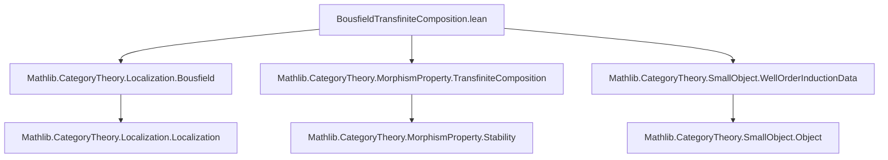

**Technical Brief: Stability of `P.isLocal` under Transfinite Composition**

---

### 1. **Key Definitions & Theorems**

| Name | Type / Signature | Purpose |
|------|------------------|---------|
| `P.isLocal` | `MorphismProperty C` | For an object property `P : ObjectProperty C`, `P.isLocal` is the induced *local* morphism property: a morphism `f : X → Y` is in `P.isLocal` iff for all `Z` with `P Z`, the induced map `Hom(Y, Z) → Hom(X, Z)` is surjective. |
| `IsStableUnderTransfiniteCompositionOfShape J` | `P.isLocal.IsStableUnderTransfiniteCompositionOfShape J` | Instance asserting that `P.isLocal` is stable under transfinite compositions indexed by a well-ordered type `J` (with `LinearOrder`, `SuccOrder`, `OrderBot`, `WellFoundedLT`). |
| `IsStableUnderTransfiniteComposition` | `P.isLocal.IsStableUnderTransfiniteComposition` | Global instance (universes `w`) stating stability under *arbitrary* transfinite compositions (i.e., over any well-ordered index category). |

**Core Lemma (implicit):**  
If `P` holds for all objects in a transfinite sequence `F : J → C`, and each structure map `F i → F j` (for `i < j`) is in `P.isLocal`, then the colimit cocone legs `F j → colim F` are also in `P.isLocal`.

---

### 2. **Naming Conventions**

- **Prefixes:**
  - `is_`: Denotes properties (e.g., `isLocal`, `isStableUnder...`)
  - `map_mem`: Used for membership in a family indexed by `j : J` (e.g., `hf.map_mem j hj _ hZ`)
- **Suffixes:**
  - `_OfShape J`: Indicates stability for a specific indexing shape `J`
  - `val_op`, `op_bot`, `fac`, `desc`: Standard colimit/cocone notation (e.g., `σ.1 (op j)`, `d.sectionsMk_val_op_bot`)
- **Notation:**
  - `hf`: Typically a proof that a cocone is a colimit (`hf : IsColimit F`)
  - `σ`, `d`: Sections/morphisms constructed via induction or universal properties

---

### 3. **Tactic Stack**

The proof uses a layered tactic pipeline:

| Tactic | Role |
|--------|------|
| `induction ... using SuccOrder.limitRecOn` | Transfinite induction over well-ordered `J` (handles min, succ, limit cases) |
| `simpa [...]` | Simplifies using equalities and properties (e.g., `cancel_epi`, `isoBot.inv`) |
| `hom_ext` | Extends equality of cocone legs to equality of colimit morphisms |
| `let ... := ...` + `simp only [...]` | Constructs intermediate objects (e.g., `Cocone`, `WellOrderInductionData`) and simplifies definitions |
| `exact ...` | Completes subgoals after construction |
| `dsimp` | Delta-reduces definitions (e.g., in naturality checks) |

No heavy automation (e.g., `aesop`, `ring`, `linarith`) is used — the proof is highly structured and categorical.

---

### 4. **Proof Logic**

The proof proceeds in two main steps:

1. **Morphism Extension Property (`le`)**  
   Given:
   - A transfinite diagram `F : J → C`
   - A colimit cocone `hf : IsColimit F`
   - A target object `Z` with `P Z`
   - A family of morphisms `g_j : F j → Z` compatible with the diagram (i.e., `g_j ∈ P.isLocal(F i → F j)`)

   Goal: Show there exists a unique `g : colim F → Z` factoring all `g_j`.

   - **Uniqueness**: Follows from `hf.isColimit.hom_ext`.
   - **Existence**:
     - Construct a `WellOrderInductionData` `d` encoding the section data for each principal segment.
     - Use `d.sectionsMk` to build a section `σ` from the initial map `⊥ → Z`.
     - Use `σ` to define a cocone `c` over `F`.
     - Apply colimit universal property (`hf.isColimit.desc c`) to get the mediating morphism.

2. **Global Instance (`IsStableUnderTransfiniteComposition`)**  
   Follows from the shape-specific instance via general categorical principles (e.g., stability under all well-ordered shapes implies stability under arbitrary transfinite compositions).

---

### 5. **Imports**

| Module | Role |
|--------|------|
| `Mathlib.CategoryTheory.Localization.Bousfield` | Defines `ObjectProperty`, `isLocal`, and localization machinery |
| `Mathlib.CategoryTheory.MorphismProperty.TransfiniteComposition` | Defines stability under transfinite composition and related lemmas |
| `Mathlib.CategoryTheory.SmallObject.WellOrderInductionData` | Provides `WellOrderInductionData` and `sectionsMk` for transfinite induction |

---

### 6. **Mermaid Diagrams**

#### Dependency Graph (Module-Level)



#### Proof Structure Overview

```mermaid
flowchart LR
  P[P : ObjectProperty C] --> isLocal[P.isLocal : MorphismProperty C]
  isLocal --> shapeInst[IsStableUnderTransfiniteCompositionOfShape J]
  shapeInst --> colimLegs[Colimit legs F j → colim F ∈ P.isLocal]
  colimLegs --> globalInst[IsStableUnderTransfiniteComposition]

  subgraph Induction
    min[isMin] --> succ[succ case]
    succ --> limit[limit case]
    limit --> colimLegs
  end

  subgraph Construction
    d[WellOrderInductionData d] --> σ[σ = d.sectionsMk(...)]
    σ --> c[Cocone c over F]
    c --> desc[colim universal property]
  end
```

---

### 7. **Summary**

This file establishes a foundational stability property of *local* morphism properties under transfinite compositions — a key ingredient in Bousfield localization and small object arguments. The proof leverages transfinite induction over well-ordered index categories, universal properties of colimits, and careful handling of cocone naturality. It exemplifies Lean’s strength in formalizing advanced categorical constructions with precise control over induction principles.
