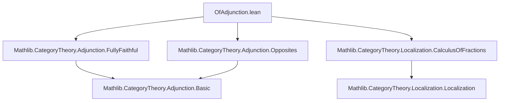
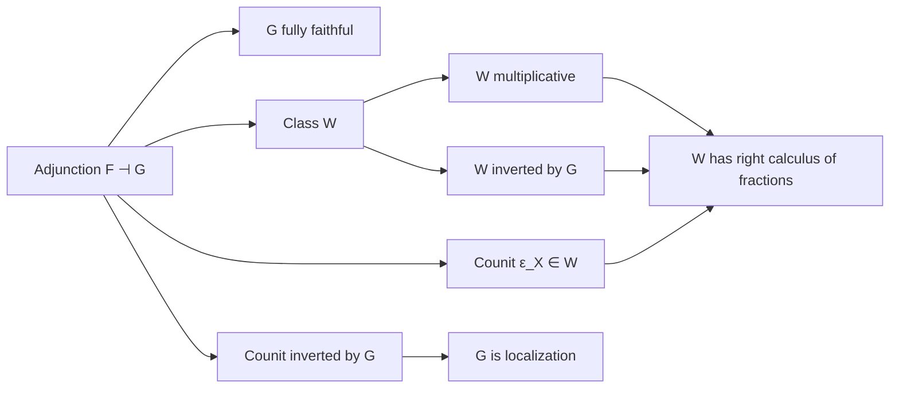

Here is a structured technical brief extracted from `OfAdjunction.lean`, focusing on formal metadata for domain-specific AI agent training.

---

### **1. Key Definitions & Theorems**

| Name | Type / Signature | Purpose |
|------|------------------|---------|
| `hasLeftCalculusOfFractions` | `G ⊣ F → W : MorphismProperty C₁ → [W.IsMultiplicative] → W.IsInvertedBy G → (W.functorCategory C₁) adj.unit → W.HasLeftCalculusOfFractions` | Shows that under an adjunction `G ⊣ F` with `F` fully faithful, if `W` is multiplicative, inverted by `G`, and `adj.unit` lands in `W`, then `W` has a calculus of left fractions. |
| `hasRightCalculusOfFractions` | `F ⊣ G → W : MorphismProperty C₁ → [W.IsMultiplicative] → W.IsInvertedBy G → (W.functorCategory _) adj.counit → W.HasRightCalculusOfFractions` | Dual of `hasLeftCalculusOfFractions`, using the counit instead of the unit. |
| `isLocalization_leftAdjoint` | `G ⊣ F → W : MorphismProperty C₁ → W.IsInvertedBy G → (W.functorCategory C₁) adj.unit → G.IsLocalization W` | Proves that `G` is the localization functor w.r.t. `W` under the same hypotheses (plus full & faithful of `F`). |
| `isLocalization_rightAdjoint` | `F ⊣ G → W : MorphismProperty C₁ → W.IsInvertedBy G → (W.functorCategory C₁) adj.counit → G.IsLocalization W` | Dual version using the counit. |
| `functorCategory_inverseImage_isomorphisms_unit` | `G ⊣ F → ((isomorphisms C₂).inverseImage G).functorCategory C₁ adj.unit` | Shows that the unit of an adjunction is inverted by `G` when `W = G⁻¹(isos)`. |
| `functorCategory_inverseImage_isomorphisms_counit` | `F ⊣ G → ((isomorphisms C₂).inverseImage G).functorCategory C₁ adj.counit` | Dual statement for the counit. |
| `isLocalization_leftAdjoint'` | `G ⊣ F → G.IsLocalization ((isomorphisms C₂).inverseImage G)` | Special case of `isLocalization_leftAdjoint` for `W = G⁻¹(isos)`. |
| `isLocalization_rightAdjoint'` | `F ⊣ G → G.IsLocalization ((isomorphisms C₂).inverseImage G)` | Dual special case. |
| `hasLeftCalculusOfFractions'` | `G ⊣ F → ((isomorphisms C₂).inverseImage G).HasLeftCalculusOfFractions` | Special case of `hasLeftCalculusOfFractions` for `W = G⁻¹(isos)`. |
| `hasRightCalculusOfFractions'` | `F ⊣ G → ((isomorphisms C₂).inverseImage G).HasRightCalculusOfFractions` | Dual special case. |

---

### **2. Naming Conventions**

- **Prefixes**:
  - `has*CalculusOfFractions`: existence of left/right calculus of fractions.
  - `isLocalization_*`: characterization of localization functors.
  - `functorCategory_*`: properties of unit/counit in the functor category w.r.t. a class `W`.
  - `inverseImage_*`: inverse image of isomorphisms along a functor.

- **Suffixes**:
  - `'` (prime): special case or corollary of the unprimed version.
  - `op`: dual version (e.g., `adj.op`, `W.op`, `hW.op`).

- **Variables**:
  - `adj`: an adjunction (`G ⊣ F` or `F ⊣ G`).
  - `W`: a `MorphismProperty`, interpreted as a class of morphisms.
  - `hW`, `hW'`: hypotheses that `W` is inverted by `G`, and that unit/counit lands in `W`.

---

### **3. Tactic Stack**

Frequently used tactics in proofs:
- `obtain ⟨...⟩ := ...`: destructuring existential or product types.
- `dsimp`: definitional simplification.
- `rw [...]`: rewriting using naturality, inverses, adjunction laws.
- `have := ...`: introduce intermediate facts.
- `refine ⟨_, _, _, ?_⟩`: constructing witnesses for existential goals.
- `congr 2`: congruence for binary operations.
- `cancel_epi`: epimorphic cancellation.
- `infer_instance`: typeclass resolution.
- `simp only [...]`: targeted simplification using lemmas like `inverseImage_iff`, `isomorphisms.iff`.
- `apply Localization.*`: applying localization universal properties.
- `rw [NatTrans.isIso_iff_isIso_app]`: reduce isomorphism checks to components.

---

### **4. Proof Logic**

- **Structure**:
  1. **Existence of fractions**: Construct explicit left/right fractions using the unit/counit and inverses in `W`.
  2. **Verification**: Use naturality of unit/counit, properties of adjunctions (`adj.unit_naturality`, `adj.counit_naturality`), and invertibility of `G(s)` for `s ∈ W`.
  3. **Localization**: Use the universal property of localization (`Localization.lift`, `Localization.fac`) and show equivalence of functors via natural isomorphisms.
  4. **Duality**: Prove right versions by passing to opposite categories (`op`) and reusing left versions.

- **Induction / Cases**: Not used; proofs are constructive and rely on categorical universal properties.

- **Key Lemmas Used**:
  - `adj.unit_naturality`
  - `Functor.map_inv`
  - `IsIso.hom_inv_id_assoc`
  - `Localization.inverts`
  - `Localization.liftNatIso`

---

### **5. Imports**

- `Mathlib.CategoryTheory.Adjunction.Opposites`: Opposite adjunctions, duality.
- `Mathlib.CategoryTheory.Adjunction.FullyFaithful`: Properties of fully faithful functors.
- `Mathlib.CategoryTheory.Localization.CalculusOfFractions`: Calculus of fractions, localization functors.

---

### **6. Mermaid Diagrams**

#### **Dependency Graph (Module-Level)**



#### **Overview of Theoretical Flow**

```mermaid
flowchart LR
  A[Adjunction G ⊣ F] --> B[F fully faithful]
  A --> C[Class W ⊆ Mor(C₁)]
  C --> D[W multiplicative]
  C --> E[W inverted by G]
  A --> F[Unit η_X ∈ W]
  D & E & F --> G[W has left calculus of fractions]
  A --> H[Unit η inverted by G]
  H --> I[G is localization w.r.t. W]
  I --> J[Localization universal property]
```

#### **Duality Flow**



---

### **7. Summary**

This module formalizes a foundational result in categorical localization: under mild hypotheses (multiplicativity, invertibility, and unit/counit in `W`), a right/left adjoint in an adjunction becomes a localization functor. It connects adjunctions, fully faithfulness, and calculus of fractions — central tools in homological algebra and derived categories. The dual statements are obtained uniformly via opposite categories.

--- 

Let me know if you'd like this exported as JSON or YAML for ingestion into a knowledge base.
