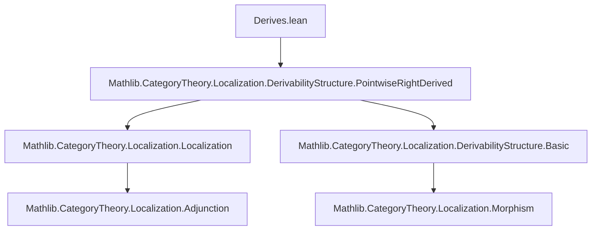

### Technical Brief: `Derives.lean`

---

#### **1. Key Definitions & Theorems**

| Name | Type / Signature | Purpose |
|------|------------------|---------|
| `Derives` | `abbrev Derives : Prop := W₁.IsInvertedBy (Φ.functor ⋙ F)` | States that the composite functor `Φ.functor ⋙ F` inverts the morphism class `W₁`. This is the core *derivation condition*. |
| `hasPointwiseRightDerivedFunctor` | `lemma` | Under the assumption that `Φ` is a *right derivability structure* and `Φ.Derives F`, proves that `F` has a pointwise right derived functor w.r.t. `W₂`. |
| `isIso` | `lemma` | If `RF` is a right derived functor of `F`, then for all `X₁ : C₁`, the component `α.app (Φ.functor.obj X₁)` is an isomorphism. |
| `isRightDerivedFunctor_of_isIso` | `lemma` | If all components `α.app (Φ.functor.obj X₁)` are isomorphisms, then `α : F ⟶ L₂ ⋙ RF` equips `RF` with the structure of a right derived functor. |
| `isRightDerivedFunctor_iff_isIso` | `lemma` | Equivalence: `RF` is a right derived functor of `F` **iff** all `α.app (Φ.functor.obj X₁)` are isomorphisms. |

---

#### **2. Naming Conventions**

- **Prefixes**:
  - `Derives` — predicate for derivation condition.
  - `isIso` — checks whether a morphism is an isomorphism.
  - `hasPointwiseRightDerivedFunctor` — existence of a pointwise right derived functor.
- **Suffixes**:
  - `_iff_` — indicates an equivalence (e.g., `isRightDerivedFunctor_iff_isIso`).
  - `_of_` — indicates a conditional implication (e.g., `isRightDerivedFunctor_of_isIso`).
- **Functional composition notation**:
  - `Φ.functor ⋙ F` — categorical composition (right-to-left).
  - `α.app X` — component of a natural transformation at object `X`.
  - `L₂ ⋙ RF` — composition of localization with derived functor.

---

#### **3. Tactic Stack**

The proofs rely heavily on:

- `rw` — rewriting using equivalences and definitions (e.g., `hasPointwiseRightDerivedFunctor_iff_of_isRightDerivabilityStructure`).
- `simp only [...]` — simplification with specific lemmas and eliminators.
- `infer_instance` — typeclass resolution for properties like `IsLocalization`, `IsRightDerivabilityStructure`, etc.
- `cat_disch` — category-theoretic tactic for discharging categorical goals (likely from `Mathlib.CategoryTheory.Simp` or custom).
- `dsimp`, `cases`, `apply`, `exact`, `intro`, `have`, `let` — standard Lean proof scripting.

No heavy automation like `aesop` or `ring` is used — the proofs are mostly structural and rely on known lemmas from localization theory.

---

#### **4. Proof Logic**

The logical flow is:

1. **Assumptions**:
   - `Φ : LocalizerMorphism W₁ W₂`
   - `F : C₂ ⥤ H`
   - `h : Φ.Derives F` (i.e., `W₁` inverted by `Φ.functor ⋙ F`)
   - `[Φ.IsRightDerivabilityStructure]`

2. **Main derivation result**:
   - Use `hasPointwiseRightDerivedFunctor_iff_of_isRightDerivabilityStructure` to reduce to showing `Φ.functor ⋙ F` inverts `W₁`, which holds by `h`.

3. **Characterization of derived functors**:
   - Show that a candidate `RF` with transformation `α` is a right derived functor **iff** `α` becomes iso on objects in the image of `Φ.functor`.
   - Use:
     - `Localization.lift` to construct the factorization through the localization.
     - `Functor.isRightDerivedFunctor_of_inverts` and related lemmas.
     - `Φ.isIso_iff_of_isRightDerivabilityStructure` to relate isomorphisms in `C₁` and `D₂`.
     - `F.totalRightDerived` and its universal property (`rightDerivedDesc`, `rightDerived_fac`) to construct and test derived functors.

4. **Equivalence proof**:
   - One direction uses `isIso` (derived ⇒ iso on Φ-image).
   - The other direction constructs the derived functor via universal property and shows the mediating morphism is iso using `isIso_app_iff_of_iso` and essential surjectivity of `Φ.functor ⋙ L₂`.

---

#### **5. Imports**

- `Mathlib.CategoryTheory.Localization.DerivabilityStructure.PointwiseRightDerived`  
  → Provides foundational results on pointwise right derived functors under derivability structures.

This file builds on:
- Localization theory (`Localization` module).
- Derivability structures (`DerivabilityStructure`).
- Pointwise derived functors (`PointwiseRightDerived`).

---

#### **8. Mermaid Diagrams**

##### **Dependency Graph (Module Level)**



##### **Overview of Theoretical Flow**

```mermaid
graph LR
  A[LocalizerMorphism Φ : W₁ ⇒ W₂] --> B[Derives F := W₁ inverted by Φ ⋙ F]
  B --> C[Φ is Right Derivability Structure]
  C --> D[F has Pointwise Right Derived Functor]
  D --> E[Characterization via α : F ⇒ L₂ ⋙ RF]
  E --> F[RF is Right Derived ⇔ α.app(ΦX₁) iso ∀X₁]
```

##### **Proof Structure (High-Level)**

```mermaid
graph TD
  H[Assume h : Φ.Derives F] --> I[Φ is Right Derivability Structure]
  I --> J[Apply hasPointwiseRightDerivedFunctor_iff]
  J --> K[Use h to conclude F.HasPointwiseRightDerivedFunctor]

  L[Given α : F ⟶ L₂ ⋙ RF] --> M{RF is Right Derived?}
  M -->|⇒| N[α.app(ΦX₁) is iso]
  M -->|⇐| O[Construct RF via totalRightDerived]
  O --> P[Show mediating map is iso]
  P --> Q[Conclude RF.IsRightDerivedFunctor]
```

---

This file is a key step in formalizing derived functors in homological algebra within the categorical framework of derivability structures, especially in the context of *localization* and *pointwise* constructions.
